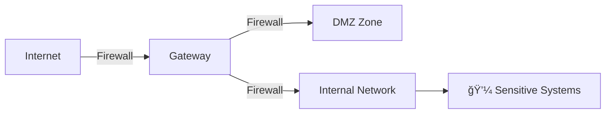

# 🚀 Career Transition: From Healthcare Professional to Cybersecurity Specialist

---

## Introduction

I am embarking on a focused journey into **Cybersecurity**, leveraging over 7 years of experience in healthcare where safeguarding sensitive patient information and system integrity was critical. This background has fueled my commitment to protecting digital assets through cybersecurity.

I approach this transition with humility, patience, and a strong willingness to learn. Cybersecurity is a constantly evolving field, and I am dedicated to mastering both foundational knowledge and practical skills needed to contribute responsibly and effectively.

---

## Learning & Certification Path

I have structured my learning around globally recognized certifications that build a comprehensive and relevant skillset:

- **ISC² Certified in Cybersecurity (CC)**  
  My current focus, providing essential cybersecurity principles, network defense, access control, and incident response fundamentals.

- **Google Cybersecurity Certificate**  
  Building practical skills around cloud security and modern infrastructure protection.

- **Cisco CyberOps Associate**  
  Preparing for hands-on Security Operations Center (SOC) roles with real-time threat monitoring and response.

- **CompTIA Security+ and Advanced Certifications (CySA+, PenTest+)**  
  Expanding knowledge into threat management, vulnerability assessment, and penetration testing.

This sequential approach ensures steady progress and a well-rounded skillset aligned with industry needs.

---

## Practical Experience & Skills Development

- Creating a personal cybersecurity lab for hands-on practice with tools and simulations.
- Analyzing network traffic and applying threat detection techniques.
- Automating routine security monitoring and incident response tasks.
- Documenting and sharing projects that demonstrate applied cybersecurity knowledge.

---

## Balancing Growth with Life Commitments

Maintaining a sustainable balance between work, personal life, and learning is a priority. I dedicate focused time to study while honoring my professional duties and personal wellbeing, including social and family commitments. This balance supports my motivation, resilience, and consistent progress.

---

## Repository Purpose

This repository serves as my personal learning journal and toolkit where I:

- Organize study notes, cheat sheets, and lab walkthroughs.
- Track progress and reflect on new skills.
- Share practical projects and scripts.
- Curate valuable cybersecurity resources for ongoing growth.

---

## Invitation for Collaboration

I welcome feedback, mentorship, and connections from professionals and peers. My goal is to grow thoughtfully and contribute meaningfully to cybersecurity efforts, particularly where protecting sensitive data is vital.

Thank you for reviewing my journey.

---

## Useful Links

- [ISC² Certified in Cybersecurity (CC)](https://www.isc2.org/Certifications/CC)  
- [Google Cybersecurity Certificate](https://grow.google/certificates/cybersecurity/)  
- [Cisco CyberOps Associate](https://www.cisco.com/c/en/us/training-events/training-certifications/certifications/associate/cyberops.html)  
- [CompTIA Security+](https://www.comptia.org/certifications/security)  
- [TryHackMe](https://tryhackme.com/)  
- [Hack The Box](https://www.hackthebox.eu/)  
- [SANS Cyber Aces](https://www.cyberaces.org/)  
- [OWASP](https://owasp.org/)

---

# ISC2 NOTES

## 🌟 Progress Update: Today’s Learning Achievement

Today, I dedicated focused time to deeply study and understand the **CIA Triad** — the core foundation of information security.  
This principle of **Confidentiality, Integrity, and Availability** is vital for protecting data in any environment.

I’m excited to have grasped these concepts clearly, and I’m committed to building on this knowledge every day.  
This marks an important step in my journey toward becoming a skilled cybersecurity professional.

Continuous learning and growth are my priorities, and I’m motivated to keep pushing forward with discipline and passion.

---

# 🔐 The CIA Triad: Fundamental Principles of Information Security

The **CIA Triad** defines the three core goals to protect information systems:

- **Confidentiality:** Keep data private and secure.  
- **Integrity:** Ensure data is accurate and trustworthy.  
- **Availability:** Make data and systems accessible when needed.

---

## 🔒 Confidentiality

1. Grant access **only to authorized users**.  
2. Block **unauthorized access** effectively.  
3. Use **strong passwords** and **multi-factor authentication**.  
4. Protect data with **encryption**.  
5. Limit access based on **user roles**.  
6. Train employees on **data privacy best practices**.  
7. Log and monitor **data access activities**.  
8. Label sensitive data as **confidential**.  
9. Avoid sharing data over **public or unsecured networks**.  
10. Ensure policies prevent **data leakage or exposure**.

**Example:** Nurses can view patient records; cleaning staff cannot.

---

## 🧾 Integrity

1. Maintain data **accuracy and consistency**.  
2. Prevent **unauthorized data modifications**.  
3. Use tools to **detect changes or tampering**.  
4. Keep detailed **logs of all data changes**.  
5. Perform **regular backups**.  
6. Allow edits by **trusted personnel only**.  
7. Regularly check data for **errors or inconsistencies**.  
8. Follow strict **change control procedures**.  
9. Use **digital signatures** for data verification.  
10. Verify data sources to ensure **authenticity**.

**Example:** Lab results remain unaltered unless properly updated.

---

## ⚙️ Availability

1. Ensure systems and data are **accessible when needed**.  
2. Resolve issues **promptly to reduce downtime**.  
3. Use **backup systems** to maintain service during failures.  
4. Perform regular **system maintenance and updates**.  
5. Defend against attacks that **disrupt service**.  
6. Monitor system health for early issue detection.  
7. Maintain **backup power sources** like generators.  
8. Prepare **disaster recovery plans**.  
9. Design systems to support **high user demand**.  
10. Protect hardware from **damage or theft**.

**Example:** Hospital IT systems run continuously, 24/7.

---

### Summary Table

| Principle       | Focus                     | Example                                  |
|-----------------|---------------------------|------------------------------------------|
| Confidentiality | Protect data privacy       | Nurses access records; cleaners do not.  |
| Integrity       | Ensure data accuracy       | Lab results remain unchanged unless valid.|
| Availability    | Keep systems accessible    | Hospital systems operate without downtime.|


# Privacy and Data Protection Overview

Understanding privacy and data protection is essential in today’s digital world. Personal data must be handled responsibly to protect individuals and comply with laws.

---

## What is Privacy?

- **Control over personal information** such as names, emails, and online activity  
- Determines who can **access, use, or share** your data

---

## Privacy vs. Security

| Aspect   | Description                                     |
|----------|------------------------------------------------|
| **Privacy** | Control over who accesses and uses data       |
| **Security**| Protects data from unauthorized access & threats |

---

## Important Privacy Laws

- **General Data Protection Regulation (GDPR) – 2016**  
  Applies globally to companies handling EU residents’ data  
  _Example:_ Facebook complies with GDPR for EU users

- **California Consumer Privacy Act (CCPA) – 2018**  
  Protects California residents’ data rights  
  _Example:_ Google follows CCPA rules for California users

---

## Global Compliance

- Organizations must follow privacy laws based on where their users live  
- Ensures responsible data handling across different regions

---

## Risks of Non-Compliance

- ⚠️ Heavy fines (up to millions of dollars or euros)  
- ⚠️ Legal actions and lawsuits  
- ⚠️ Loss of customer trust and damage to reputation

---

## Summary

- Privacy gives people control over their personal data  
- Security protects data but doesn’t guarantee privacy alone  
- Laws like GDPR and CCPA enforce responsible data use  
- Compliance helps avoid penalties and build trust

---
# Non-Repudiation

---

## Overview

Non-repudiation is a crucial security principle that ensures a person or entity **cannot deny** having performed a specific digital action. It provides **undeniable proof** of data origin and delivery, making it impossible to falsely deny involvement in transactions or communications.

With the rise of electronic transactions and digital communication, non-repudiation builds trust, enforces accountability, and supports legal compliance.

---

## Why Non-Repudiation Matters

In digital systems, actions happen remotely and quickly. Without non-repudiation, users could deny their actions, leading to fraud, disputes, and legal issues.

**Non-repudiation helps to:**

- Protect all parties by providing clear evidence of actions  
- Reduce fraud and impersonation  
- Enforce electronic contracts and agreements  
- Build confidence in digital platforms  

---

## Key Concepts

### 1. Prevents Denial  
Stops users from denying digital actions (e.g., online purchases).

### 2. Legal Evidence  
Digital signatures and logs serve as evidence in courts.

### 3. Action Tracking  
Logs record who did what and when, creating an audit trail.

### 4. Identity Verification  
Digital signatures and certificates confirm true user identities.

### 5. Builds Trust and Accountability  
Makes digital actions traceable and verifiable, increasing trust.

---

## Common Applications

- **Digital Signatures:** Authenticate and verify documents and messages  
- **Online Transactions:** Record payment details to prevent fraud  
- **Secure Email:** Verify sender authenticity using cryptographic signatures  
- **Audit Logs:** Track user activity for compliance and forensic analysis  
- **E-Government Services:** Ensure transparency and legal integrity in citizen requests  

---

## How Non-Repudiation Works

Non-repudiation typically relies on:

- **Cryptographic Techniques:** Digital signatures and hashing ensure integrity and authenticity  
- **Timestamping:** Records the exact time of actions  
- **Authentication Mechanisms:** Strong identity verification (passwords, biometrics, certificates)  
- **Audit Trails:** Detailed logs for future verification  

---

## Challenges & Considerations

- **Key Management:** Secure storage and handling of cryptographic keys  
- **System Integrity:** Prevent tampering with logs and signatures  
- **User Privacy:** Balance transparency with privacy protections  
- **Legal Compliance:** Follow local laws and regulations  

---

## Conclusion

Non-repudiation is essential for trustworthy and secure digital interactions. It protects businesses, governments, and individuals by ensuring actions are verifiable and cannot be denied.

---
# Risk Management in Cybersecurity

Important concepts to understand how organizations protect their digital assets:

**1. Asset**  
Anything valuable that needs protection to keep the organization safe.  
*Example: Customer data, company computers, or software applications.*

**2. Vulnerability**  
A weakness or gap in security that could be exploited by a threat.  
*Example: Using weak passwords or failing to update software regularly.*

**3. Threat**  
Anything that can cause harm by exploiting a vulnerability.  
*Example: Hackers, viruses, or phishing emails.*

**4. Risk**  
The chance that a threat will exploit a vulnerability and cause harm.  
*Example: The possibility that a hacker will break into an outdated system.*

**5. Risk Assessment**  
The process of identifying risks, evaluating their likelihood, and potential impact.  
*Example: Analyzing which systems are most likely to be attacked and what damage could result.*

**6. Using Risk Data**  
Using information about past incidents and current threats to prioritize security efforts.  
*Example: Focusing on improving email security after an increase in phishing attacks.*

**7. Collaboration**  
Different teams working together to manage and reduce risks effectively.  
*Example: IT working with HR to train employees about safe online behavior.*

**8. Reporting**  
Communicating clear and actionable information about risks to decision-makers.  
*Example: Providing monthly security reports to company leadership.*

**9. Monitoring**  
Continuously observing systems and networks to detect new threats or weaknesses early.  
*Example: Using security software to track suspicious activity on company computers.*

**10. Improvement**  
Learning from incidents and regularly updating security measures to stay protected.  
*Example: Updating security policies after a data breach to prevent future attacks.*


---
# Decision Making Based on Risk Priorities

When managing risks, organizations must carefully evaluate several factors:

**1. Likelihood of the Risk**  
How likely is the risk to happen?

**2. Impact of the Risk**  
What would be the severity of the consequences if the risk occurs?

**3. Risk Tolerance**  
How much risk is the organization willing to accept or ignore?

**4. Location-Specific Risks**  
- Companies in different places face different risks.  
- Example: A company in Hawaii worries more about volcanic eruptions.  
- Example: A company in Chicago focuses on blizzards (severe snowstorms with heavy snow and strong winds that make travel dangerous).

**5. Decision Makers**  
Executive management and the board of directors decide the organization's risk tolerance.

**6. Consequences of Ignoring Risks**  
Ignoring serious risks, such as exposing workers to asbestos, can lead to significant legal and financial trouble.


# 🛡️ Domain 2: Incident Response, Business Continuity, and Disaster Recovery Concepts

# 🔐 Cybersecurity Incident Terminology for Beginners

Understanding cybersecurity starts with learning the basic terms used to describe digital attacks, weaknesses, and defenses. This guide breaks down common terms in simple language, perfect for beginners or non-technical users.

---

## 📘 Table of Contents

1. [Event](#1-event)
2. [Incident](#2-incident)
3. [Threat](#3-threat)
4. [Zero Day](#4-zero-day)
5. [Breach](#5-breach)
6. [Exploit](#6-exploit)
7. [Intrusion](#7-intrusion)
8. [Vulnerability](#8-vulnerability)
9. [Summary Table](#9-summary-table)

---

## 1. 📌 Event
**Definition:**  
An activity or action that happens in a computer or network system.

**Example:**  
Logging into a system, opening a file, or sending an email.

---

## 2. ⚠️ Incident
**Definition:**  
An activity that could damage data, systems, or make information unavailable.

**Example:**  
A virus deletes files, or someone tries to hack into an account.

---

## 3. 🚨 Threat
**Definition:**  
A possible danger that could harm systems, people, or organizations.

**Example:**  
A hacker attempts to steal login information.

---

## 4. 🕳️ Zero Day
**Definition:**  
A new security flaw that no one knows about yet, so there’s no fix.

**Example:**  
Hackers discover a bug in software and use it before the company fixes it.

---

## 5. 🔓 Breach
**Definition:**  
When someone gains access to private or personal data without permission.

**Example:**  
Hackers steal customer credit card numbers from a company’s database.

---

## 6. 🧰 Exploit
**Definition:**  
A method or tool used to take advantage of a weakness in a system.

**Example:**  
Using a bug to bypass login screens and access restricted areas.

---

## 7. 👤 Intrusion
**Definition:**  
An attempt to enter a system without authorization.

**Example:**  
A cybercriminal tries different passwords to break into an account.

---

## 8. 🛠️ Vulnerability
**Definition:**  
A weakness or flaw in a system that can be used by attackers.

**Example:**  
Using outdated software without recent security updates.

---

## 9. 📊 Summary Table

| **Term**        | **Simple Definition**                                       | **Example**                                     |
|----------------|--------------------------------------------------------------|-------------------------------------------------|
| **Event**       | Any activity happening in a system                          | Logging in, sending a message                   |
| **Incident**    | Harmful or suspicious activity                              | A virus deleting files                          |
| **Threat**      | Possible danger to a system or data                         | Hacker trying to steal data                     |
| **Zero Day**    | Unknown flaw with no fix yet                                | New bug used by hackers                         |
| **Breach**      | Unauthorized access to private information                  | Data stolen from a company                      |
| **Exploit**     | Method used to take advantage of a flaw                     | Bypassing login due to a bug                    |
| **Intrusion**   | Unauthorized entry attempt                                  | Breaking into a system using password guessing  |
| **Vulnerability** | Weak point in a system that attackers can use           | Old software without security patches           |

---

## ✅ Want to Learn More?

Explore resources like:

- [NIST Glossary](https://csrc.nist.gov/glossary)
- [Cybersecurity & Infrastructure Security Agency (CISA)](https://www.cisa.gov/)
- [OWASP Top 10](https://owasp.org/www-project-top-ten/)

# 🔐 Cybersecurity Incident Terminology for Beginners

A beginner-friendly guide to understanding the most essential cybersecurity incident response terms — written in clear, non-technical language with real-world examples.

---

## 🧾 Extended Description

**Cybersecurity Incident Terminology for Beginners** is a simple, accessible resource designed to help those new to cybersecurity understand the core language used in the field — especially when dealing with incidents, threats, and vulnerabilities.

In cybersecurity, communication is key. Whether you're a student, new professional, or simply curious, learning this foundational vocabulary helps you better understand risks, communicate clearly, and build your knowledge step by step.

---

## 📘 Table of Contents

1. [The Goal of Incident Response](#-the-goal-of-incident-response)
2. [Terminology Explained](#-terminology-explained)
3. [Summary Table](#-summary-table)
4. [Who This Is For](#-who-this-is-for)
5. [Why This Matters](#-why-this-matters)
6. [More Resources](#-more-resources)

---

## 🎯 The Goal of Incident Response

Every organization, no matter how secure, must be prepared for cybersecurity incidents. Despite best efforts to prevent problems, adverse events **will** happen — and some can disrupt business operations or impact mission-critical services.

🔍 **Key Concepts**:
- An **event** is any measurable activity in a system — most are harmless.
- If an event has the potential to **disrupt business**, it becomes an **incident**.
- An **incident response plan** helps reduce damage and restore normal operations quickly.

🛠️ **Incident Response is part of a larger strategy** known as **Business Continuity Management (BCM)**, which ensures the organization can survive and recover from unexpected events.

⚠️ **Top Priority**:  
The #1 goal in incident response is to **protect life, health, and safety**. When choosing betwee

---
# 🏢 Components of a Business Continuity Plan (BCP)

A beginner-friendly guide to understanding what goes into a Business Continuity Plan and why it's critical for any organization.

---

## 📖 What Is Business Continuity Planning?

**Business Continuity Planning (BCP)** is the process of preparing an organization to **continue operating** during and after unexpected disruptions — like cyberattacks, natural disasters, or system failures.

> 🔄 The goal is to **minimize downtime**, protect people and resources, and help the business recover as quickly as possible.

---

## 👥 Who Builds the BCP?

Creating a BCP is **not just an IT task**. It should include input from all departments:
- Operations
- Human Resources
- Legal
- Finance
- Management
- Information Technology

Why? Because each department has critical functions that must be accounted for in the plan.

---

## 🧱 Key Components of a Business Continuity Plan

Here are the essential elements of an effective BCP, explained in plain language:

---

### 1. 📋 BCP Team Members

- A list of the **people responsible** for managing the BCP.
- Include **multiple ways to contact** each person (e.g., email, phone).
- Assign **backup contacts** in case someone is unavailable.

---

### 2. 🧑‍💼 Management Guidance

- Define **who has authority** during a crisis.
- Provide clear **roles and responsibilities** for decision-making.
- Helps ensure leadership can act quickly and effectively.

---

### 3. 📞 Emergency Contact Information

- A list of important contacts outside the organization:
  - **Vendors**
  - **Customers**
  - **Third-party partners**
  - **Emergency services** (fire, police, medical)

---

### 4. 🚨 Activation Guidelines

- Instructions for **how and when to activate** the BCP.
- Clear **triggers** that let the team know it’s time to put the plan into action.

---

### 5. 🧯 Immediate Response Procedures

- **Step-by-step checklists** to follow during the first moments of an emergency:
  - Fire suppression
  - Security protocols
  - Evacuation or lockdown procedures
  - Contacting emergency responders

---

### 6. 📣 Notification Systems

- Tools and processes to **alert staff quickly** when the BCP is activated:
  - Email alerts
  - Text messages
  - Phone trees
  - Emergency notification apps

---

## 🧠 Why It Matters

Even with strong security and good management, **disruptions are unavoidable**. A well-prepared business continuity plan:
- Reduces confusion during emergencies
- Helps protect people, data, and assets
- Gets the business back on track faster
- Builds trust with customers, partners, and employees

> ⚠️ **Always prioritize life, health, and safety**. Every decision in your BCP should put human safety first.

---

## 📊 Quick Summary Table

| **Component**              | **Purpose**                                                                 |
|---------------------------|------------------------------------------------------------------------------|
| **BCP Team Members**       | Identify responsible people and backup contacts                             |
| **Management Guidance**    | Define who has authority during emergencies                                 |
| **Emergency Contact Info** | Ensure fast communication with partners and emergency services              |
| **Activation Guidelines**  | Explain when and how to activate the BCP                                    |
| **Response Procedures**    | Provide checklists for safety and immediate actions                         |
| **Notification Systems**   | Alert staff quickly when the plan is put into action                        |

---

## 📌 Final Notes

- BCP is a **business function first**, not just a technical one.
- IT systems must support business priorities, not the other way around.
- Regularly test, review, and update the BCP to keep it effective.

---

## 🧭 Looking for More?

Explore these resources:
- [NIST Business Continuity Framework](https://csrc.nist.gov/publications/detail/sp/800-34/rev-1/final)
- [FEMA Business Continuity Planning Suite](https://www.ready.gov/business-continuity-planning-suite)
- [CISA Business Continuity Resources](https://www.cisa.gov/resources-tools)

---

**📂 Use this guide to build stronger, safer, and more resilient organizations.**

# 🔄 Business Continuity in Action: A Real-World Example

Imagine the **billing department** of a company suffers a **complete loss** due to a fire that occurred overnight. Fortunately, no personnel were in the building at the time, so there were no injuries.

---

## 📊 Background

- A **Business Impact Analysis (BIA)** was performed four months ago.
- The BIA identified the billing department as **very important** to the company.
- However, the billing functions **do not immediately affect other areas** of the business.

---

## 🏢 Pre-Planning and Preparedness

- The company had a **previously signed agreement** for an **alternative work area** for the billing department.
- This alternate location can be made available in **less than one week**.
- Meanwhile, **customer service staff** will handle billing inquiries during the transition.
- Billing personnel will work from the alternate site until a new permanent office space is secured.

---

## 💡 Key Insights

- The BIA highlighted dependencies between **customer billing inquiries** and **company revenue**.
- The company has **ample cash reserves**, so a **one-week delay** in billing operations is manageable.
- Having an alternate work area and a plan to redirect customer inquiries demonstrates **effective pre-planning**.

---

## ✅ Outcome

- The business continuity plan was successfully **executed without major disruptions**.
- There was **no material interruption** to the company’s operations or service to customers.
- This scenario shows how **business continuity looks in action**:  
  - Understanding critical functions through BIA  
  - Preparing alternate solutions ahead of time  
  - Flexibly managing customer service during disruptions  

---

> **Business continuity planning ensures organizations can respond quickly and effectively to unexpected events, minimizing impact and maintaining service.**

# 🔐 Incident Response Plan (IRP)

## 📄 What is an IRP?

An **Incident Response Plan (IRP)** is a structured, documented strategy that helps organizations detect, manage, and recover from cybersecurity incidents.

### 🎯 Objectives:
- Minimize business disruption
- Protect sensitive systems and data
- Reduce incident impact and recovery time
- Ensure legal and regulatory compliance
- Improve response through continuous learning

---

## 🧭 Strategic Alignment

The IRP aligns with the organization’s:
- **Vision** – Long-term goals and aspirations
- **Mission** – Core purpose and responsibility
- **Strategic Objectives** – Business continuity, risk tolerance, and compliance goals

---

## 👥 A Plan for Everyone

This is **not just a technical document**. It’s a **plan that all employees follow**, with:
- Clear, role-specific responsibilities
- Communication guidelines
- Organizational-wide training
- Executive and cross-functional coordination

---

## 🧰 Core Elements of the IRP

The IRP consists of:
- 📜 **Policies** – Governance and commitment
- 🧭 **Procedures** – Step-by-step guidance
- 🛠️ **Technical tools** – Detection and analysis tools
- ✅ **Checklists** – Ensure completeness
- 📢 **Communication protocols** – Manage internal/external information flow

---

# 📌 Common Components of an Incident Response Plan

Organized under four key categories:

---

## 1️⃣ Preparation and Planning

Preparation sets the foundation for a timely and effective response.

- ✅ **Develop a management-approved policy**
- 🧩 **Identify critical systems and single points of failure**
- 👨‍🏫 **Train staff on incident response procedures**
- 👥 **Implement an Incident Response Team (IRT) with defined roles**
- 📋 **Define roles and responsibilities for all staff**
- 📢 **Coordinate communication with stakeholders**
- 📡 **Establish backup communication methods in case of outages**

---

## 2️⃣ Detection and Analysis

Focused on early detection, triage, and investigation.

- 🚨 **Practice incident identification (first response drills)**
- 🕵️‍♀️ **Monitor all attack vectors** (e.g., endpoints, networks, cloud)
- 📊 **Analyze using internal logs and threat intelligence**
- 🧮 **Prioritize response based on severity and business risk**

---

## 3️⃣ Containment, Eradication, and Recovery

These actions limit the scope of an incident and restore services.

- 🔐 **Select an appropriate containment strategy**
- 🚪 **Isolate compromised systems or user accounts**
- 👤 **Attempt attacker identification (if possible)**
- 🧾 **Collect and preserve forensic evidence**
- 🧾 **Retain critical evidence with proper chain of custody**

---

## 4️⃣ Post-Incident Activities & Continuous Improvement

Learn from each incident and enhance readiness.

- 🗃️ **Standardize incident documentation**
- 📝 **Document lessons learned from each incident**
- 🔁 **Conduct retrospectives for all incident phases:**
  - Preparation
  - Detection and Analysis
  - Containment, Eradication, Recovery
  - Post-Incident Review

---

# 🔄 Incident Response Lifecycle

| **Phase**                          | **Description**                                                             |
|-----------------------------------|-----------------------------------------------------------------------------|
| 🧰 **Preparation**                | Establish policies, train staff, set up tools                              |
| 🔎 **Detection and Analysis**     | Identify and assess incidents                                              |
| 🛡️ **Containment, Eradication, Recovery** | Limit spread, remove threats, restore systems                   |
| 📘 **Post-Incident Activity**     | Review, learn, and improve processes                                       |

---
## 🧠 Best Practices

- 🔄 **Regularly test the IRP** with simulations and tabletop exercises
- 🎓 **Train all employees**, not just IT/security staff
- 📁 **Keep documentation current** and version-controlled (Git recommended)
- 🔐 **Integrate IRP with Business Continuity and Disaster Recovery Plans**

---
## 📌 Overview

A **properly staffed and trained Incident Response Team (IRT)** is vital for handling cybersecurity incidents effectively. Teams may be:

- **Leveraged** (from existing staff)
- **Dedicated** (full-time roles)
- A **hybrid** (combination of both)

IT professionals often serve as **first responders** and must distinguish between routine IT issues and actual security incidents.

---

## 👥 Typical Incident Response Team (IRT) Composition

Incident Response Teams are **cross-functional**, consisting of individuals from various departments affected by incidents.

### Potential Team Members:

- 🧑‍💼 Senior Management Representatives  
- 🔐 Information Security Professionals  
- ⚖️ Legal Representatives  
- 🗣️ Public Affairs / Communications Personnel  
- 🛠️ Engineering (System and Network) Representatives  

---

## 🎯 Responsibilities of the Incident Response Team

Team members must be trained on:

- The **incident response plan**
- **Security awareness and escalation procedures**

### During an incident, team members typically:

- 🔍 Investigate the incident  
- 📊 Assess damage and impact  
- 🧪 Collect and preserve evidence  
- 📝 Report the incident to stakeholders  
- 🔄 Initiate and oversee recovery efforts  
- 🛠️ Assist in remediation  
- 📖 Participate in post-incident analysis (root cause, lessons learned)

---

## 💻 Dedicated Response Teams

Organizations often establish dedicated teams known as:

- **CIRT** — Computer Incident Response Team  
- **CSIRT** — Computer Security Incident Response Team  

---

## 🧭 Core Responsibilities of CIRTs/CSIRTs

1. 📉 **Damage Assessment**  
   Determine the scope and severity of the incident.

2. 🔐 **Data Confidentiality**  
   Assess if any sensitive data was compromised.

3. 🛠️ **Recovery Implementation**  
   Restore affected systems and mitigate damage.

4. 🔒 **Preventive Measures**  
   Improve security posture to prevent recurrence.

---

## 🧠 Summary

An effective Incident Response Team is essential for:

- Rapid response and mitigation
- Maintaining business continuity
- Minimizing reputational and financial impact
- Strengthening the organization’s security framework

> _Think of your IRT like a well-trained emergency crew—swift, coordinated, and critical during digital crises._

---

# 🔄 The Importance of Business Continuity

Business continuity is the process of maintaining essential operations during and after a **significant disruption**, such as a cyberattack, natural disaster, or system failure.

A well-prepared **Business Continuity Plan (BCP)** helps organizations:

- Continue critical functions during disruptions
- Communicate effectively with stakeholders
- Recover quickly and minimize operational impact

---

## 📋 Key Objectives of Business Continuity

### 1. ✅ Sustain Operations During Disruptions
When an event disturbs the normal environment (e.g., a cyberattack or power outage), the goal is to **maintain core business functions** while the situation is being addressed.

### 2. 📞 Communication is Critical
Effective communication is a cornerstone of business continuity. The BCP should include:

- Multiple **contact methodologies** (email, mobile, satellite, radio, etc.)
- **Backup contact numbers** in case of communication system failures
- Procedures to **initiate communication** immediately after a disruption

---

## 🧑‍💼 Activating the Plan

The **first step** after a disruption is to **notify the appropriate individuals** and begin activating the business continuity plan.

### Important Considerations:

- **Involve management**: Situational awareness and shifting priorities require decision-makers.
- Ensure the presence of **authorized personnel** to execute key actions (e.g., shutting down critical systems or departments).
- **Access emergency contacts**:
  - Supply chain contacts
  - Law enforcement
  - Off-site facilities or backup locations

---

## 🏥 Real-World Example: Cyberattack on a Hospital

> A hospital experiences a severe cyberattack that disrupts:
> - Internet access
> - Internal communications (e.g., pharmacy systems)
> - Phone lines

In the U.S., during major cyberattacks that disable communication infrastructure, **military-grade communication networks** (like FirstNet) can be used. These are:

- Pre-assigned to **authorized personnel**
- Used in **critical infrastructure sectors** (e.g., healthcare, emergency services)
- Essential for **maintaining critical services** in extreme situations

---

## 🌲 Phone Trees & Contact Chains

Many organizations implement a **phone tree** system:

- Ensures continuity in communication even if someone is unavailable
- Provides **redundancy**: If one person cannot be reached, the next contact is known
- Supports **rapid escalation** and delegation

---

## 🧾 Checklists & Procedures

> Just like pilots use a pre-flight checklist before every takeoff—no matter how many times they’ve flown—organizations must have detailed checklists for business continuity.

- Clearly define **roles and responsibilities**
- Use step-by-step **procedures** for each phase of continuity
- Regularly test and update to reflect:
  - New systems
  - Staff changes
  - Emerging risks

---

## 🧠 Summary

A strong Business Continuity Plan should include:

- 🔄 Procedures for maintaining operations during disruptions
- 📞 Robust, redundant communication methods
- 🧑‍💼 Management involvement and clear authority delegation
- 🧾 Detailed, practiced checklists
- 📡 Access to backup networks for critical sectors
- 📈 Continuous review and improvement

> _Business continuity isn’t just about survival—it’s about resilience, readiness, and responsibility._

---
# ⚠️ The Goal of Disaster Recovery

**Disaster Recovery (DR)** refers specifically to restoring the **information technology (IT)** and **communications systems** an organization needs to function after a disruptive event.

### 🔧 Key Objectives:

- Restore IT and communication services during and after a disaster
- Support the recovery of business operations through technological restoration
- Transition from disruption back to **last-known reliable operations**

---

## 🆚 Business Continuity vs. Disaster Recovery

| Aspect | Business Continuity | Disaster Recovery |
|--------|----------------------|-------------------|
| **Focus** | Maintain critical business functions | Restore IT and communication systems |
| **Timing** | During the disruption | After the disruption |
| **Scope** | Organization-wide | Technology-focused |
| **Goal** | Keep business running | Return to full operational status |

**Note:** While business functions may resume temporarily through workarounds, disaster recovery ensures the full restoration of IT systems that support those functions.

---

## 📘 The Role of the Disaster Recovery Plan (DRP)

The **Disaster Recovery Plan (DRP)** guides emergency response teams through the process of:

1. **Responding** to the incident or disaster
2. **Restoring** affected systems, applications, and communications
3. **Recovering** data and configurations
4. **Returning** the business to normal, reliable operations

Disaster recovery planning steps in **after** the initial business continuity efforts, ensuring that temporary solutions are replaced with full system functionality.

---

## 🎯 End Goal

> To restore **full, reliable operations** of IT and communications infrastructure, enabling the organization to return to its pre-disruption state.
>
> # 💥 Disaster Recovery in the Real World

Disaster recovery isn't just a theoretical exercise—it requires **real-world readiness** for complex and sometimes delayed incidents. Critical systems, backup strategies, and system interdependencies must all be accounted for to avoid catastrophic data loss and operational shutdown.

---

## 🔍 Importance of Early Detection

In many real-world cases:

- Incidents are **not discovered immediately**.
- **Days, weeks, or even months** can pass before signs of compromise appear.
- This delay can result in backups containing **malware or corrupted data**, making recovery far more complex.

> 🔎 **Real-World Example:**  
> A hospital in Los Angeles discovered a data compromise **260 days** (~8.5 months) after the initial breach.

---

## 🧠 Key Takeaways for Real-World DR Planning

### 1. ✅ Identify Critical Systems
Ensure all critical systems are:

- Formally documented
- Mapped to their dependencies
- Included in recovery testing scenarios

> Backing up individual servers isn't enough—you must understand how systems interact.

---

### 2. 🗃️ Backup More Than Just the Server

Disaster recovery must consider:

- The **entire database structure**
- All **application-level dependencies**
- **Inter-system communication paths** (e.g., message queues, APIs, sync routines)

---

## 🏥 Real-World Healthcare Example

### Hospital System Dependencies:

In a hospital environment:

- The **radiology** and **laboratory** departments used **separate systems**.
- Patient data originated in the **registration system** and was copied into both the radiology and laboratory systems.
- Each system used **separate databases**.
- A **sync routine** handled data transfers between systems.

> 🔄 This complex data flow means that a simple server-level restore could **fail** if these dependencies are not fully understood.

---

## 🛑 When Backups Contain Malware

In one real-world scenario:

- A hospital was attacked with **time-based malware**.
- The malware lay dormant in backups and only triggered upon restoration.
- As a result, the hospital had to:
  - Go back nearly **a year** to find a clean, pre-infection backup
  - **Manually restore data** piece-by-piece to avoid reinfection

### 🔁 Lessons Learned:

- **Multiple levels of backup** are essential (e.g., daily, weekly, monthly snapshots)
- Implement **longer retention periods**
- Backups must be **regularly tested** for integrity and malware contamination

---

## 📌 Summary

Disaster recovery in complex environments requires:

- A deep understanding of **system architecture**
- Planning for **data flow and cross-system dependencies**
- **Regular backup testing**
- **Threat modeling** that includes dormant and delayed threats

> _"A backup is only as good as your ability to restore it—safely and completely."_

---
# 🧩 Components of a Business Continuity Plan (BCP)

**Business Continuity Planning (BCP)** is the proactive creation of procedures and structures that ensure critical business operations can continue—or be quickly restored—after a major disruption or disaster.

> 💡 **BCP is not just an IT or technical exercise.** It’s a **business-driven process** that integrates input from all departments to ensure full organizational resilience.

---

## 🧑‍💼 Who Should Be Involved?

- **Cross-functional teams** should participate in the development of a BCP.
- Representatives from **operations, HR, IT, legal, compliance, facilities, and executive management** must collaborate.
- This ensures that **all critical systems, processes, people, and dependencies** are properly covered.

---

## 🧱 Key Components of a Business Continuity Plan

### 1. 📋 BCP Team Roster
- List of primary and backup members
- Multiple contact methods (e.g., mobile, email, radio)
- Clear roles and responsibilities

### 2. 🧑‍💼 Management Guidance
- Step-by-step instructions for leadership during a crisis
- Delegation of authority for key decisions
- Escalation paths and authorization rules

### 3. 📞 Critical Contact Information
- Vendors and suppliers
- Third-party providers
- External emergency response agencies (e.g., fire, police, IT forensics)
- Important customer contacts (for major B2B or high-priority clients)

### 4. 🚨 Plan Activation Guidelines
- Specific criteria for enacting the BCP
- Who has the authority to trigger the plan?
- Procedures for assessing the situation and moving to contingency operations

### 5. 🚒 Emergency Procedures & Checklists
- Safety and evacuation protocols
- Fire suppression instructions
- Steps for securing IT systems and facilities
- Notification of emergency responders

### 6. 📣 Communication Plan & Notification Systems
- Call trees and automated alerting systems
- Messaging templates and channels (SMS, email, internal apps)
- Designated communication officers and alternates

---

# 📝 Detailed Description

A **Business Continuity Plan (BCP)** is not just a document—it’s a **strategic, living framework** designed to help organizations **respond to and recover from significant disruptions** such as:

- Cyberattacks
- Natural disasters
- Equipment or system failures
- Power outages
- Pandemics or other health-related crises

### 🎯 Purpose of the BCP

The primary objective of a BCP is to **safeguard business viability** by ensuring that key functions and services:

- Continue to operate with minimal downtime
- Can be quickly restored if interrupted
- Align with business, regulatory, and customer expectations

### 🔍 Why It Must Be Cross-Functional

Too often, business continuity is viewed as "just an IT issue." In reality:

- **Operations** may need to shift locations or modify workflows
- **Legal and compliance** may need to report incidents to regulators
- **HR** must manage employee communications and safety
- **IT** must recover systems while ensuring **confidentiality, integrity, and availability (CIA)** of data

BCP efforts must reflect **organization-wide coordination**—not just technical contingencies.

---

## 📌 Best Practices

1. **Test the Plan Regularly**
   - Conduct tabletop exercises and full simulations
   - Review and update the plan annually (or after major changes)

2. **Use Realistic Scenarios**
   - Simulate cyberattacks, ransomware, natural disasters, and insider threats

3. **Train All Stakeholders**
   - Every department should know its role
   - Train backups in case key team members are unavailable

4. **Keep It Accessible**
   - Store digital and printed versions in secured but easily reachable locations
   - Provide offline access if IT infrastructure is down

5. **Integrate with DR and Incident Response**
   - Ensure alignment between **BCP**, **Disaster Recovery Plans (DRP)**, and **Incident Response Plans (IRP)**

---

## 🧠 Final Thought

> _“A business continuity plan isn’t just about surviving the storm—it’s about ensuring you can still serve your customers, protect your people, and uphold your brand while the storm is happening.”_

A well-prepared BCP is a sign of **maturity, resilience, and foresight**. It turns chaos into clarity, and uncertainty into structured response.

---
# 🚀 Business Continuity in Action

Imagine a scenario where the **billing department of a company suffers a complete loss due to a fire**. The fire occurred overnight, so no personnel were present at the time.

---

## 🔍 Background

- A **Business Impact Analysis (BIA)** was performed four months earlier.
- The BIA identified the billing department’s functions as **very important**, but not immediately critical to other departments.
- The company has a **pre-arranged agreement** for an alternate workspace that can be made available in **less than one week**.

---

## 🛠️ Response & Recovery Actions

- While the alternate area is being prepared, **customer billing inquiries are handled by the customer service team**.
- Billing department personnel relocate to the alternate workspace and remain there until a new permanent area is ready.
- The company’s **ample cash reserves** make a one-week interruption in billing acceptable.

---

## ✅ Key Takeaways

- The **dependencies between billing, customer inquiries, and revenue** were identified during the BIA.
- Pre-planning enabled the company to **quickly activate an alternate workspace** and temporarily reassign customer service duties.
- Thanks to these preparations and the execution of the business continuity plan, **there was no significant interruption** to business operations or customer service.

---

## 💡 What Does Business Continuity Look Like in Action?

This example illustrates how **proactive planning, clear analysis, and coordinated execution** ensure that even unexpected disasters **do not derail critical business functions**.

---
# 🛠️ Components of a Disaster Recovery Plan (DRP)

The size of an organization and the number of people involved in disaster recovery efforts often dictate the need for **multiple types of plan documents**, each tailored to specific audiences and roles.

---

## 📄 Types of Disaster Recovery Documents to Consider

- **Executive Summary**  
  Provides a high-level overview of the disaster recovery plan for leadership and stakeholders.

- **Technical Guides**  
  Detailed instructions for IT personnel responsible for implementing and maintaining critical backup systems and alternate site setups.

- **Full Copies of the Plan**  
  Distributed to critical disaster recovery team members to ensure everyone has access to comprehensive procedures.

---

## ✅ Role-Based Documentation

- **Critical Disaster Recovery Team Members**  
  Equipped with **checklists** to guide their actions during the chaotic and stressful environment of a disaster.

- **IT Personnel**  
  Provided with technical guides to help **get alternate sites up and running** swiftly and efficiently.

- **Managers and Public Relations Personnel**  
  Supplied with simple, high-level documents to communicate issues accurately without burdening recovery teams.

---

## 🏢 Department-Specific Plans and Checklists

- Tailored plans and checklists for individual departments or roles ensure clarity and focus, helping each team member understand their responsibilities during disaster recovery.

---

By preparing and distributing these varied documents, organizations can improve coordination, reduce confusion, and increase the likelihood of a successful recovery.


# Domain 3: Access Control Concepts

# Security Controls

Security controls are safeguards or countermeasures designed to preserve the **Confidentiality**, **Integrity**, and **Availability** of data — collectively known as the **CIA Triad**.

---

## What is a Security Control?

A security control limits access and actions by defining which subjects (users, processes) can interact with which objects (data, resources) under specific rules.

---

## Examples of Security Controls

### Access Control

Access control involves limiting what objects are available to what subjects according to defined policies or rules. It ensures that only authorized users or processes can access certain resources.

### Firewall

A firewall is a network security control that:

- **Blocks unauthorized external access:** Prevents potentially harmful traffic from entering and compromising the internal system or network.
- **Prevents data leakage:** Stops sensitive internal information from leaving the network and being accessed by unauthorized parties on the internet.

---

## Summary

Security controls are essential tools to maintain the security posture of any system by enforcing the CIA Triad principles:

- **Confidentiality:** Keeping data private.
- **Integrity:** Ensuring data accuracy and reliability.
- **Availability:** Making sure data and resources are accessible when needed.

---

*This document provides a brief overview of security controls with a focus on access control and firewalls.*

# Controls Overview

Access control is often considered the **heart of an information security program**. Security ultimately depends on **who** can access organizational assets (buildings, data, systems) and **what** they can do with that access.

Access controls are not just about restricting access; they also ensure that **authorized subjects** get the **appropriate level of access** while denying unauthorized access.

---

## Core Elements of Access Control

Access control relies on three key components:

- **Subjects**  
- **Rules**  
- **Objects**

---

### Subjects

A subject is any **active entity** that requests access to assets. Examples include:

- Users  
- Processes  
- Programs  
- Devices (workstations, smartphones, USB drives)

Subjects initiate requests and must have permissions or clearance to access resources.

---

### Objects

An object is anything a subject attempts to access. Objects are **passive** and respond to requests. Examples include:

- Files, databases  
- Devices like printers or scanners  
- Servers or software processes  
- Physical assets like buildings

Objects have owners who define access permissions, usually enforced by rules.

---

### Rules

Rules define the logic that determines if a subject can access an object and under what conditions. They:

- Compare subject identities and attributes to access policies  
- Allow or deny access  
- Specify levels of access (read, write, execute)  
- May include conditions like time-based access restrictions

Example: Firewall rules allowing traffic from trusted IP addresses.

---

## How Access Control Works

1. A **subject** requests access to an **object**.  
2. A **rule** evaluates the request based on identity and permissions.  
3. Access is either granted or denied accordingly.

This framework secures systems by controlling who can do what, and when.

---

## Summary

Access control ensures that organizational resources are protected by:

- Granting the right access to authorized subjects  
- Denying unauthorized access  
- Applying consistent policies across systems  

Understanding **subjects**, **rules**, and **objects** is essential for building secure access control models.

---

*Access control is not just about denying access—it’s about enabling the right access at the right time.*


# Defense in Depth

**Defense in Depth** is a layered security strategy that integrates **people**, **technology**, and **operations** to create multiple barriers protecting an organization's assets. These layers work together to deter or prevent cyberattacks by applying various countermeasures across different points of vulnerability.

---

## What is Defense in Depth?

Defense in depth involves implementing **multiple layers of controls** across various domains of an organization, including:

- Physical access (e.g., buildings, server rooms)  
- Network and system access  
- Applications and utilities  

This strategy ensures that if one layer is breached, other layers continue to provide protection.

> *Note: While defense in depth reduces risk, it does not guarantee complete prevention of attacks.*

---

## Examples of Defense in Depth

### Technical Controls

- **Multi-Factor Authentication (MFA):**  
  Requires a combination of credentials, such as:
  - Something you **know** (password)  
  - Something you **have** (verification code sent to a phone)  
  This layered approach significantly increases security over single-factor authentication.

- **Multiple Firewalls:**  
  Using several firewalls to segment networks based on trust levels. For example:  
  - One firewall separates the internet (untrusted network) from the organization's internal network.  
  - Additional firewalls protect sensitive servers behind stricter rules.

### Physical Controls

- Locked doors restricting access to data centers.
- Security personnel monitoring entry points.
- Surveillance cameras and badge access systems.

### Administrative Controls

- Policies that define who is authorized to access sensitive areas or data.
- Procedures for granting, reviewing, and revoking access permissions.

---

## Applying Defense in Depth to Asset Protection

When protecting assets with different sensitivity levels, organizations often implement multiple overlapping controls:

| Control Type         | Example                                    |
|----------------------|--------------------------------------------|
| **Physical Controls** | Locked doors, security guards              |
| **Logical/Technical** | Firewalls, multi-factor authentication    |
| **Administrative**   | Access policies, user training             |

For example, accessing data in a data center might require:

1. Physical entry through a locked door  
2. Network access through controlled firewall rules  
3. Authorization based on administrative policies  

---

## Summary

Defense in depth is about building **redundant layers of protection** that address diverse risks and vulnerabilities. This layered approach enhances overall security posture by:

- Increasing the difficulty for attackers to breach systems  
- Reducing the likelihood that a single failure will compromise critical assets  
- Supporting comprehensive protection across physical, technical, and administrative domains  

---

*Implementing defense in depth helps organizations manage complex security challenges and protect sensitive information effectively.*

# Logical Access Controls

Logical access controls are **electronic mechanisms** that restrict access to systems, applications, and sometimes even physical assets or areas. Unlike physical access controls, which involve tangible barriers like locks and security guards, logical controls operate in the digital realm to ensure only authorized users gain entry.

---

## What Are Logical Access Controls?

Logical access controls limit who can access resources such as:

- Computer systems  
- Networks  
- Applications  
- Sensitive data  

Even if a person has physical access to a device or location, logical controls prevent unauthorized use of systems or information.

---

## Common Types of Logical Access Controls

- **Passwords:** The most common form of authentication requiring users to provide a secret phrase or combination of characters.  
- **Biometrics:** System-implemented recognition methods such as fingerprint scanners or facial recognition on smartphones and laptops.  
- **Badge/Token Readers:** Electronic devices that authenticate users by reading a physical badge or token connected to a system.

---

## Summary

Logical access controls are a critical component of an organization's security posture. They provide an essential layer of protection by electronically verifying identities and restricting system access to authorized users, complementing physical security measures.


# Controls and Risks

Security controls help reduce risks to a level that is acceptable to individuals or organizations. These controls can be **physical**, **administrative**, or a combination of both.

---

## Examples of Controls and Risks

### Seatbelt Example

- **Physical Control:** The seatbelt itself, which physically protects the driver.  
- **Administrative Control:** Laws that require the use of seatbelts.

Together, these controls reduce the risk of injury while driving.

---

### Bookshelf Example

- **Risk:** A tall bookshelf might topple and hurt someone.  
- **Administrative Control:** Building codes or regulations requiring the bookshelf to be secured.  
- **Physical Control:** The strap or bracket that attaches the bookshelf to the wall.

In this case, the administrative and physical controls work together to prevent injury.

---

## Summary

- A **control** reduces risk to an acceptable level.  
- Controls can be **physical** (tangible measures) or **administrative** (policies, laws, or regulations).  
- Often, both types of controls are combined to effectively manage risk.

---

*Understanding how controls relate to risks is key to managing safety and security in any environment.*

# Controls Assessments

Effective risk reduction depends on how well a control fits the current situation and adapts to changes in the environment. Assessing controls involves evaluating their appropriateness, effectiveness, and cost relative to the assets being protected.

---

## Example Scenario: Securing an Office Space for Confidential Storage

Imagine an office area being repurposed as a secure storage facility for confidential files. This area has **five doors** that need to be secured before sensitive materials can be stored.

### Key Considerations:

- **Type of Control:**  
  For maximum security, biometric scanners could be installed on all five doors.

- **Site Assessment:**  
  A thorough site assessment helps determine:
  - If all doors require biometric scanners  
  - Whether some doors can be permanently secured without electronic access  
  - If doors should be removed and replaced with permanent walls (budget permitting)

- **Cost vs. Value:**  
  The expense of implementing controls must align with the value and sensitivity of the protected information.

- **Alternative Controls:**  
  If full biometric access control is unnecessary and auditing entry is not required, simple **deadbolt locks** on all doors might provide sufficient security.

---

## Summary

Control assessments help balance:

- **Security Needs:** What level of protection is required?  
- **Cost Constraints:** What budget is available for controls?  
- **Operational Practicality:** What controls make sense given the environment and use case?

The goal is to implement controls that effectively reduce risk without excessive cost or complexity.

---

*Regular assessment and adjustment of controls ensure continued effectiveness as organizational needs and environments evolve.*

# Role-Based Access Control (RBAC) in the Workplace

Role-Based Access Control (RBAC) assigns access privileges to employees based on their specific roles within an organization. This ensures that individuals can only access the information and systems necessary to perform their job functions.

---

## How RBAC Works

- **Role Assignments:**  
  Each employee is assigned a role that determines their access level.  
  - *Example:* Only Human Resources can access personnel files.  
  - *Example:* Only Finance can access bank accounts.  
  - *Example:* Managers can access data related to their direct reports and departments.

- **Access Granularity:**  
  High-level system administrators may have full access, while new employees start with minimal permissions required to perform their tasks.

- **Dynamic Role Management:**  
  Roles and permissions must be closely monitored and updated as job responsibilities evolve to prevent unauthorized access.

---

## Challenges with RBAC

- **Privilege Creep:**  
  Occurs when users accumulate permissions beyond what their role requires, often due to temporary access that is never revoked.  
  - *Example:* A junior employee temporarily acting as a department manager retains elevated permissions after the role change ends.

- **Complexity in Granular Roles:**  
  Managing multiple roles with different permissions requires careful oversight to ensure accuracy and security.

---

## Best Practices

- **Avoid Copying User Profiles:**  
  When hiring or changing roles, do not duplicate permissions from existing users. Instead, assign standardized roles with predefined permissions.

- **Standardize Roles:**  
  Establish clear, standard roles so new employees start with appropriate and consistent access.

- **Regular Monitoring:**  
  Continuously review and update permissions to prevent privilege creep and maintain security.

---

*Implementing RBAC effectively helps organizations secure sensitive information while providing employees with the access they need to be productive.*

# Privileged Access Management (PAM)

Privileged Access Management (PAM) is a critical security control that manages and monitors access to highly sensitive systems and data by users with elevated permissions. PAM is designed to reduce the risk of abuse or compromise of privileged accounts, which can cause significant damage when misused—either accidentally or maliciously.

---

## 🔐 What is Privileged Access?

Privileged access refers to special permissions that allow users to:
- **Create**, **read**, **update**, or **delete** critical data
- Administer operating systems, databases, and applications
- Make configuration changes or install software
- Access highly sensitive environments

These permissions are typically granted to:
- System administrators
- Network engineers
- Database administrators
- IT support staff

---

## 🧪 Real-World Scenario: ABC, Inc.

ABC, Inc. is a small company with a limited IT team responsible for system administration. To streamline their tasks, IT staff members added their user accounts to the **Domain Admins** group, giving them unrestricted access across all servers and workstations.

One day, while reviewing an email invoice, a team member inadvertently opened a **malicious attachment**. This triggered a **ransomware attack**, which quickly encrypted files across the entire environment—servers, workstations, and backups.

Because these user accounts had continuous, high-level privileges:
- The malware was able to operate with **Domain Admin** rights.
- No restrictions or triggers were in place to detect or limit the damage.
- The organization faced major operational and financial losses.

---

## ⚠️ Problem with Static Privileged Access

Without a PAM solution:
- Admin accounts are always **"on"** — 24/7, whether in use or not.
- Access control relies solely on secure logins (e.g., username and password).
- All routine tasks (like checking email) may be performed under privileged accounts, increasing exposure to threats.

---

## ✅ Just-in-Time Privileged Access

A modern PAM solution enforces **Just-in-Time (JIT)** access, where:
- Privileges are **granted temporarily**, only when needed.
- Access is **role-based**, giving users only the permissions required for a specific task.
- Elevated permissions are removed once the task is complete.
- Routine tasks are performed under **non-privileged accounts**.

This approach significantly reduces the attack surface and mitigates the impact of malware or insider threats.

---

## 🛡️ Why Privileged Access Management Matters

- **Limits Exposure:** Reduces the amount of time users have elevated permissions.
- **Minimizes Damage:** Prevents ransomware or attackers from leveraging full admin access.
- **Improves Accountability:** Tracks and audits privileged access usage.
- **Supports Compliance:** Meets security standards and regulatory requirements.

---

## 🔄 Best Practices

- Use **least privilege** principles: Only assign access necessary for the task.
- Enforce **Just-in-Time (JIT)** privilege elevation.
- Regularly **audit and review** admin roles and activity.
- Separate day-to-day tasks from admin functions using **dedicated accounts**.

---

# 🔐 Examples of Least Privilege

This document outlines real-world examples of how the **Principle of Least Privilege (PoLP)** is applied to preserve the **confidentiality**, **integrity**, and **availability** of sensitive data.

> 🛡️ Least Privilege ensures users are granted only the minimum access necessary to perform their job responsibilities—nothing more.

---

## ✅ What is Least Privilege?

The **Principle of Least Privilege** is a security concept that restricts access rights for users, accounts, and computing processes to only those resources absolutely required to perform assigned tasks.

This helps:

- 🔒 Protect **confidential** information from unauthorized access  
- 🛠️ Maintain **integrity** by preventing unauthorized modification or deletion  
- 📈 Ensure **availability** by granting necessary access in a controlled way  

---

## 📚 Examples of Least Privilege in Practice

### 💳 Billing Department Access
- Only billing personnel can **view** consumer financial records.
- A smaller group is authorized to **edit or delete** that data.
- Ensures financial data is protected from unauthorized changes.

---

### ⏱️ Time-Based or Temporary Access
- Users may be given access:
  - For a **limited time period**
  - **During business hours** only
- Useful for contractors, auditors, or temporary project work.
- Access automatically **expires** when no longer needed.

---

### 📋 Field-Level Access
- Systems may restrict access to specific **data fields** only.
- Example: In healthcare, support staff may access **patient contact info**, but **not medical records**.
- Doctors can only access information for **their assigned patients**.
- Complies with data protection regulations like **HIPAA (USA)** or GDPR.

---

### 🔁 Role-Based Restrictions
- Access is granted based on the user's **job role**.
- Example: Developers may access staging environments but not production.
- HR personnel can access employee profiles but not payroll systems.

---

## 🔐 Security Controls Supporting Least Privilege

| Control Type           | Description                                                                 |
|------------------------|-----------------------------------------------------------------------------|
| 🔑 Role-Based Access    | Permissions assigned based on job function or group                         |
| ⏰ Time-Based Access    | Temporary or scheduled access windows                                        |
| 🧱 Field-Level Controls | Limit visibility to specific parts of a dataset                             |
| 🧍 User Authentication  | Ensure identity using strong passwords and sign-on methods                  |
| 🔒 Multi-Factor Auth    | Required for users with access to critical or sensitive data                |
| 🧾 Access Auditing      | All access attempts are logged and reviewed regularly                       |

---

## 🚨 Monitoring and Response

- Systems continuously **monitor access logs** for unauthorized attempts.
- **Alerts** are triggered automatically if someone tries to access data without proper permissions.
- Security teams **investigate and record** all incidents.
- Preventive controls such as **MFA** are enforced for sensitive roles.

---

## ✅ Summary

Implementing Least Privilege:

- Reduces the risk of data breaches
- Prevents accidental or malicious data manipulation
- Helps ensure compliance with security and privacy laws
- Strengthens the overall security posture of the organization

---
*Privileged accounts are high-value targets—protecting them through PAM is essential to maintaining a secure IT environment.*

# 🔐 Privileged Accounts

This document outlines the concept, usage, and risk management strategies associated with **Privileged Accounts**—those user accounts with elevated permissions beyond normal users. These accounts require stricter controls and monitoring due to the potential impact they have on the security of systems and data.

---

## 🚀 What Are Privileged Accounts?

**Privileged accounts** are user accounts that have access rights and permissions exceeding those of standard users. These accounts allow users to perform sensitive tasks such as system configuration, user management, security changes, and application control.

### 👤 Examples of Privileged Account Users

- **System Administrators**:  
  Manage operating systems, application deployment, and performance.

- **Help Desk / IT Support Staff**:  
  Perform restricted operations like password resets, account unlocks, or endpoint manipulation.

- **Security Analysts**:  
  Require access to infrastructure, endpoints, and security data across the environment.

- **Project or Client-Based Roles**:  
  Temporary elevated privileges may be granted on a per-client or per-project basis.

---

## ⚠️ Why Are Privileged Accounts High Risk?

Due to their powerful capabilities, misuse—intentional or accidental—can lead to:

- Unauthorized access to critical systems or data
- Untraceable configuration changes
- Elevated risk of internal threats
- Compliance violations

---

## 🛡️ Risk Mitigation Strategies

To manage and secure privileged accounts effectively, organizations should implement the following controls:

### 📜 1. Extensive Logging and Auditing

- All actions by privileged users should be **thoroughly logged**.
- Logs serve as:
  - A **deterrent** for misuse
  - An **audit trail** for investigations
- Logs should be **reviewed regularly** and stored securely.

### 🔑 2. Stringent Access Controls

- Use **Multi-Factor Authentication (MFA)** for all users—mandatory for privileged accounts.
- Consider **Just-In-Time (JIT) access**:
  - Privileges granted only when needed
  - Automatically revoked after the task is complete

### 🧍‍♂️ 3. Trust and Background Verification

- Privileged users should undergo:
  - **Detailed background checks**
  - **Non-disclosure agreements (NDAs)**
  - **Acceptable use policies**
- Ongoing or event-triggered reviews may be required based on role and risk.

### 🕵️ 4. Elevated Monitoring and Auditing

- Privileged account activity should be audited at a **higher frequency**.
- Specific tasks—like password resets or account unlocks—must be **tracked and validated**.

---

## 💡 Help Desk Example: Granular Privilege Use

In some environments (e.g., Windows domain), **domain admin** access is required for tasks like:

- Resetting user passwords  
- Unlocking user accounts

However, granting full domain admin rights is **not recommended**. Instead:

- Grant **only the necessary permissions** to perform these tasks.
- Log each password reset and verify it against Help Desk tickets.
- Automate a **daily password reset report** to cross-check with support requests.

This ensures:

- 🔄 Password issues are resolved on the first contact
- 🔐 Security is maintained by limiting exposure
- 📊 Auditing remains consistent and automated

---

## 🔎 Explore Further: Privileged Access Management (PAM)

To learn more about how to secure and manage privileged accounts, explore topics like:

- 🔐 Role-Based Access Control (RBAC)
- ⏳ Just-In-Time Access
- 🧾 Session Recording and Review
- ⚙️ Privileged Access Management (PAM) Tools
- 🛑 Least Privilege Enforcement

---

## ✅ Summary

Privileged accounts are essential for operating and securing systems, but they also present significant risks if mismanaged. Implementing strict controls—including logging, access restrictions, and user verification—ensures that these accounts are used **safely, responsibly, and in alignment with organizational policies**.

---

# 🔄 Separation of Duties (SoD)

**Separation of Duties (SoD)**—also known as **Segregation of Duties**—is a fundamental principle of security and internal controls. It ensures that no single individual has complete control over a critical or high-risk transaction or process.

> ⚠️ SoD prevents errors, reduces the risk of fraud, and increases accountability by dividing responsibilities among multiple people.

---

## 🔑 What is Separation of Duties?

The core concept of SoD is to **split a task or process into multiple steps**, each requiring a **different individual**. This ensures that sensitive operations are not executed from start to finish by one person, protecting against abuse of power and operational mistakes.

---

## 📚 Real-World Examples

### 🧾 Invoice Approval
- **Employee A** submits an invoice (e.g., for reimbursement or vendor payment)
- **Manager B** must approve the invoice before payment is issued

This separation:
- Prevents self-authorization of payments
- Adds a review layer to detect errors or fraud

---

### ⚙️ Change Management
- **User A** submits a system configuration change request
- The request goes through:
  - **Technical review**
  - **Management approval**
- Only then is the change implemented

---

### 🔐 Dual Control (Two-Key Access)
Used in **banking or high-security scenarios**:
- A vault has **two separate locks**
- **Person A** knows one combination
- **Person B** knows the other
- 🔒 **Both must be present to access the vault**

This ensures no single person can gain access alone.

---

## 👥 Two-Person Integrity (TPI)

The **Two-Person Rule** is a variation of SoD applied to physical security and high-risk operations.

### 🚨 How It Works:
- At least **two individuals** must be present in a secure or sensitive area
- Access control systems may **deny entry to a single person**
- Used to:
  - Prevent insider threats
  - Ensure emergency support (e.g., medical issues)

### 🏥 Life Safety & Insider Threat Protection
- In critical areas (e.g., data centers, server rooms, control rooms):
  - Ensures someone is always available to assist in an emergency
  - Deters malicious activity that might occur when an individual is alone

---

## ⚠️ Collusion Risk

While SoD is effective, it's **not foolproof**. Two individuals could **collaborate maliciously** to override the protections SoD provides.

> This type of threat is known as **collusion**.

Mitigating collusion requires:
- Regular **audits**
- Strong **monitoring**
- Well-defined **incident response plans**

---

## ✅ Benefits of Separation of Duties

| Benefit                 | Description                                                                 |
|-------------------------|-----------------------------------------------------------------------------|
| 🔐 Risk Reduction        | Prevents fraud and insider threats                                          |
| 🧾 Error Detection       | Adds checkpoints that catch mistakes early                                   |
| 👥 Accountability        | Clearly defines roles and responsibilities                                   |
| 📊 Compliance Support    | Meets regulatory requirements in industries like finance, healthcare, etc. |

---

## 🛠️ Related Controls

- **Role-Based Access Control (RBAC)**  
  Assigns access based on clearly defined roles

- **Least Privilege Principle**  
  Users only have access to what they need—nothing more

- **Privileged Access Management (PAM)**  
  Secures and monitors the use of elevated privileges

---
# 🛡️ Authorized vs Unauthorized Personnel

This document outlines how access control is enforced within secure environments by distinguishing between **authorized** and **unauthorized** personnel. Access decisions are based on **authentication**, **authorization**, and appropriate **provisioning** of user accounts and privileges.

---

## 🔐 Authentication and Authorization

### 🧾 Definitions

- **Authentication**: Verifying the identity of a user (subject).
- **Authorization**: Determining whether the authenticated user has the rights to perform a specific action or access a specific resource (object).

Once a subject has been authenticated, the system checks its **authorization** before allowing access to the requested resource or action.

---

## 📋 Real-World Examples

### 🔒 Physical Access Example
When a user scans their **ID badge** at a secure facility entrance:

- The system verifies the **badge ID** against an internal **security matrix**.
- If **authorized**, the door unlocks.
- If **unauthorized**, the door remains locked.

### 🗑️ File Deletion Example
When a user tries to delete a file:

- The file system checks the user's **file permissions**.
- If **authorized**, the file is deleted.
- If **unauthorized**, an error is returned and the file remains unchanged.

---

## 👥 User Provisioning Lifecycle

Provisioning users properly is crucial for maintaining a secure access control environment. This involves creating, updating, or removing user accounts and privileges based on employment status and role changes.

### ➕ New Employee Onboarding

- The **hiring manager** submits a request to the **security administrator** to create a new user account.
- Access levels are assigned based on the employee’s job function.
- **Additional authorization** is required for elevated access.

### 🔁 Role or Position Change

- When an employee is **promoted or moved**:
  - New access rights are granted based on the new role.
  - Old permissions that are no longer relevant are **revoked**.
- Prevents **privilege creep** and aligns access with job duties.

### ➖ Termination of Employment

- Upon separation:
  - The user account is **disabled** immediately.
  - After a grace period (for audit trail retention), the account may be **deleted**.
  - Access is removed from all **security roles** and **group memberships**.

> ⚠️ Terminated accounts should be disabled immediately to prevent unauthorized access, even if deletion is delayed for audit and forensic purposes.

---

## 🚫 Avoiding Privilege Creep

A common pitfall in access provisioning is **copying existing user profiles** when creating new accounts. This can unintentionally propagate excessive or outdated permissions.

### ❌ Problem:
- User A is temporarily granted extra access to perform a one-time task.
- Their account is later copied to create User B.
- User B now has access they **do not need**, possibly creating a security risk.

### ✅ Solution:
- Use **standardized roles** and **access templates**.
- Provision new users based on **defined job roles**, not cloned profiles.
- Regularly **review and update** permissions to reflect current responsibilities.

---

## ✅ Best Practices Summary

| Practice | Description |
|---------|-------------|
| 🔐 Authenticate users | Confirm user identity before allowing access |
| 📊 Authorize based on roles | Grant only necessary access per job function |
| 🧑‍💼 Role-based provisioning | Use standardized roles for new accounts |
| 🧹 Remove unused access | Revoke unnecessary privileges during role changes |
| ❌ Disable upon exit | Immediately disable accounts when users leave |
| 🧾 Audit trails | Preserve logs for compliance and investigations |
| 🔄 Periodic reviews | Regularly review roles and access for accuracy |

---
# 🏢 Physical Security Controls

Physical security controls are tangible mechanisms designed to **prevent, monitor, and detect unauthorized physical access** to systems, facilities, and assets. These controls protect both the people within a facility and the physical infrastructure essential for business operations.

---

## 🔑 What Are Physical Security Controls?

Physical security controls include any physical devices or measures that restrict or regulate access to a location or hardware. Common examples include:

- Security guards  
- Fences and gates  
- Motion detectors  
- Locked doors and windows  
- Lighting systems  
- Cable locks and laptop locks  
- Access badges and swipe cards  
- Guard dogs  
- Surveillance cameras  
- Mantraps and turnstiles  
- Alarm systems  

---

## 🎯 Why Are Physical Security Controls Important?

The primary goal of physical security controls is to **protect personnel safety** first and foremost, followed by safeguarding physical and technological assets such as computers, servers, and network equipment.

Key objectives include:

- Preventing theft or tampering with critical hardware  
- Ensuring only authorized individuals enter secure areas  
- Detecting unauthorized access attempts in real time  
- Maintaining a safe environment for employees and visitors  

Physical security controls are foundational to a holistic security strategy, complementing cybersecurity and administrative controls to provide comprehensive protection.

---

## 🔄 Summary

| Aspect              | Description                                        |
|---------------------|--------------------------------------------------|
| **Controls**        | Physical devices and mechanisms                    |
| **Purpose**         | Protect people and physical assets                 |
| **Examples**        | Guards, cameras, locks, badges, alarms             |
| **Benefit**         | Prevent unauthorized access and enhance safety    |

---

# 🔐 Types of Physical Access Controls

Physical access control mechanisms are essential for controlling, monitoring, and managing access to facilities. These controls vary widely—from deterrents to detection systems—and must be tailored to the unique requirements of different physical areas, including both perimeter and internal security zones.

---

## 🚪 Common Types of Physical Access Controls

### Badge Systems and Gate Entry  
Access control systems typically use badges assigned through enrollment stations. These badges carry employee identifiers and define the areas accessible to each individual. When a badge is scanned, the system verifies it against a database and, if authorized, allows entry through doors or gates. These systems usually log all access attempts—both authorized and unauthorized.

Badge types include:  
- Bar Code  
- Proximity  
- Hybrid  
- Magnetic Stripe  
- Smart Cards  

---

### 🏢 Environmental Design (CPTED)  
**Crime Prevention through Environmental Design (CPTED)** promotes safer workplaces using passive design strategies such as architectural layout, natural surveillance, and controlled circulation flow. These design elements help guide human behavior, reduce hidden areas, and discourage criminal activity. Security professionals use CPTED principles to create functional and secure physical environments where information is handled.

---

### 🧬 Biometrics  
Biometric authentication uses unique physiological or behavioral characteristics for identity verification. It involves two main processes:  

- **Enrollment:** The user’s biometric data is captured and stored in a system or on a smart card.  
- **Verification:** The user presents biometric data (e.g., fingerprint, iris scan) to the system, which compares it against the stored record to authenticate identity.

#### Types of Biometric Systems:  
- **Physiological:** Fingerprint, iris scan, retinal scan, palm scan, venous scan  
- **Behavioral:** Voiceprint, signature dynamics, keystroke dynamics  

Biometrics are highly accurate but often costly to implement and maintain. Privacy concerns and sanitization challenges must be addressed to ensure user trust and hygiene.

---

## ⚠️ Considerations and Challenges

- Biometric data is personally identifiable information (PII) and must be protected carefully.  
- Users may resist biometric systems due to privacy or medical concerns.  
- Environmental and design controls require collaboration between security and facilities teams.  
- Badge systems must be managed diligently to avoid misuse or duplication.  

---

## 📊 Summary Table

| Control Type            | Description                                        | Pros                              | Cons                                  |
|------------------------|--------------------------------------------------|----------------------------------|--------------------------------------|
| Badge Systems          | Electronic or physical badges granting access    | Easy to deploy, widely used      | Can be lost, stolen, or duplicated   |
| Environmental Design   | Architectural and natural controls to deter crime| Passive, cost-effective           | Requires planning and ongoing review |
| Biometrics             | Unique biological or behavioral traits for ID    | High accuracy                    | Expensive, privacy concerns           |

---

# Monitoring

Monitoring is a crucial component of any physical security program. It encompasses a variety of tools and processes designed to deter, detect, record, and respond to unauthorized activities within an organization’s physical environment.

---

## 🔎 Key Monitoring Components

### Cameras  
Surveillance cameras are commonly integrated into security systems and centrally monitored. They serve as a deterrent, help detect suspicious activities when paired with sensors, and provide forensic evidence if incidents occur. Cameras are particularly valuable in hard-to-access locations or areas requiring a detailed activity record.

---

### 📜 Logs  
Physical security logs document events such as visitor sign-ins, access attempts, or system-generated entries. Logs support business and legal requirements, helping with compliance and forensic investigations. Protecting logs from manipulation and unauthorized access is essential, and organizations should implement policies for regular review and retention.

---

### 🚨 Alarm Systems  
Alarm systems alert personnel to unexpected access attempts or emergencies. Examples include:  
- Door/window alarms triggered by forced entry  
- Fire alarms activated by smoke or heat sensors  
- Panic buttons that notify security or police immediately  

These systems act as early warnings to prevent damage or respond rapidly.

---

### 👮 Security Guards  
Security personnel provide a physical presence that deters unauthorized entry and assists in monitoring access points. Guards can prevent tailgating (unauthorized following through secured doors) and verify identities when needed, complementing technological controls.

---

### 🌐 Additional Sensors  
Motion detectors (infrared, microwave, laser), vibration sensors, and strain-sensitive cables enhance perimeter security by detecting intrusion attempts such as fence climbing or unauthorized entry across open spaces.

---

## 📝 Log Management and Anomalies

- Logs must be retained according to legal and business requirements, often dictated by regulations like PCI DSS or federal laws.  
- Excessive logging can overwhelm resources; organizations should strike a balance.  
- Log anomalies (e.g., missing timestamps, unexpected lockouts) are often the first indicators of security incidents and must be actively monitored.  

---

## 📚 Summary Table

| Monitoring Component | Purpose                              | Benefits                           | Challenges                         |
|----------------------|------------------------------------|----------------------------------|----------------------------------|
| Cameras              | Surveillance & evidence collection | Deterrent & forensic record      | Privacy concerns, cost           |
| Logs                 | Event documentation                 | Compliance & investigations      | Data volume, protection          |
| Alarm Systems        | Alert on unauthorized/ emergency   | Rapid response                   | False alarms, maintenance       |
| Security Guards      | Physical deterrence & verification | Human judgment & intervention   | Staffing cost, coverage limits   |
| Motion Sensors       | Detect perimeter intrusions        | Early warning & detection        | Environmental sensitivity        |

---

# 🔐 Logical Access Controls

Logical access controls are **electronic security mechanisms** used to manage access to digital systems, applications, data, and in some cases, even physical assets. Unlike physical access controls, which restrict physical entry to locations or objects, logical access controls govern who can interact with **digital resources**, and how.

---

## 💻 What Are Logical Access Controls?

Logical access controls help **restrict unauthorized users** from accessing information systems, even if they already have physical access to the device or environment. These controls work by **verifying identity and enforcing access rules** through electronic means.

---

## 🛠️ Common Types of Logical Access Controls

### 🔑 Passwords
The most basic and widely used form of logical control. Passwords act as a first line of defense by validating user identity. Strong password policies, complexity requirements, and periodic changes are key components of secure password implementation.

### 🧬 Biometrics
Biometric systems authenticate users based on **unique physical or behavioral traits** such as fingerprints, facial recognition, iris scans, or voice patterns. Commonly implemented on smartphones, laptops, and high-security systems.

### 🪪 Badge or Token Readers
Badge or token-based systems use **smart cards, proximity badges, or USB tokens** that interface with a system to grant access. These are typically paired with PINs or biometric verification for **multi-factor authentication (MFA)**.

---

## 🔐 Logical vs. Physical Access Controls

| Access Control Type | Description | Examples |
|---------------------|-------------|----------|
| **Physical**         | Restricts physical access to locations or assets | Security guards, doors, fences, gates |
| **Logical**          | Restricts access to systems and data | Passwords, biometrics, access tokens |

---

# 🔐 Discretionary Access Control (DAC)

**Discretionary Access Control (DAC)** is a type of access control policy that allows the **owner of an object** (such as a file or folder) to determine who is allowed access and what type of access they are granted. DAC is widely used across various operating systems and platforms.

DAC systems rely on the **discretion of the owner** to manage access permissions, making it flexible but also less secure and harder to scale than other models such as Mandatory Access Control (MAC).

---

## 🛠️ Key Features of DAC

- Users (subjects) can **grant permissions** to other users.
- Permissions can include:
  - 🔄 Read
  - ✏️ Write
  - ▶️ Execute
- Users may also:
  - Pass information to other users or systems.
  - Modify security attributes of owned objects.
  - Grant privileges to other users for owned resources.
  - Set access permissions for newly created objects.

---

## 📊 DAC Access Control Table Example

|            | Excel File 1         | Excel File 2         |
|------------|----------------------|----------------------|
| **Aidan**  | Read, Write, Execute | Read, Execute        |
| **Steve**  | Read                 | Read, Write          |

### 📋 Aidan's Capability List
- Excel File 1: Read, Write, Execute
- Excel File 2: Read, Execute

### 📋 Access Control List (ACL) for Excel File 1
- Aidan: Read, Write, Execute
- Steve: Read

---

## 🖥️ Real-World Examples

- **Operating Systems**: UNIX/Linux, Windows, and macOS implement DAC by allowing users to set file and folder permissions.
- **Cloud Storage**: In platforms like Google Drive, Dropbox, or OneDrive, users can share a file or folder and specify view/edit permissions.
- **Low-Tech DAC**: A temporary visitor badge issued at a front desk — granted at the discretion of the receptionist.

---

## ⚠️ Limitations of DAC

- **Not Scalable**: Each object’s permissions are managed by individual users, leading to potential chaos in large organizations.
- **Hard to Audit**: Tracing the origin of permissions or resolving access issues can be complex.
- **Vulnerable to Insider Threats**: Since users can grant access freely, sensitive information might be shared inappropriately.

---

# 🛡️ Mandatory Access Control (MAC)

**Mandatory Access Control (MAC)** is a highly structured access control model in which **access permissions are centrally controlled** by system administrators. Unlike Discretionary Access Control (DAC), where users have the ability to manage access to resources they own, MAC enforces access policies **uniformly and rigidly** across all subjects and objects in the system.

Access decisions are based on pre-defined **security labels** assigned to users and resources (e.g., classifications like *Confidential*, *Secret*, *Top Secret*). Only trusted security administrators can configure or modify these labels or the policies governing access.

---

## 🔐 Core Characteristics of MAC

- Policies are **centrally defined** and **strictly enforced**.
- Access is **not left to the discretion of users**.
- Only **security administrators** can:
  - Modify access permissions.
  - Change system security attributes.
  - Assign or alter security labels.
  - Control access rules across all system components.

---

## 🚫 Subjects Are Prevented From:

- Sharing information with unauthorized subjects.
- Delegating their access rights or privileges.
- Changing system-level security attributes.
- Assigning security labels to new or existing objects.
- Modifying or disabling access control rules.

---

## 🆚 MAC vs DAC

| Feature                              | MAC (Mandatory)                                  | DAC (Discretionary)                               |
|--------------------------------------|--------------------------------------------------|---------------------------------------------------|
| Access Control Authority             | Centralized (Admin-controlled)                   | User/owner-controlled                             |
| Flexibility                          | Low – strict, rigid enforcement                  | High – owners manage their resources              |
| Suitable For                         | Government, military, high-security environments | General business, personal computing              |
| Risk of Misuse or Accidental Sharing | Very low                                         | Higher, due to user discretion                    |

---

## 🖥️ Common Use Cases

- Military and defense systems with classified data.
- Government agencies dealing with sensitive information.
- Healthcare systems adhering to strict privacy laws (e.g., HIPAA).
- Enterprise environments needing robust information compartmentalization.

---

# 🏢 Mandatory Access Control (MAC) in the Workplace

**Mandatory Access Control (MAC)** in workplace environments refers to a centralized and systematic approach to defining and enforcing access rules. In this model, access to data and systems is **not granted based on individual discretion**, but rather by **predefined security policies** often dictated by organizational or governmental standards.

---

## 🔐 How MAC Works in the Workplace

- Access is determined **by asset owners or administrators**, not end-users.
- **Employees must meet specific criteria** (e.g., security clearance) to gain access to certain resources or areas.
- These policies are often **uniform across departments** or entire organizations.
- Individuals **cannot grant access** to others based on personal judgment.

---

## 🛡️ Example Scenario

At a **government agency**, access to classified documents or secure locations may require a **Top Secret clearance**. This clearance is granted only through formal processes and is **not influenced by personal relationships or requests**. The system enforces MAC uniformly, denying access automatically to anyone who doesn’t meet the required clearance level.

---

## 🧩 Integration with Other Controls

MAC in the workplace is often used alongside:

- **Separation of Duties (SoD):** Ensures that individuals only have access to what they need for their specific job responsibilities.
- **Role-Based Access Control (RBAC):** Helps streamline access assignments by associating permissions with roles instead of individuals.

This layered security approach ensures employees do not have access to sensitive information that does not pertain to their duties, reducing risk and supporting compliance with internal policies and external regulations.

---

## ✅ Key Benefits of MAC in Organizations

- Prevents unauthorized data exposure
- Centralized control over permissions
- Ideal for high-security environments
- Reduces the likelihood of human error in access decisions
- Enhances compliance with regulations and audit requirements

---

# 👥 Role-Based Access Control (RBAC) in the Workplace

**Role-Based Access Control (RBAC)** is a widely used access control model where permissions are assigned to users based on their **job role within an organization**. Rather than giving access on an individual basis, access rights are grouped by role, and users are assigned to those roles.

---

## 🔑 Key Characteristics of RBAC

- Users are **granted access** based on their organizational role.
- Access is **limited to the minimum privileges** necessary to perform their job (Principle of Least Privilege).
- Roles reflect **departmental functions** and levels of authority.
- Helps in **standardizing and streamlining** access across the organization.

---

## 🧩 Real-World Examples

- **Human Resources** → Access to personnel files  
- **Finance Department** → Access to financial records and bank accounts  
- **Managers** → Access to reports and data related to their teams or departments  
- **System Administrators** → Access to system-wide settings and critical infrastructure  
- **New Employees** → Limited access based on onboarding role

---

## ⚠️ Managing RBAC Challenges

RBAC can become complex in dynamic environments where roles frequently change or overlap. A common issue is **permissions creep**, where:

> A user is granted additional permissions temporarily but never has them revoked.

This can result in inappropriate access for future users if user profiles are copied without proper role reassignment.

---

## ✅ Best Practices for RBAC

- Avoid copying old user profiles when onboarding new hires.
- Create **standardized role templates** based on job functions.
- Review and **audit permissions regularly** to ensure compliance.
- Use **automated tools** to monitor for permission anomalies or over-privileged users.
- Implement **approval workflows** for any changes to roles or permissions.

---

## 📋 Summary

RBAC simplifies access control by organizing user permissions through roles rather than individuals. This improves **security, scalability, and auditability**, especially in larger or regulated environments.

---

# 📡 Domain 4: Network Security – Networking

## 📘 Table of Contents
- [🌐 What is Networking](#-what-is-networking)
- [🔌 Types of Networks](#-types-of-networks)
  - [LAN – Local Area Network](#lan--local-area-network)
  - [WAN – Wide Area Network](#wan--wide-area-network)
- [📟 Network Devices](#-network-devices)
  - [Hub](#hub)
  - [Switch](#switch)
  - [Router](#router)
  - [Firewall](#firewall)
  - [Server](#server)
  - [Endpoint](#endpoint)
- [📡 Network Addressing](#-network-addressing)
  - [MAC Address](#mac-address)
  - [IP Address](#ip-address)
- [📐 Protocols and Standards](#-protocols-and-standards)
  - [Ethernet (IEEE 802.3)](#ethernet-ieee-8023)
- [🧠 Summary](#-summary)
- [✅ Recommended Use](#-recommended-use)

---

## 🌐 What is Networking

**Networking** means connecting computers and other devices so they can share:
- Information (like emails or files)
- Resources (like printers)
- Internet connections

> 🧠 Think of it like building roads between cities so people can send messages and goods.

---

## 🔌 Types of Networks

### LAN – Local Area Network

A **LAN (Local Area Network)** connects devices in a small area, such as:
- Your home
- An office
- A classroom

**Key facts:**
- Works fast
- Easy to manage
- Not for long distances

> 🏠 Example: Your laptop and printer connected by Wi-Fi at home.

---

### WAN – Wide Area Network

A **WAN (Wide Area Network)** connects networks across large distances (like cities or countries).

**Key facts:**
- Slower than LANs (because it's bigger)
- Needs more secure and powerful tools
- The **Internet** is the largest WAN

> 🌍 Example: Sending an email from the U.S. to Europe.

---

## 📟 Network Devices

These are the **building blocks** of networks. Each device plays a different role.

### Hub
- A simple device that connects multiple computers
- Sends all data to **every** connected device (even if it doesn't need it)
- Not used much anymore (inefficient)

> 📢 Like shouting in a room — everyone hears everything, even if it’s not for them.

---

### Switch
- Connects devices like a hub, but smarter
- Sends data **only** to the correct device
- Makes networks faster and more efficient
- Can create **VLANs** (explained below)

> ✉️ Like delivering a letter directly to the right person, not to everyone.

#### 🔍 What is a VLAN?
**VLAN** stands for **Virtual Local Area Network**. It lets you split one physical network into smaller, **virtual networks**.

- Devices in different VLANs **can’t talk to each other** without permission
- Useful for **security and organization**

> 🧱 Like walls in an office building — everyone’s in the same building, but in separate rooms.

---

### Router
- Connects **different networks** together (like your home network to the internet)
- Finds the best path for your data to travel
- Can be wired or wireless
- Often has a built-in firewall and Wi-Fi

> 🚚 Like a delivery truck finding the best road to take a package to another city.

---

### Firewall
- Protects your network from unwanted access
- Checks incoming and outgoing traffic
- Can be hardware (a box) or software (a program)

> 🛡️ Like a security guard checking IDs before letting people in.

---

### Server
- A powerful computer that **shares data or services**
- Examples: websites, email, files, apps
- Other devices (called "clients") connect to it

> 🧃 Like a vending machine — you ask for something, and it gives it to you.

---

### Endpoint
- Any device that connects to a network
- Examples: phones, laptops, printers, smart TVs
- Endpoints are **common attack targets**, so they need protection

> 📱 Your phone is an endpoint when it connects to Wi-Fi.

---

## 📡 Network Addressing

Every device needs an **address** so the network knows where to send data — like a phone number or mailing address.

---

### MAC Address
- A unique address built into your device’s network card
- Example: `00-13-02-1F-58-F5`
- Stays the same, even if you move to a different network

> 🆔 Like your device's fingerprint — it's unique and hardcoded.

---

### IP Address
- A logical address used to identify devices in a network
- Can change depending on where you're connected
- Two versions:
  - IPv4: `192.168.1.1` (most common)
  - IPv6: `2001:db8::f:0:1` (used for future expansion)

> 🏠 Like your device’s temporary home address on the internet.

---

## 📐 Protocols and Standards

### Ethernet (IEEE 802.3)
- The most common way to connect devices with **cables**
- Makes sure all devices **use the same format** when sending data
- Still widely used in homes and offices for fast, reliable connections

> 🔌 Like a standard plug — it fits and works everywhere.

---

## 🧠 Summary

If you're just getting started in IT or cybersecurity, understanding networking is **step one**.

This guide helps you:
- Understand what a network is
- Learn about the devices and how they work
- Get familiar with network addresses (MAC and IP)
- Understand basic security tools like firewalls
- Learn a key protocol: Ethernet

> 🎓 These concepts are essential before you dive into more advanced topics like ethical hacking, server management, or cloud networking.

---

# 🔌 Redundant Power Systems and Data Backup

Redundant systems are essential for critical facilities like **hospitals**, **government agencies**, **data centers**, and **emergency services**. These systems ensure **continuous power and data protection** in case of power failures, weather blackouts, or system crashes.

---

## 🗂️ 1. Redundant Backup of Information

### ✅ What Is It?
Saving important data in multiple locations to prevent loss in case of failure.

### ✅ Why It Matters
- Protects against data loss from blackouts, cyberattacks, and hardware failure.
- Ensures critical operations continue without disruption.

### ✅ Where It’s Used
- **Hospitals** (patient records)
- **Government agencies** (citizen data)
- **Schools and businesses** (assignments, financial records)

### ✅ Backup Methods
- On-site servers or hard drives
- Off-site data centers
- Cloud storage (e.g. AWS, Google Drive)

### 🧾 Example
A hospital stores patient records on internal servers, cloud storage, and external backups. If a storm damages the local server, data can still be accessed online.

---

## ⚡ 2. Redundant Power Sources

### ✅ What Is It?
Multiple sources of electricity to keep buildings running during blackouts or power grid failure.

### ✅ Why It Matters
Power is critical for life-support systems, communication, and security. Redundant power prevents dangerous downtime.

### ✅ Backup Power Options
- **Generators**: Start automatically, run on diesel, gasoline, or propane.
- **Solar Panels with Battery Storage**: Eco-friendly power with energy storage.
- **Secondary Power Grids**: Some large facilities have access to two grid lines.

### 🧾 Example
A hospital loses grid power during a storm. A diesel generator starts within seconds to power critical areas, and solar batteries support lighting and non-essential systems.

---

## 🔋 3. UPS (Uninterruptible Power Supply)

### ✅ What Is It?
A battery-powered device that provides **instant power** when electricity fails.

### ✅ Why It Matters
- Prevents sudden shutdown of critical machines (ventilators, computers, servers).
- Buys time (few minutes to an hour) before backup generators take over.

### ✅ Where It’s Used
- Hospitals (surgical equipment, monitors)
- Data centers (servers and databases)
- Government systems (security and communication)

### 🧾 Example
During surgery, a blackout occurs. The UPS instantly powers medical machines. 30 seconds later, the backup generator kicks in. No interruption happens.

---

## 🏥 4. Who Needs Redundant Systems?

| Facility             | Reason for Redundancy                                      |
|----------------------|------------------------------------------------------------|
| **Hospitals**         | Continuous power for ICU, ventilators, surgeries          |
| **Government Offices**| Protect public records and maintain services              |
| **Police/Fire Stations**| 24/7 emergency operations and communication systems     |
| **Airports**          | Control towers, runway lights, radar                      |
| **Data Centers**      | Prevent downtime, protect user data and services          |

---

## 🌩️ 5. What Happens During a Weather Blackout?

1. A storm or natural disaster causes a **power grid failure**.
2. A **UPS** instantly powers essential devices (no delay).
3. A **generator** automatically starts within 10–30 seconds.
4. **Solar panels and battery systems** help supply extra power.
5. **Data backups** keep all information safe and accessible.

✅ Result: Operations continue **without interruption**. No power loss, no data loss.

---

## ✅ 6. Quick Summary Table

| System              | Purpose                                        | Powered By                      |
|---------------------|-----------------------------------------------|----------------------------------|
| **Data Backup**     | Stores extra copies of files and records       | Cloud, external drives, servers |
| **Backup Power**    | Provides power during outages or grid failure | Diesel/gas generators, solar    |
| **UPS**             | Supplies instant short-term emergency power    | Internal battery systems         |

---

> Redundant systems = Safety, continuity, and peace of mind during blackouts, disasters, and failures.


## ✅ Recommended Use

Use this guide if you are:

- 🧠 Just starting your journey in IT, networking, or cybersecurity
- 📚 Studying for **CompTIA Security+** or **Network+**
- 🛠️ Learning how to build or secure small networks
- 👨‍🏫 A trainer or student looking for beginner-friendly notes
- 💼 Onboarding in a new tech job and need a refresher

---

# 📶 What is Wi-Fi? – Simple Explanation

---

## 🌐 What is Wi-Fi?

Wi-Fi is a way to connect computers and devices **without using wires**. It’s very popular in homes and offices because it’s:

- Easy to set up  
- Low cost  
- Allows devices to connect wirelessly  

---

## 🏠 How Far Does Wi-Fi Reach?

- Wi-Fi usually covers the size of a **home or small office**.  
- For bigger places like large offices or campuses, devices called **range extenders** can boost the Wi-Fi signal to cover more area.

---

## 🚀 Wi-Fi Gets Faster Over Time

Wi-Fi technology keeps improving. Each new version is faster and better than the last, so your wireless connection gets stronger and quicker as technology advances.

---

## 🔒 Wired vs Wireless Security

- In a **wired network**, attackers need to be **physically close** — they might plug in a device or tap into cables to get data.  
- With **Wi-Fi (wireless)**, attackers can try to connect **from a distance** without physically plugging in.

---

## 🌟 Why Wi-Fi is Useful

Wi-Fi makes networking much more flexible:

- Devices like laptops, phones, and tablets don’t need to be connected by cables.  
- You can move around freely inside the Wi-Fi signal range and stay connected.

---

## ⚠️ But Beware: Wireless Risks

Because Wi-Fi works through the air, it can be easier for hackers to try to access your network if it’s not protected. So, **extra security measures are important**.

---

## 🏢 Typical Wi-Fi Network Setup

Internet 
↓
Router (with Firewall)
↓
Switch (optional)
↓
Wireless Access Point
↓
Devices: Laptops, Phones, Tablets, Workstations

---

# 🔐 Microsegmentation – A Powerful Cybersecurity Strategy

---

## 📘 Table of Contents

- [🌟 What is Microsegmentation?](#-what-is-microsegmentation)
- [🧱 Key Characteristics](#-key-characteristics)
- [🌐 Why It Matters](#-why-it-matters)
- [🏢 Use Cases](#-use-cases)
- [⚙️ Technologies That Enable It](#-technologies-that-enable-it)
- [📋 Summary](#-summary)

---

# 🔐 Microsegmentation – Easy Guide for Beginners

---

## 📘 Table of Contents

- [🌟 What is Microsegmentation?](#-what-is-microsegmentation)
- [🧱 Key Features](#-key-features)
- [🌐 Why Is It Important?](#-why-is-it-important)
- [🏢 Where Is It Used?](#-where-is-it-used)
- [⚙️ Tools That Make It Work](#-tools-that-make-it-work)
- [📋 Summary](#-summary)

---

## 🌟 What is Microsegmentation?

**Microsegmentation** is a smart way to protect your network by **dividing it into smaller, safer parts**.

Instead of one big open network where everything is connected, microsegmentation **creates separate zones**, so if a hacker gets into one area, they **can’t easily reach the rest**.

> Think of it like turning one big room into many smaller locked rooms. If someone breaks into one, they can’t get to the others.

---

## 🧱 Key Features

✅ **Fine-Grained Control**  
- You can make detailed rules like:
  - “Only this laptop can connect to this server.”
  - “Allow this only during work hours.”
  - “Only if the user has the right password.”

✅ **No Extra Hardware Needed**  
- You don’t need to buy new devices or plug in more cables.  
- Everything is done using software.

✅ **Better Security**  
- Even if one system is hacked, the attack won’t spread across your whole network.  
- Each part is protected separately.

✅ **Limited Access (Least Privilege)**  
- People and devices only get access to what they really need.  
- Example: HR can see employee info, but Marketing can’t.

✅ **Perfect for Shared Networks**  
- In **shared environments** like the **cloud** (explained below), many users share the same space.
- Microsegmentation keeps everyone’s data **separate and private**.

✅ **Works in Virtual and Cloud Networks**  
- You can use microsegmentation on **virtual machines** (computers inside other computers) or in **cloud services** like AWS or Google Cloud.

✅ **Use at Home Too**  
- Want to stop your smart fridge or TV from talking to your work laptop?  
  Microsegmentation can do that!

---

## 🌐 Why Is It Important?

Most networks are like open spaces — once a hacker breaks in, they can go anywhere.

**Microsegmentation stops that from happening.**

It puts barriers between every part of your network so:
- Hackers can’t move around
- Malware can’t spread easily
- Sensitive data stays safe

> It’s like having a house with locks on every room, not just the front door.

---

## 🏢 Where Is It Used?

- ☁️ **Cloud providers** like AWS or Microsoft Azure use it to keep customer data safe
- 🏢 **Businesses** use it to protect departments like HR, Finance, or Legal
- 🛡️ **IT teams** use it to stop malware from moving between employees’ computers
- 🏠 **Homes** can use it to separate smart devices from laptops and phones

---

## ⚙️ Tools That Make It Work

Here are some technologies that help with microsegmentation — all explained simply:

### 🖥️ Virtualization  
- Running multiple “virtual” computers inside one real computer (like using different apps at the same time).  
- Example: VMware, Hyper-V

### 🌐 Software-Defined Networking (SDN)  
- Lets you control your network using **software**, not just hardware.  
- Makes it easy to set up microsegmentation rules from anywhere.

### ☁️ Cloud Security Groups  
- Cloud services like AWS let you set **rules for which devices can talk to each other** — this is microsegmentation in action.

### 🔐 VPNs (Virtual Private Networks)  
- VPNs create a **secure tunnel** between two points on a network.  
- They help isolate and protect traffic.

### 🛡️ Zero Trust Security  
- “Never trust, always verify” 
- Even inside your network, every connection must prove it’s safe.

---

## 📋 Summary

Microsegmentation makes your network much safer by:
- Breaking it into **smaller protected areas**
- Giving you **full control** over who can access what
- Helping you **contain attacks** if something goes wrong

You don’t need fancy equipment — just smart planning and the right tools. Whether you’re securing a company network or your home Wi-Fi, microsegmentation helps keep your digital space private and protected.

---

# 🛡️ Cybersecurity Tools: Detecting and Preventing Threats

This guide explains common tools used to keep networks and devices safe from hackers, viruses, and other threats. Each section is written in **plain language**, perfect for beginners in IT, cybersecurity, or networking.

---

## 📘 Table of Contents

- [🔍 IDS – Intrusion Detection System](#-ids--intrusion-detection-system)
  - [🖥️ HIDS – Host-based IDS](#️-hids--host-based-ids)
  - [🌐 NIDS – Network-based IDS](#️-nids--network-based-ids)
- [🚫 IPS – Intrusion Prevention System](#-ips--intrusion-prevention-system)
  - [🌐 NIPS – Network-based IPS](#️-nips--network-based-ips)
  - [🖥️ HIPS – Host-based IPS](#️-hips--host-based-ips)
- [🧰 SIEM – Security Information and Event Management](#-siem--security-information-and-event-management)
- [🦠 Antivirus / Antimalware](#-antivirus--antimalware)
- [🧪 Vulnerability Scanners](#-vulnerability-scanners)
- [🔥 Firewall](#-firewall)
- [📋 Summary Table](#-summary-table)
- [📖 Extended Description](#-extended-description)

---

## 🔍 IDS – Intrusion Detection System

An **Intrusion Detection System (IDS)** is a tool that watches your network or computer to spot **unusual or suspicious activity**. It sends an **alert** if it notices something wrong.

> Think of IDS like a **motion sensor** in a house — it tells you someone is inside but doesn’t stop them.

### 🖥️ HIDS – Host-based IDS
- Installed directly on one device (like a laptop or server).
- Watches that device for anything strange (file changes, logins, etc.).
- Example: OSSEC.

### 🌐 NIDS – Network-based IDS
- Monitors all traffic flowing through a network.
- Detects attacks like scanning, unusual traffic, or known malware.
- Example: Snort.

---

## 🚫 IPS – Intrusion Prevention System

An **Intrusion Prevention System (IPS)** not only detects threats like an IDS, but it also **automatically blocks them**.

> It’s like a **security guard** who not only sees danger but stops it from entering.

### 🌐 NIPS – Network-based IPS
- Protects the entire network.
- Stops harmful traffic before it reaches computers.
- Often works with firewalls.

### 🖥️ HIPS – Host-based IPS
- Runs on individual devices.
- Can stop harmful apps or actions right on that machine.
- Example: Windows Defender with real-time protection.

---

## 🧰 SIEM – Security Information and Event Management

A **SIEM** collects **logs and alerts** from all your security tools (like IDS, firewalls, antivirus) into one dashboard.

- It shows what's happening across your systems.
- Helps detect attacks and investigate problems.
- Example tools: Splunk, IBM QRadar, Microsoft Sentinel.

> Think of it as your **security command center**, showing everything in one place.

---

## 🦠 Antivirus / Antimalware

These are programs designed to **find and remove malware**, such as:
- Viruses
- Ransomware
- Spyware
- Worms
- Trojans

They work by:
- Scanning files
- Checking behavior
- Blocking known threats in real time

> Like a **doctor for your computer**, checking for infections and treating them.

Popular tools: Bitdefender, Norton, Malwarebytes, Windows Defender.

---

## 🧪 Vulnerability Scanners

These tools **scan systems for weak spots** that hackers could use to get in.

- They look for outdated software, misconfigurations, or missing patches.
- Example: Nessus, OpenVAS, Qualys.

> Like a **security inspection** that checks every door and window to make sure they're locked.

---

## 🔥 Firewall

A **firewall** is like a **gatekeeper** for your network or computer.

- It blocks unwanted traffic.
- Allows only approved connections.
- Protects against hackers and malware from getting in or spreading.

There are two types:
- **Network firewall**: Protects the whole network.
- **Host firewall**: Installed on a single device (like Windows Firewall).

---

## 📋 Summary Table

| Tool | What It Does | Where It's Used | Active or Passive? |
|------|--------------|------------------|---------------------|
| IDS | Detects threats and alerts | Network or device | Passive (just alerts) |
| IPS | Detects and blocks threats | Network or device | Active (takes action) |
| HIDS | Monitors one device | Host (laptop/server) | Passive |
| NIDS | Monitors network traffic | Network level | Passive |
| SIEM | Collects and analyzes data | Across all systems | Monitoring tool |
| Antivirus | Removes malware | End-user devices | Active |
| Scanner | Finds weaknesses | All systems | Passive |
| Firewall | Blocks or allows traffic | Network or device | Active |

---

# 🛡️ Intrusion Detection Systems (IDS) – Explained for Beginners

Intrusion Detection Systems (IDS) are important cybersecurity tools that help organizations detect when something suspicious or harmful is happening in their network or devices.

---

## 📘 Table of Contents

- [🔍 What is an IDS?](#-what-is-an-ids)
- [🚪 What is an Intrusion?](#-what-is-an-intrusion)
- [🧠 How IDS Works](#-how-ids-works)
- [🏠 HIDS – Host-Based Intrusion Detection System](#-hids--host-based-intrusion-detection-system)
- [🌐 NIDS – Network-Based Intrusion Detection System](#-nids--network-based-intrusion-detection-system)
- [🧰 SIEM – Security Information and Event Management](#-siem--security-information-and-event-management)
- [🧱 IDS vs Firewall](#-ids-vs-firewall)
- [📋 Summary](#-summary)

---

## 🔍 What is an IDS?

An **Intrusion Detection System (IDS)** is a tool that **watches over your network or devices** to detect any suspicious behavior, like a hacker trying to break in.

> Think of it like a **security camera** for your network — it sees what’s happening and alerts you if anything looks wrong.

---

## 🚪 What is an Intrusion?

An **intrusion** is when someone **bypasses your security** and gains unauthorized access to your system or data.

> For example, a hacker guessing your password and logging into your company’s server is an intrusion.

---

## 🧠 How IDS Works

- IDS collects data from your system or network (like logs and real-time events).
- It **analyzes the data** to look for unusual behavior or known attack patterns.
- If it sees something strange, it **sends an alert** to the security team.
- It does **not block** the attack; it only detects and reports it.

---

## 🏠 HIDS – Host-Based Intrusion Detection System

### ✅ What It Is
A **Host-Based IDS (HIDS)** is installed on a **single computer or device** (like a server, laptop, or workstation).

### 🔍 What It Does
- Monitors activity on that specific device.
- Checks system logs, file changes, processes, and local firewall activity.
- Can detect changes deep inside the system (like a virus infecting a file).

### 💡 Example
If a hacker infects your computer and tries to control it remotely, **HIDS can detect it**.

### ⚠️ Limitations
- Can’t see what's happening across the **whole network**.
- Needs to be installed and managed on **each device**, which can be a lot of work.

---

## 🌐 NIDS – Network-Based Intrusion Detection System

### ✅ What It Is
A **Network-Based IDS (NIDS)** watches the entire **network traffic** to detect threats.

### 🔍 What It Does
- Monitors traffic between devices.
- Looks for attack patterns or suspicious activity in the data flowing across the network.
- Uses **sensors** placed at key locations like firewalls, routers, and switches.

### 💡 Example
If someone from the internet is scanning your network for open ports, **NIDS can detect it**.

### ⚠️ Limitations
- Can’t see what’s happening **inside encrypted traffic**.
- Might not know if the attack actually **succeeded** on a specific computer.

---

## 🧰 SIEM – Security Information and Event Management

### ✅ What It Is
**SIEM (pronounced "SIM")** is a **security dashboard** that collects information from multiple tools (like IDS, firewalls, and antivirus).

### 🔍 What It Does
- Gathers logs and alerts from many systems.
- Helps security teams see patterns and threats across the entire environment.
- Often used for investigations and responding to incidents.

### 💡 Example
If multiple alerts are triggered across different devices, **SIEM shows everything in one place** to help figure out what’s going on.

---

## 🧱 IDS vs Firewall

| Feature           | IDS                          | Firewall                      |
|------------------|-------------------------------|-------------------------------|
| Main Job         | Detect and alert              | Block or allow network traffic|
| Blocks Attacks?  | ❌ No                          | ✅ Yes                         |
| Alerting         | ✅ Yes                         | Maybe                         |
| Visibility       | Internal activities (HIDS) or network traffic (NIDS) | Incoming/outgoing traffic only |
| Placement        | On devices (HIDS) or on the network (NIDS) | Usually at the edge of the network |

> 🔁 IDS and firewalls **work together** in a layered security (defense-in-depth) setup.

---

## 📋 Summary

- **IDS** = A tool that detects suspicious or harmful activity.
- **HIDS** = Watches one computer/device (good for deep inspection).
- **NIDS** = Watches network traffic (good for detecting external attacks).
- **SIEM** = Central system that collects and analyzes data from all tools.
- **Firewall** = Blocks or allows traffic, notifies less often, but actively prevents access.

Using these tools together makes it **much harder for attackers** to get in and cause damage.

---

# 🛡️ Preventing Threats in IT Security

There is no one-size-fits-all solution for cybersecurity.  
However, following best practices and using layered defenses can significantly reduce risk.

---

## 🔄 Patch Management

> _"Patch early, patch often."_

Patching means keeping your systems updated to fix security bugs before attackers exploit them.

### ✅ Why It Matters
- Prevents known vulnerabilities from being used in attacks.
- Helps meet compliance requirements.
- Reduces attack surface dramatically.

### 🔧 Best Practices
- Regularly install updates for operating systems, apps, drivers, and firmware.
- Use automation to manage patching efficiently.
- Monitor patch status across all devices.

### 🛠️ Patch Management Tools

| Platform        | Tools                                           |
|-----------------|--------------------------------------------------|
| **Windows**     | WSUS, SCCM, Intune                              |
| **Linux**       | `yum-cron`, `dnf-automatic`, `unattended-upgrades` |
| **Cross-platform** | ManageEngine, PDQ Deploy, Ivanti              |

```bash
# Example: Set up auto-patching on Ubuntu
sudo apt install unattended-upgrades
sudo dpkg-reconfigure --priority=low unattended-upgrades
```

---

## 🔍 Intrusion Detection & Prevention Systems (IDS/IPS)

These tools help monitor and protect your systems from suspicious or malicious activity.

---

### 🔎 Intrusion Detection System (IDS)

> _Monitors and alerts you about potential threats, but doesn’t block them._

| Type  | Description                        |
|-------|------------------------------------|
| NIDS  | Network-based IDS — monitors network traffic |
| HIDS  | Host-based IDS — monitors activity on a device |

📦 **Examples**: Snort, Suricata, OSSEC, Wazuh

---

### 🚫 Intrusion Prevention System (IPS)

> _Detects and automatically blocks malicious traffic in real time._

| Type  | Description                        |
|-------|------------------------------------|
| NIPS  | Network-based IPS — blocks attacks at network level |
| HIPS  | Host-based IPS — blocks threats on local machines  |

IPS is usually installed **inline** with network traffic so it can stop attacks before they reach devices.

📦 Often included in **next-gen firewalls** or **UTM (Unified Threat Management)** systems.

---

## 🔥 Firewalls

Firewalls filter and block unauthorized traffic based on defined security rules.

---

### 🔐 What Firewalls Do
- Allow or block traffic based on IP, port, and protocol.
- Segment your network into zones (like public and private).
- Enforce strict access control rules.

---

### 🧱 Types of Firewalls

| Type              | Description                                            |
|-------------------|--------------------------------------------------------|
| **Network Firewall** | Protects entire networks (e.g., company routers)      |
| **Host Firewall**    | Protects individual systems (e.g., Windows Firewall) |

---

### 🆚 Traditional vs Next-Generation Firewalls (NGFW)

| Traditional Firewall       | Next-Generation Firewall (NGFW)                   |
|----------------------------|----------------------------------------------------|
| Filters by IP and port     | Deep application-layer inspection (Layer 7)        |
| Basic VPN and proxy        | Malware scanning, anti-bot, identity integration   |
| Static rules               | Dynamic and context-aware policies                 |
| Separate IDS/IPS tools     | Built-in IDS/IPS                                   |

📦 **Popular NGFW Vendors**: Palo Alto Networks, Fortinet, Cisco Firepower, Sophos XG

---

### 🌐 Firewall Placement Diagram



---

### Recommended Firewall Locations

- 🌍 **Internet Gateway** – Protects from outside threats.
- 🔐 **Internal Segments** – Isolate sensitive internal systems.
- 🌐 **DMZ (Demilitarized Zone)** – Used for public-facing services like web or mail servers.

---

## 🧰 Quick Security Summary

| Tool          | Function                                | Examples                              |
|---------------|-----------------------------------------|---------------------------------------|
| Patch Manager | Fixes vulnerabilities via updates       | WSUS, SCCM, Intune, apt               |
| IDS           | Detects threats and alerts              | Snort, OSSEC, Suricata, Wazuh         |
| IPS           | Detects and blocks threats              | Suricata, NGFW-integrated IPS         |
| Firewall      | Filters network traffic and segments    | iptables, Palo Alto, Fortinet         |

---

## 🔍 What Is a Next-Gen Firewall (NGFW) – Simple Explanation

> This section explains a complex concept in a beginner-friendly way.

A **Next-Generation Firewall (NGFW)** combines multiple security features in one system. Think of it as a **multi-tool** for cybersecurity.

### 🔐 What It Includes:

- ✅ **Firewall filtering** – Controls which traffic is allowed.
- ✅ **Proxy services** – Acts as a gateway for web traffic.
- ✅ **Intrusion Prevention (IPS)** – Automatically blocks known attacks.
- ✅ **Identity & Access Management (IAM) Integration** – Ensures only the right users can access resources.

### 🔍 How It Works:

Firewalls control traffic at different **OSI layers**:

| Layer | Name                        | Example                                        |
|-------|-----------------------------|------------------------------------------------|
| 2     | Data Link (MAC addresses)   | Controls by physical device address            |
| 3     | Network (IP addresses)      | Filters based on IP ranges                     |
| 4     | Transport (Ports)           | Traditional firewalls filter by port/protocol  |
| 7     | Application Layer           | NGFWs inspect apps, APIs, content, users       |

> 🔸 **Traditional firewalls** mostly worked at Layer 4 — IPs and ports only.  
> 🔹 **NGFWs** can inspect and control traffic at **Layer 7** — the application level (e.g., block Facebook, detect malware, enforce user roles).

---

# 🔌 Redundant Power Systems and Data Backup

Redundant systems are essential for critical facilities like **hospitals**, **government agencies**, **data centers**, and **emergency services**. These systems ensure **continuous power and data protection** in case of power failures, weather blackouts, or system crashes.

---

## 🗂️ 1. Redundant Backup of Information

### ✅ What Is It?
Saving important data in multiple locations to prevent loss in case of failure.

### ✅ Why It Matters
- Protects against data loss from blackouts, cyberattacks, and hardware failure.
- Ensures critical operations continue without disruption.

### ✅ Where It’s Used
- **Hospitals** (patient records)
- **Government agencies** (citizen data)
- **Schools and businesses** (assignments, financial records)

### ✅ Backup Methods
- On-site servers or hard drives
- Off-site data centers
- Cloud storage (e.g. AWS, Google Drive)

### 🧾 Example
A hospital stores patient records on internal servers, cloud storage, and external backups. If a storm damages the local server, data can still be accessed online.

---

## ⚡ 2. Redundant Power Sources

### ✅ What Is It?
Multiple sources of electricity to keep buildings running during blackouts or power grid failure.

### ✅ Why It Matters
Power is critical for life-support systems, communication, and security. Redundant power prevents dangerous downtime.

### ✅ Backup Power Options
- **Generators**: Start automatically, run on diesel, gasoline, or propane.
- **Solar Panels with Battery Storage**: Eco-friendly power with energy storage.
- **Secondary Power Grids**: Some large facilities have access to two grid lines.

### 🧾 Example
A hospital loses grid power during a storm. A diesel generator starts within seconds to power critical areas, and solar batteries support lighting and non-essential systems.

---

## 🔋 3. UPS (Uninterruptible Power Supply)

### ✅ What Is It?
A battery-powered device that provides **instant power** when electricity fails.

### ✅ Why It Matters
- Prevents sudden shutdown of critical machines (ventilators, computers, servers).
- Buys time (few minutes to an hour) before backup generators take over.

### ✅ Where It’s Used
- Hospitals (surgical equipment, monitors)
- Data centers (servers and databases)
- Government systems (security and communication)

### 🧾 Example
During surgery, a blackout occurs. The UPS instantly powers medical machines. 30 seconds later, the backup generator kicks in. No interruption happens.

---

## 🏥 4. Who Needs Redundant Systems?

| Facility             | Reason for Redundancy                                      |
|----------------------|------------------------------------------------------------|
| **Hospitals**         | Continuous power for ICU, ventilators, surgeries          |
| **Government Offices**| Protect public records and maintain services              |
| **Police/Fire Stations**| 24/7 emergency operations and communication systems     |
| **Airports**          | Control towers, runway lights, radar                      |
| **Data Centers**      | Prevent downtime, protect user data and services          |

---

## 🌩️ 5. What Happens During a Weather Blackout?

1. A storm or natural disaster causes a **power grid failure**.
2. A **UPS** instantly powers essential devices (no delay).
3. A **generator** automatically starts within 10–30 seconds.
4. **Solar panels and battery systems** help supply extra power.
5. **Data backups** keep all information safe and accessible.

✅ Result: Operations continue **without interruption**. No power loss, no data loss.

---

## ✅ 6. Quick Summary Table

| System              | Purpose                                        | Powered By                      |
|---------------------|-----------------------------------------------|----------------------------------|
| **Data Backup**     | Stores extra copies of files and records       | Cloud, external drives, servers |
| **Backup Power**    | Provides power during outages or grid failure | Diesel/gas generators, solar    |
| **UPS**             | Supplies instant short-term emergency power    | Internal battery systems         |

---

> Redundant systems = Safety, continuity, and peace of mind during blackouts, disasters, and failures.

# Network Segmentation and Demilitarized Zone (DMZ)

## Overview

Network segmentation is a key security practice that divides a large network into smaller, isolated segments to control access and improve protection. One common example is the use of a **Demilitarized Zone (DMZ)**, which serves as a buffer zone between the public internet and an organization's private internal network.

---

## What is Network Segmentation?

- Divides a network into smaller parts (segments).
- Controls how traffic moves between these parts.
- Helps protect sensitive resources by limiting access.
- Supports **defense in depth** by adding multiple security layers.
- Especially useful for complex, multitiered applications.

---

## What is a DMZ?

- A **DMZ** is a separate network segment placed between the public internet and the private internal network.
- Hosts public-facing systems like web servers that need internet access.
- Isolates these systems to protect the internal network from external attacks.
- Acts as a buffer zone where external users can connect but cannot directly access sensitive internal systems.

---

## How Does a DMZ Work?

- Public servers are placed in the DMZ.
- DMZ is physically or logically separated from the internal network by:
  - **Secured switches**, or
  - An **additional firewall**.
- Firewalls control and monitor traffic between:
  - Internet ↔ DMZ, and
  - DMZ ↔ Internal network.
- Only authorized and filtered traffic can pass through these firewalls.

---

## Application DMZs (Semi-Trusted Networks)

- Application servers sometimes need to communicate with both the DMZ and internal network.
- These are placed in an **application DMZ** or **semi-trusted network**.
- Access is limited to only those networks or systems that need it.
- Further restricts exposure and increases security.

---

## Why Use Network Segmentation and DMZ?

- Limits the damage if a public server is compromised.
- Protects sensitive internal systems and data.
- Controls and monitors access between network zones.
- Provides layered security to prevent attackers from moving freely.
- Ensures only authorized systems communicate with sensitive resources.

---

## Real-Life Analogy

| Network Component | Real-Life Equivalent             |
|-------------------|--------------------------------|
| Internet          | The street outside your house  |
| DMZ               | The building lobby or porch    |
| Internal Network  | The private rooms inside house |

Visitors can enter the lobby (DMZ), but cannot access the private rooms (internal network) without permission, enforced by security guards (firewalls).

---

# Virtual Private Network (VPN)

## Overview

A **Virtual Private Network (VPN)** is a technology that creates a **secure and private connection** between devices over the internet. It acts like a **private tunnel** that hides your data from outsiders and keeps communication safe.

---

## How VPN Works

- The internet is like a busy public road where anyone could see your data.
- VPN creates a **hidden, encrypted tunnel** for your data, accessible only by authorized devices.
- All traffic passing through this tunnel is **encrypted**, which means it's unreadable to others.

---

## What is Encryption?

- **Encryption** turns your data into a secret code to protect it from hackers or anyone trying to spy on your connection.
- Only the intended recipient can decrypt (unlock) the information using a secure key.
- This ensures **confidentiality**, **integrity**, and **privacy** of your data during transmission.

---

## Why Use a VPN?

### 1. Secure Remote Work
- Employees can safely connect to their company's internal network from home or while traveling.
- VPN keeps sensitive company information protected from threats, even over public Wi-Fi.
- It allows access to files, tools, and systems as if the employee were in the office.

### 2. Connect Multiple Offices or Business Partners (Gateway-to-Gateway VPNs)
- Instead of paying for expensive private leased lines, organizations use **site-to-site VPNs** (also called **gateway-to-gateway VPNs**) to securely connect entire office networks.
- Each office has a VPN **gateway** (like a router or firewall) that manages the VPN tunnel.
- These tunnels allow secure and continuous communication between **two or more locations** or even **external partners**.
- The communication is encrypted, reliable, and cost-effective, using the public internet.

### 3. Secure Internet Usage & Online Privacy
- A VPN encrypts all internet activity on your device, keeping you safe from eavesdropping.
- It hides your IP address and online activities from your internet provider, advertisers, and hackers.

---

## Devices That Can Connect via VPN

- 🖥️ **Computers** (Desktops, Laptops)
- 📱 **Smartphones & Tablets** (Android, iOS)
- 📡 **Routers** (protects all devices on the network)
- 📺 **Smart TVs & Streaming Devices** (e.g., Fire Stick, Roku)
- 🎮 **Gaming Consoles** (via VPN-enabled routers)
- 🏠 **IoT Devices** (e.g., smart cameras, thermostats) through secured networks

---

## Real-Life Example: Remote Work Using VPN

Think of your company’s network as a **secure office building**.

- Without a VPN: Working from outside is like shouting information across an open field — anyone nearby can hear.
- With a VPN: It's like having a **private, locked tunnel** from your home directly into the office — no one else can see or access what’s inside.
- Once connected, you can use files, software, and services just like you’re sitting at your office desk.

---

## VPN vs WhatsApp for Sharing Data

| Feature           | WhatsApp                         | VPN                                       |
|------------------|----------------------------------|-------------------------------------------|
| Purpose           | Chat & file sharing              | Secure full network communication         |
| Data Protection   | End-to-end encryption for chats  | Encrypts all internet traffic             |
| Use Scope         | Personal communication           | Business access, full device protection   |
| Control           | Managed by WhatsApp              | Full control if you host your own VPN     |
| Best For          | Messaging, quick sharing         | Private business access, network security |

> **WhatsApp** only encrypts messages between users, while **VPN encrypts your full internet connection**, including apps, files, websites, and remote network access.

---

## Can You Create Your Own VPN?

**Yes!**  
You can set up your own VPN for your business or personal use to ensure privacy and control.

### How:
- Set up a **VPN server** (on-premises or in the cloud).
- Install **VPN client software** on the employee or partner’s devices.
- Use **secure authentication** (usernames, certificates, or two-factor login).
- Only trusted users can access your network securely over the internet.

---

## Types of VPN Connections

| Type                | Description                                 | Use Case                                  |
|---------------------|---------------------------------------------|-------------------------------------------|
| **Remote Access**   | One device connects to the company network  | Employees working from home               |
| **Site-to-Site**    | Two entire networks connect through VPN     | Offices or businesses linking securely    |

### 🔐 Site-to-Site VPN (Gateway-to-Gateway)
- Used by companies with **multiple branches** or who need to connect with **business partners**.
- A **VPN device (gateway)** at each location manages the secure connection.
- It is an alternative to **expensive leased lines or MPLS connections**.
- Great for **automated, always-on communication** between networks.

---

## VPN Software

VPN software helps you create and manage a secure VPN connection.

### 🔧 Client Software (Installed on user's device)
- **Cisco AnyConnect**
- **OpenVPN Client**
- **ExpressVPN / NordVPN** (personal use)

### 🖥️ Server Software (Installed on a server or firewall)
- **OpenVPN Server**
- **Windows Server VPN**
- **SoftEther VPN**
- **pfSense (firewall with VPN features)**

---

## Summary: How VPN Protects You

- ✅ **Encryption**: Makes your data unreadable to outsiders  
- ✅ **Authentication**: Only approved users can access the network  
- ✅ **Integrity**: Ensures the data isn’t changed during transit  
- ✅ **Privacy**: Keeps your online activity hidden and secure  
- ✅ **Access Control**: Lets you choose who gets into your system and what they can use  

---

# 🏢 On-Premises Data Centers: Heat, Fire, and System Shutdown Management

## 📌 Overview

On-premises data centers contain high-performance computers, servers, and network equipment running continuously. These devices **generate large amounts of heat** and are **sensitive to temperature, humidity, and electrical stability**.

If not properly managed, excess heat can lead to:
- ❌ **Abnormal system shutdowns**
- 🔥 **Fires**
- 📉 **Hardware damage**
- 💾 **Data loss or corruption**
- ⚠️ **Voided warranties**

---

## 🌡️ 1. Heat Generation and Cooling Needs

### 🖥️ Why Data Centers Get Hot
- Servers and network devices operate 24/7, creating **constant heat**.
- The more equipment installed, the **more cooling power** is needed.

### ❄️ Cooling & Air Conditioning Requirements
- Data centers use **industrial-grade air conditioning (CRAC/CRAH units)**.
- Maintain temperature: **18°C to 27°C (64°F–80°F)**
- Control humidity: **45%–55% relative humidity**

### 🧊 Methods Used
- **Hot-Aisle / Cold-Aisle design**
- **Precision in-rack cooling**
- **Evaporative and liquid cooling**

---

## ⛔ 2. Why Abnormal System Shutdowns Are a Major Concern

### ⚠️ What Is an Abnormal Shutdown?
An **abnormal shutdown** occurs when servers suddenly power off due to overheating, power loss, or fire detection systems.

### 🔍 Why It's a Problem:
- 💾 **Data Loss**: Unsaved data or database transactions are lost.
- 📂 **File Corruption**: Incomplete writes or failed updates may corrupt files or databases.
- 💻 **Hardware Damage**: Sudden shutdowns can damage disks, power supplies, or memory modules.
- 🚫 **Voided Warranty**: Repeated overheating and shutdowns may **void equipment warranties**.
- 🔁 **Service Outage**: Business operations may be interrupted, affecting clients or customers.

> 🧠 Imagine working on a document and your laptop dies — but instead of one file, it’s **thousands of systems and users affected at once**.

---

## 🔥 3. Fire Hazards and Prevention

### ❌ Why Water Sprinklers Aren’t Used
- Water causes **short circuits**, **data loss**, and **equipment destruction**.
- Common sprinkler systems are **not safe** for electronics.

### ✅ Safer Alternatives: Fire Suppression Systems

| System Type            | Water Used? | Safe for Devices? | How It Works                           |
|------------------------|-------------|-------------------|----------------------------------------|
| Water Sprinkler        | ✅ Yes       | ❌ No              | Sprays water; damages electronics      |
| FM-200 / Novec 1230    | ❌ No        | ✅ Yes             | Gas removes heat & extinguishes fire   |
| Inert Gas Systems      | ❌ No        | ✅ Yes             | Reduces oxygen to stop combustion      |
| Hypoxic Air Systems    | ❌ No        | ✅ Yes             | Lowers oxygen to prevent fires         |
| VESDA Smoke Detection  | N/A         | ✅ Yes             | Alerts before fire starts              |

### 🔒 Additional Safety Systems
- Fire-rated walls and compartments
- Real-time monitoring systems
- Automatic power shutdown on alarm
- Fire drills and trained personnel

---

## 🛠️ 4. Operating Conditions and Warranty Concerns

| Factor                        | Risk                               | Solution                               |
|------------------------------|------------------------------------|----------------------------------------|
| High Heat                    | Overheating, fire                  | Industrial A/C, airflow control        |
| Humidity Too High or Low     | Static or corrosion                | Dehumidifiers and humidifiers          |
| Frequent Shutdowns           | Equipment failure                  | UPS + cooling + alert systems          |
| Above Temperature Thresholds | Warranty void, shutdowns           | Thermal monitoring and alerts          |

---

## 🧠 5. Real-Life Example

> 🔌 A company ignored rising temperatures due to a blocked vent.  
> ⚠️ The server shut down automatically to avoid overheating.  
> 💾 Databases became corrupted, and several users lost access.  
> 💸 The company lost hours of productivity and had to replace two power units — **not covered under warranty**.

---

## ✅ Summary Table

| Key Issue                     | Risk                                   | How It’s Handled                      |
|------------------------------|----------------------------------------|---------------------------------------|
| Heat generation              | Shutdowns, failure, fire                | Industrial cooling, hot/cold aisles   |
| Use of water sprinklers      | Electrical damage                      | Gas-based fire suppression            |
| Abnormal system shutdown     | Data loss, corruption, outage          | UPS, temperature monitoring, alerting |
| Human safety and comfort     | Heat stress, poor air quality          | A/C systems, ventilation              |
| Warranty & lifetime          | Voided if operating outside spec       | Keep within thermal & humidity limits |

---
# 🌐 Virtual Local Area Network (VLAN)

## 📌 Overview

A **VLAN (Virtual Local Area Network)** is a method of creating multiple, separate networks within the same physical network infrastructure. VLANs are configured using **network switches** and allow administrators to **group devices logically**, regardless of their physical location.

Think of a VLAN as a **virtual wall** that separates one group of devices from another — even if all devices are plugged into the same switch.

---

## 🎯 Key Benefits of VLANs

| Benefit               | Description                                                                 |
|-----------------------|-----------------------------------------------------------------------------|
| 🧱 Network Segmentation | Divide one physical network into multiple virtual segments                 |
| 🔒 Improved Security   | Limit access between departments or user groups                            |
| 📶 Reduced Broadcasts  | Broadcasts stay within each VLAN, reducing congestion                       |
| 🔧 Easy Management     | Devices can be moved to different VLANs without rewiring                   |
| 🖥️ Logical Grouping     | Group devices by function, department, or location                         |

---

## 🖥️ How VLANs Work

- **Switches** allow you to create VLANs by assigning ports to specific VLAN IDs.
- Devices in the **same VLAN can communicate directly** (Layer 2).
- **Devices in different VLANs cannot talk to each other** unless a **router** (Layer 3 device) is used.

### 📦 Example Scenario

| VLAN ID | Department | Devices                     |
|---------|------------|-----------------------------|
| 10      | HR         | HR PCs, printers             |
| 20      | IT         | Admin computers, servers     |
| 30      | Finance    | Finance PCs, database access |

All devices connect to the same switches but are logically isolated in separate VLANs.

---

## 🔄 VLAN Communication Rules

| Within Same VLAN  | Communication allowed ✅ |
|-------------------|--------------------------|
| Between VLANs     | Communication blocked ❌ by default |

### 🔄 Inter-VLAN Communication
To enable traffic **between VLANs**, a **router** or **Layer 3 switch** is required. This setup is often referred to as **"Router on a Stick"** configuration.

---

## ⚙️ VLAN Configuration Methods

VLANs can be created based on:

- 🔌 **Port-based VLAN** – Based on switch port numbers
- 🌐 **IP subnet** – Group by IP ranges
- 💻 **MAC address** – Based on device hardware address
- 📡 **Protocol-based** – For specific types of network traffic

---

## 🔐 VLANs and Security

### ✅ What VLANs Help With:
- Isolating sensitive systems (e.g., HR or Finance)
- Limiting broadcast domains (reducing attack surface)
- Making traffic easier to monitor and control

### ⚠️ Important Note:
VLANs are **not full security tools**. Techniques like **VLAN hopping attacks** can be used by malicious users to intercept traffic from other VLANs.

**Solution**: Combine VLANs with other security measures like:
- Firewalls
- Access control lists (ACLs)
- Network monitoring tools

---

## 🧠 Real-World Analogy

Imagine a large open-plan office with **invisible walls**. Although everyone is in the same building (network switch), each team — HR, IT, and Finance — is separated into different rooms (VLANs). They **can’t hear each other** unless a manager (router) lets them communicate.

---

## 📷 (Optional) Diagram Description

A helpful VLAN diagram would show:

- Two connected **switches**
- Three VLANs (e.g., Red for HR, Blue for IT, Green for Finance)
- Devices grouped by VLAN color
- A **router** that connects VLANs for inter-VLAN communication

---

## 📖 Summary

| Feature                        | Explanation                                                   |
|-------------------------------|---------------------------------------------------------------|
| Virtual LAN (VLAN)            | Logically separates devices on the same physical network      |
| Same VLAN Communication       | Allowed by default (within Layer 2 switch)                    |
| Different VLAN Communication  | Needs routing (Layer 3)                                       |
| Improves Performance          | Reduces network noise and broadcast traffic                   |
| Aids in Security              | Helps isolate sensitive systems, but not a complete solution  |

---

#  Redundancy & Cloud Redundancy 

---

##  What is Redundancy?

**Redundancy** means having extra or backup systems in place so that if one component fails, another can take over immediately—ensuring continuous operation.

### Why is Redundancy Important?
- **Avoids downtime:** Backup systems keep services running even when something fails.
- **Improves reliability:** Systems become more robust and dependable.
- **Protects critical data and operations:** Minimizes risk of disruption or loss.

### Real-Life Examples:
- **Spare tire** in a car—used when the main tire goes flat.
- **Generator backup** for power—kicks in when electricity is lost.
- **Redundant data storage**—copies stored on multiple drives to prevent data loss.

---

##  What is Cloud Redundancy?

**Cloud redundancy** is the cloud-based version of redundancy: your data and services are copied across multiple data centers (known as *availability zones*). If one location fails, another one keeps services running without interruption.

---

### Why is Cloud Redundancy Important?

Cloud servers, unlike rigid physical servers, are susceptible to:
- Hardware failures  
- Power outages  
- Natural disasters  

**Example:** A hospital’s operation theatre monitoring system must always be online—any downtime can be dangerous. Cloud redundancy ensures that if one part fails, the load shifts automatically to another working location.

---

##  How Cloud Redundancy Works

### Multiple Data Centers & Availability Zones
- Cloud providers maintain data centers in different geographic zones, each with separate power, cooling, and networking.
- Your applications and data are automatically replicated across these zones.

### Automatic Failover
- If a server or a zone fails, your systems switch seamlessly to a healthy zone.
- Think of it like a backup generator kicking in when the power goes out—your apps keep working without downtime.

---

##  Real-Life Example

In a hospital using a cloud-based patient monitoring system:
- The data and monitoring tools are copied across multiple availability zones.
- If one data center fails, the system instantly uses backups in another zone.
- Doctors and nurses experience no interruption—patient care continues seamlessly.

---

##  Security and Flexibility

- **Resilience:** Removes single points of failure, increasing overall system security.
- **Scalability:** Cloud services adapt quickly to changing demand.
- **Data protection:** Multiple backups ensure safe data even in case of failures.

---

##  Role of Cloud Service Providers (CSPs)

CSPs handle:
- Infrastructure and maintenance across availability zones  
- Failover processes to ensure seamless service  
- Billing based on usage (storage, compute, bandwidth)  
- Easy resource scaling for users

---

##  What Customers Should Do

- Choose redundancy setups like multi-zone deployments  
- Implement security and data management policies  
- Monitor usage to avoid unexpected costs

---

##  Billing and Resource Usage

Cloud billing tracks:
- Data stored and transferred  
- CPU and memory used  
- Extra resources during high demand periods  
You pay as you go—similar to a mobile data plan.

---

##  Cloud Service Models

Different service levels offer various responsibilities split between provider and user:

| Model | Service Provided | Responsibilities |
|-------|------------------|------------------|
| **SaaS** | Ready-made apps (e.g., email, office tools) | Provider handles everything; user just uses |
| **PaaS** | Platform to build and run apps | Provider manages platform; user builds and manages apps |
| **IaaS** | Virtual machines, storage, networking | Provider handles hardware; user manages OS, apps, and data |

---

###  Cloud Service Features

- **Broad Network Access:** Accessible from various devices via the internet  
- **Rapid Elasticity:** Scalability on demand  
- **Measured Service:** Tracked and billed usage  
- **Self-Service Provisioning:** Users manage resources directly  
- **Resource Pooling:** Efficient sharing of infrastructure

---

##  Summary Table

| Topic                  | Explanation                                         |
|------------------------|-----------------------------------------------------|
| Redundancy             | Backup systems to prevent failure                   |
| Cloud Redundancy       | Data/services replicated across cloud locations     |
| Availability Zones     | Independent data centers with separate infrastructure |
| Automatic Failover     | Automatic shift to healthy zones upon failure       |
| Security & Flexibility | Robustness, scaling, and data protection            |
| CSP’s Role             | Infrastructure, failover, billing, resource handling|
| Customer’s Role        | Configure, secure, and monitor services             |
| SaaS vs PaaS vs IaaS   | Different levels of responsibility and control      |

---

#  Managed Service Provider (MSP)

---

##  What is an MSP?

A **Managed Service Provider (MSP)** is a company that takes over the management of IT functions for another organization—often small and medium-sized businesses (SMBs). MSPs handle routine tasks and bring specialized expertise that the client may lack.

---

##  Common Services Provided by MSPs

### 1. Day-to-Day IT Operations
- Managing and overseeing servers, networks, and end-user devices  
- Handling backups, updates, and maintenance

### 2. Network and Security Monitoring
- Keeping an eye on firewalls, intrusion detection systems, and overall network health  
- Applying security patches and updates promptly to fix vulnerabilities

### 3. Cloud-Based & Advanced Security Services
- Integrating with SaaS (Software as a Service) platforms  
- Offering **Managed Detection and Response (MDR)** services—actively monitoring alerts, investigating incidents, and responding to threats

### 4. Support & Help Desk Services
- Providing technical support to staff and end-users  
- Ensuring tickets, service requests, and issues are resolved efficiently

### 5. Project-Based Augmentation
- Filling gaps in internal staffing for short-term IT projects, such as system implementations or network upgrades

### 6. Payroll and HR System Management
- Handling pay system software, updates, and integrations (if part of MSP offerings)

---

##  Why Organizations Use MSPs

- **Access to Expertise:** Get skilled professionals without hiring full-time staff  
- **Cost Efficiency:** Typically more affordable than building an in-house IT department  
- **Focus on Core Business:** Free up internal teams to prioritize strategic initiatives  
- **Enhanced Security Posture:** MSPs offer monitoring, patching, and incident response  
- **Scalability:** Easily scale services up or down according to business needs

---

##  Example Use Case: Managed Detection & Response (MDR)

- The provider continuously monitors firewalls and security tools  
- Alerts, suspicious events, or anomalies are investigated quickly  
- Rapid response to threats minimizes potential damage and downtime

---

##  Summary Table

| MSP Role                        | What They Do                                         |
|----------------------------------|-------------------------------------------------------|
| IT Operations                     | Manage daily network, server, and endpoint tasks      |
| Enhancing Cloud/SaaS             | Provide monitoring & incident response through MDR    |
| Security Monitoring & Patching    | Keep IT infrastructure safe and up-to-date            |
| Help Desk & Support              | Assist employees with technical issues                |
| Project Staff Augmentation       | Support in-house teams on a project basis             |
| Payroll/HR System Management     | Manage payroll or HR platforms (if offered)           |

---
# Cloud Computing: Key Characteristics

## What Is Cloud Computing?

**Cloud computing** lets businesses access IT resources—like servers, storage, and applications—over the internet instead of owning physical hardware. It’s like subscribing to a service rather than buying and maintaining equipment.

---

## Why Businesses Use the Cloud

- **Cost-effective**: No large upfront investment in hardware.
- **Flexible**: Scale resources up or down quickly to meet demand.
- **Low maintenance**: Providers manage upkeep and infrastructure.
- **Eco-friendly**: Efficient shared usage reduces energy and waste.

---

## Core Cloud Features

### On-Demand Self-Service
Provision IT resources (e.g., virtual machines, storage) instantly—no support team required.

### Broad Network Access
Access cloud services from any internet-connected device—laptop, tablet, or smartphone.

### Rapid Elasticity
Automatically scale resources up or down based on usage patterns or demand spikes.

### Resource Pooling
Shared infrastructure ensures efficient use of computing resources.

### Measured (Pay-as-You-Go) Service
Usage is tracked and billed accordingly. You only pay for what's used.

---

## Benefits for Your Business

- Save money by eliminating hardware purchases and maintenance.
- Get up and running quickly—no hardware setup required.
- Reduce energy use with shared, optimized infrastructure.

---

## Cloud Service Models

| Model | Description | Responsibility |
|-------|-------------|----------------|
| **SaaS** | Use ready-made software (e.g. email, office apps) | Service provider handles everything |
| **PaaS** | Build and host your own applications | You manage apps, provider handles infrastructure |
| **IaaS** | Access virtual servers, networks, and storage | You manage software, provider manages hardware |

---

### Key Cloud Characteristics Overview

| Feature              | What It Offers                        |
|----------------------|----------------------------------------|
| On-Demand Self-Service | Instant procurement of resources     |
| Broad Network Access  | Work from anywhere on any device      |
| Rapid Elasticity       | Scale instantly with demand           |
| Resource Pooling       | Efficient resource use across users   |
| Measured Service       | Pay only for what you use             |

---

# ☁️ Cloud Computing: Comprehensive Overview 

## What is Cloud Computing?

Cloud computing is a way to access computing resources—like servers, storage, databases, software, and networking—over the internet, instead of owning and managing physical hardware. These resources are provided by **Cloud Service Providers (CSPs)** such as Amazon Web Services (AWS), Microsoft Azure, or Google Cloud.

### Everyday Life Analogy:
Think of cloud computing like electricity from a utility company. You don’t need to own a power plant or generators — you simply plug your devices into the grid and pay for the electricity you consume. Similarly, cloud computing allows you to use computing power and services on demand and pay only for what you use, without worrying about the underlying infrastructure.

---

## Core Characteristics of Cloud Computing

### 1. **Ubiquitous Network Access**  
Cloud services are accessible anytime, anywhere, using any internet-connected device such as a smartphone, laptop, or tablet.

- **Example:** You can check your emails on Gmail from your phone, your office desktop, or even a public computer.

### 2. **On-Demand Self-Service**  
Users can automatically provision computing resources like servers or storage without needing to contact the cloud provider each time.

- **Example:** You want to increase your cloud storage for photos — you just upgrade your plan online instantly.

### 3. **Rapid Elasticity (Scalability)**  
Cloud resources can expand or shrink quickly based on your needs. You can handle sudden increases in traffic or workloads without delay.

- **Example:** During Black Friday sales, online retailers automatically add more servers to manage the heavy shopping traffic, then scale down afterward.

### 4. **Measured Service (Pay-As-You-Go)**  
Cloud usage is monitored, measured, and billed based on actual consumption. You only pay for the resources you use.

- **Example:** Like paying your water or electricity bill based on consumption, cloud bills reflect data stored, compute hours, or bandwidth used.

### 5. **Resource Pooling**  
Cloud providers serve multiple customers using shared physical resources but isolate them logically for security and privacy.

- **Example:** Multiple businesses use the same physical servers, but their data and apps remain separate and secure.

---

## Cloud Service Models

Cloud computing is delivered in different service models, each offering different levels of control and management.

| Model                         | What It Provides                                   | Responsibility for Maintenance                      | Example Services                   |
|-------------------------------|--------------------------------------------------|----------------------------------------------------|----------------------------------|
| **Software as a Service (SaaS)** | Fully managed software accessible via the internet. Users just use the app without worrying about infrastructure. | Provider manages everything; user uses software only. | Gmail, Netflix, Microsoft 365    |
| **Platform as a Service (PaaS)** | Provides a platform where developers can build, test, and deploy applications without managing infrastructure. | Provider manages infrastructure; user manages applications and data. | Google App Engine, Heroku        |
| **Infrastructure as a Service (IaaS)** | Provides virtual machines, storage, and networking to build and manage your own computing environment. | Provider manages hardware; user manages OS, apps, and data. | Amazon EC2, Microsoft Azure VMs  |

---

## Cloud Deployment Models

| Deployment Model  | Description                                         | Typical Use Case                      |
|-------------------|-----------------------------------------------------|-------------------------------------|
| **Public Cloud**   | Services offered over the public internet, available to anyone. | Startups, small businesses           |
| **Private Cloud**  | Cloud infrastructure operated solely for one organization, either on-premises or hosted. | Large enterprises with strict control needs |
| **Hybrid Cloud**   | Combination of public and private clouds allowing data and apps to move between them. | Businesses needing flexibility and security |
| **Community Cloud**| Shared infrastructure for a specific community with common concerns. | Government agencies, healthcare groups |

---
# Service-Level Agreement (SLA) for Cloud Computing

## Overview

The cloud computing Service-Level Agreement (SLA) is a formal agreement between a cloud service provider (CSP) and a cloud service customer. It defines the quality and scope of cloud services delivered, using specific cloud computing terms and roles to establish clear expectations.

An SLA acts like a rule book and legal contract, outlining the minimum service levels, availability, security, controls, communication protocols, support, and other critical business elements agreed upon by both parties.

---

## Key Components of the SLA

### 1. Minimum Service Levels
- Defines the baseline performance and availability the provider commits to deliver.
- Includes measurable metrics specific to cloud services.

### 2. Availability
- Specifies service uptime guarantees.
- Defines acceptable downtime and maintenance windows.

### 3. Security and Controls
- Details security standards and controls to protect customer data.
- Includes compliance with relevant legal and regulatory frameworks.

### 4. Data Ownership
- Affirms customer ownership of all data stored in the cloud.
- Outlines data return and destruction policies upon termination.

### 5. Customer Rights
- Right to audit cloud service provider’s compliance with legal and regulatory requirements.
- Access to system infrastructure details and security standards.

### 6. Service Performance
- Sets expectations for response times, throughput, and other performance indicators.

### 7. Disaster Recovery Processes
- Specifies procedures for data backup, recovery, and business continuity.

### 8. Data Location and Access
- Defines where customer data is stored geographically.
- Outlines policies for accessing and managing data.

### 9. Data Portability
- Details the ability to migrate or export data to another service provider.

### 10. Problem Identification and Resolution
- Sets expectations for incident detection, reporting, and resolution timeframes.

### 11. Change Management
- Describes procedures for managing changes to the service or infrastructure.

### 12. Dispute Mediation
- Provides a framework for resolving conflicts related to SLA violations.

### 13. Rights and Costs Related to Service Use
- Clarifies costs and rights regarding continuation or discontinuation of the service.

### 14. Exit Strategy
- Defines steps and responsibilities for terminating the service agreement smoothly.

---

# 🛡️ Network Security in TCP/IP

## 🔍 Overview

TCP/IP stands for **Transmission Control Protocol / Internet Protocol**. It’s the basic communication system that allows computers, phones, and other devices to talk to each other over the internet or any network.

But here's the issue: **TCP/IP was designed to make devices connect and exchange data — not to keep that data secure**. When it was created, the internet wasn't full of hackers. Today, that's changed, and TCP/IP’s open nature makes it vulnerable to various types of attacks.

This guide will help you understand **how attackers can misuse TCP/IP** and what we can do to protect ourselves and our networks — explained in a way anyone can follow.

---

## 1. 🕵️‍♂️ Passive Attacks: Network Monitoring (Sniffing)

### 💡 What is Sniffing?

Think of it like this: You’re having a conversation in a coffee shop, and someone at the next table quietly listens to everything you say. That’s **sniffing** — when someone watches network traffic without interfering, hoping to steal valuable information.

### 🔓 What Hackers Can Steal:

- **Usernames & Passwords** (like someone overhearing your ATM PIN)
- **Emails & Messages**
- **Credit card or bank info**
- **Business data or secrets**

This happens especially on **public Wi-Fi**. Without protection, your device is shouting its data into the air, and hackers with the right tools can listen.

---

## 2. 🧱 TCP/IP’s Built-In Weaknesses

### ❌ No Built-In Security

TCP/IP works like a **postcard** — it gets the message from Point A to Point B, but **anyone handling it along the way can read it**. There’s no envelope, no lock, and no signature.

Unless you add **extra security**, such as:
- Encryption (like sealing your postcard in an envelope)
- Authentication (like signing the letter so the recipient knows it's really you)

### 🛠️ Bad Implementations Make It Worse

Operating systems (like Windows, Linux, or macOS) all build their own version of TCP/IP. Some don’t do it well, creating **extra holes** that hackers can exploit.

---

## 3. ⚠️ Common TCP/IP-Based Attacks (With Examples)

### A. 🛑 Denial of Service (DoS / DDoS)

Imagine thousands of fake customers rushing into a shop at once. Real customers can’t enter, and the shop can’t function.

That’s what happens when hackers **flood a server or website with traffic** until it crashes.

#### Types of DoS/DDoS:
- **SYN flood** – Repeatedly starting but not completing network connections.
- **Ping of Death** – Sending broken or oversized messages to crash systems.
- **UDP flood** – Bombarding a target with fake messages.

---

### B. 🧩 Fragmentation Attacks

Imagine getting a puzzle in the mail, but the pieces are from different puzzles or shaped wrong. You can’t put it together — you get confused, frustrated, or your puzzle table breaks.

Fragmentation attacks send broken-up messages in confusing ways to **crash or bypass firewalls and systems**.

---

### C. 📦 Oversized Packet Attacks

This is like trying to deliver a fridge into a mailbox. It’s too big — and if your system isn’t built to handle it, it could **overflow and crash**.

Example: **Ping of Death** — a classic oversized packet that crashes systems.

---

### D. 🎭 Spoofing Attacks

Spoofing is like **forging a letter** to look like it came from your boss or your bank — but it’s actually from a scammer.

Hackers fake things like:
- **IP Addresses** (IP Spoofing)
- **Device identity on a network** (ARP Spoofing)
- **Website or email names** (DNS Spoofing)

Goal: **Trick systems into trusting them**.

---

### E. 🔀 Man-in-the-Middle (MITM) Attacks

Imagine you give a sealed note to a friend through a courier, but the courier opens it, changes the message, and then passes it on. Your friend has no idea.

That’s a **MITM attack**. Hackers sit quietly between two parties:
- Reading private messages
- Changing or stealing data
- Sometimes redirecting users to **fake websites** (like a fake bank login page)

---

## 4. 🛡️ How to Stay Protected

### 🔐 Use Encryption

Think of this as sealing your message in a locked envelope.

Use:
- **HTTPS** (for websites)
- **VPNs** (especially on public Wi-Fi)
- **SSL/TLS** for secure communication

### 🧠 Monitor Your Network

Like security cameras for your data.

Use:
- **IDS/IPS** (Intrusion Detection/Prevention Systems)
- Traffic monitoring tools
- Alerts for suspicious activity

### 🚧 Firewalls & Packet Filtering

Firewalls are like **guards at the gate**, deciding which data gets in or out.

Set rules to:
- Block bad traffic
- Drop malformed or oversized packets
- Use **Deep Packet Inspection** to analyze data content

### 🧰 Secure the TCP/IP Stack

Just like updating your phone’s software to fix bugs, keep your network stack secure.

Tips:
- Always apply **security patches**
- Disable unused services and ports
- Use modern, hardened TCP/IP settings

---

## 🧾 Conclusion

TCP/IP is like a powerful delivery system — it gets your data where it needs to go. But without security, it’s like sending sensitive info on a postcard through a dangerous neighborhood.

Hackers can:
- **Watch** (sniffing)
- **Interrupt** (DoS)
- **Pretend** (spoofing)
- **Intercept** (MITM)

That’s why it's essential to add **extra layers of protection** — encryption, firewalls, monitoring, and regular updates.

---

## 📘 Final Takeaway

✅ Use secure connections  
✅ Be cautious on public Wi-Fi  
✅ Keep devices updated  
✅ Know what traffic is flowing through your network  
✅ Think like a hacker — then protect like a pro

Even though TCP/IP wasn’t built for today’s threats, **you can still use it safely** by being smart and prepared.

---

# 🤝 Understanding TCP Handshake & SYN Flood Attacks

---

## 1. Starting a Connection: The TCP 3-Way Handshake

When your device wants to connect to a server (like opening a website), it follows a three-step process to establish a reliable connection:

### Step 1: SYN — “Hello, are you there?”

- Your device sends a **SYN** (synchronize) message to the server to say:  
  “I want to start communicating.”
- Think of this like knocking on the door of the server.

---

### Step 2: SYN-ACK — “Yes, I’m here and ready”

- The server replies with a **SYN-ACK** message to say:  
  “I got your knock and I’m ready to talk back. Are you still there?”
- This message both acknowledges your request (ACK) and says it wants to connect (SYN).
- This is like the server opening the door and responding to your knock.

---

### Step 3: ACK — “Great! Let’s start talking”

- Your device responds with an **ACK** (acknowledgment) message confirming:  
  “I got your response. Let’s begin the communication.”
- Once this final step is done, the connection is established, and data transfer can begin.
- This is like you saying, “Thanks! I’m here now,” and stepping inside.

---

## 2. What Happens If a Hacker Exploits This Process? SYN Flood Attack

Attackers can abuse the handshake by sending a flood of fake SYN messages to a server but never completing the handshake.

---

## 3. How a SYN Flood Attack Works — Step by Step

### Step 1: Flood of Fake SYNs

- The attacker (or a network of infected computers called a **botnet**) sends thousands of SYN messages with fake or spoofed IP addresses.
- This tricks the server into thinking many devices want to connect.

### Step 2: Server Responds with SYN-ACK

- The server replies to each SYN with a SYN-ACK and waits for the final ACK.
- It allocates resources (memory and processing) for each half-open connection.

### Step 3: No Final ACK

- Since the attacker doesn’t send the last ACK, the server keeps these connections open, waiting indefinitely.
- These half-open connections accumulate and consume resources.

### Step 4: Server Overload

- The server’s resources fill up quickly, leaving little or no capacity to serve real users.
- Legitimate users experience delays or are unable to connect.

---

## 4. How Can One Hacker Cause So Much Trouble?

- Hackers control large **botnets** — thousands or millions of compromised devices around the world.
- These bots send SYN packets simultaneously to amplify the attack.
- By **spoofing IP addresses**, attackers hide their identity and make the traffic look like it comes from many sources.

---

## 5. Why Doesn’t the Server Get the Final ACKs?

- The SYN-ACK responses go to spoofed IP addresses that don’t exist or don’t respond.
- Attackers intentionally never send the final ACK to keep the server waiting.
- This causes the server to waste resources on incomplete connections.

---

## 6. Real-Life Analogy: The Overwhelmed Door

Imagine you run a busy store:

- Many people knock on your door asking for help.
- Each time you open the door, they **run away without saying anything**.
- You keep opening the door, waiting for a reply that never comes.
- Meanwhile, **real customers wait outside, but you’re too busy answering fake knocks**.
- Eventually, you’re overwhelmed and can’t serve anyone.

---

## 7. How Servers Protect Themselves

To defend against SYN flood attacks, servers use:

- **Firewalls & Rate Limiting:** Limit connection requests from one source.
- **SYN Cookies:** Don’t reserve resources until the handshake finishes, encoding information in the SYN-ACK itself.
- **Intrusion Detection Systems:** Detect unusual spikes in traffic.
- **Load Balancers:** Spread the load across multiple servers.
- **Timeouts:** Automatically drop half-open connections after a short wait.

---

## 8. Summary

| Step                    | Description                                             |
|-------------------------|---------------------------------------------------------|
| **SYN**                 | Client says: “I want to connect.”                        |
| **SYN-ACK**             | Server replies: “I got your request and want to connect.”|
| **ACK**                 | Client confirms: “Great! Let’s communicate.”             |
| **SYN Flood Attack**    | Attacker sends many SYNs but never replies with ACK, causing server overload. |
| **Botnet & Spoofing**   | Attack is amplified by many infected devices and fake IP addresses. |
| **Server Defenses**     | Firewalls, SYN cookies, IDS, load balancing, and timeouts help mitigate attacks. |

---

🧠 **Understanding this process is key to knowing how internet connections stay reliable — and how attackers try to disrupt them.**

---

# 🌐 Ports and Protocols in Networking

---

## 🔌 Types of Ports in Networking

### 1. Physical Ports  
These are the **actual slots or connectors** on devices like computers, routers, switches, or modems. You plug cables into them to create a wired connection.

#### 🧍‍♂️ Real-Life Example:
Imagine charging your phone — you plug the charger into a USB port. Similarly, to connect your computer to the internet, you plug an Ethernet cable into a **physical network port**.

---

### 2. Logical Ports (Network Ports)  
Logical ports are **virtual entry/exit points** that help your computer handle different types of internet traffic. They are just numbers that help sort traffic, like assigning tasks to different inboxes.

#### 🧍‍♂️ Real-Life Example:
Imagine a post office (your computer) with one address (your IP), but multiple departments (ports):
- Department 80 handles letters (web browsing)
- Department 25 handles packages (email)
- Department 443 handles secure communication (banking websites)

Each department knows exactly what to do with the incoming item — this is how logical ports work.

---

## 🎯 Purpose of Logical Ports

- They guide incoming and outgoing data to the **right application** on your device.
- Allow **multiple conversations** to happen at once — like talking on the phone while watching a YouTube video.
- They act as **traffic directors**, ensuring that web traffic, email, or gaming data all reach the correct software.

#### 🧍‍♂️ Real-Life Example:
You’re watching Netflix, chatting on WhatsApp, and downloading a game at the same time. Each app uses a **different port** to avoid mixing up the data.

---

## 🔢 Port Ranges

| **Port Range**     | **Type**              | **Purpose**                                                  |
|--------------------|-----------------------|--------------------------------------------------------------|
| 0–1023             | Well-Known Ports      | For core services like web, email, DNS.                      |
| 1024–49151         | Registered Ports      | Assigned to company apps (e.g., Skype, SQL Server).          |
| 49152–65535        | Dynamic/Private Ports | Temporarily used during live sessions like video streaming.  |

#### 🧍‍♂️ Real-Life Example:
- Port 80 (well-known): Used for regular websites
- Port 3306 (registered): Used by MySQL database software
- Port 50739 (dynamic): Randomly chosen for your Zoom call session

---

## 📦 How Ports and Protocols Work Together

**Protocols** are like spoken languages. **Ports** are like the doors through which the messages come and go. The port number tells your device which application should handle the data, while the protocol decides how that data should be structured and sent.

#### 🧍‍♂️ Real-Life Example:
If you want to visit a website:
- Protocol: **HTTP or HTTPS** (like speaking English)
- Port: **80 or 443** (like going through Door #80 or Door #443)

So, when you open Google.com, your browser uses HTTPS (secure) and talks through port 443.

---

## 📚 Common Ports and Their Protocols

| **Port** | **Protocol**         | **Purpose**                    | **Secure?** |
|----------|----------------------|--------------------------------|-------------|
| 80       | HTTP                 | Web browsing                   | ❌          |
| 443      | HTTPS                | Secure web browsing            | ✅          |
| 25       | SMTP                 | Email sending                  | ❌          |
| 465/587  | SMTP (Secure)        | Secure email sending           | ✅          |
| 110      | POP3                 | Email receiving                | ❌          |
| 995      | POP3S (Secure)       | Secure email receiving         | ✅          |
| 22       | SSH                  | Remote access to a server      | ✅          |
| 3389     | RDP                  | Remote desktop access          | ✅          |
| 53       | DNS                  | Converts URLs to IP addresses  | ❌ (usually)|
| 1433/1434| Microsoft SQL Server | Database communication         | ❌          |
| 1812     | RADIUS               | Network authentication         | ✅          |
| 2375/2376| Docker API           | Container management           | ✅ (2376)   |

---

## 📲 Real-Life Example: Using Ports at the Same Time

You open your laptop and do the following:
- 🌐 Open YouTube — uses **HTTPS** through **port 443**
- 📧 Send an email — uses **SMTP** through **port 587**
- 📱 Use WhatsApp Web — uses a **dynamic port** assigned for that session

Each task uses a separate logical port, allowing your system to handle them **simultaneously** without conflict.

---

## 🛡️ Security Best Practices

- ✅ Always use secure versions of protocols (e.g., HTTPS instead of HTTP).
- 🚪 Close or block unused ports using a **firewall**.
- 🛠️ Regularly update apps to patch vulnerabilities in their assigned ports.
- 🔍 Use network monitoring tools to detect unusual activity on any port.

---

## 🧠 Real-World Analogy

> Imagine your home:
> - Your house address = your **IP address**
> - Every door = a **port number**
> - A pizza delivery (web page) comes through Door #80
> - A confidential envelope (banking info) comes through Door #443 (secure)
> 
> Each door (port) is responsible for a specific kind of delivery, and your house can accept multiple deliveries at once — just like your computer.

---

## ✅ Summary

| **Term**           | **Definition**                                           |
|--------------------|----------------------------------------------------------|
| Physical Port      | A hardware slot for connecting cables                    |
| Logical Port       | A software-based number that routes data to the right app|
| Protocol           | A set of rules for data communication                    |
| Well-Known Port    | Common services like web browsing, email, etc.           |
| Secure Port        | Uses encryption to protect data                          |

---

# 🌐 Understanding the Data Life Cycle

Data goes through several stages during its lifetime — from the moment it's created until it's no longer needed and is securely destroyed. This process is known as the **Data Life Cycle**.

Below is a breakdown of the six core stages of the Data Life Cycle with clear, real-world examples.

---

## 1. 📥 Create

**What Happens:**  
Data is generated or captured for the first time.

**Examples:**
- Taking a photo with your phone.
- Writing a to-do list in a note-taking app.
- Creating a contact in your phone.
- A student typing a school assignment.
- Ordering food online (your order details are new data).

---

## 2. 💾 Store

**What Happens:**  
The created data is saved so it can be accessed later.

**Examples:**
- Saving a photo to your phone’s gallery or Google Photos.
- A teacher storing student grades on a USB drive.
- Backing up WhatsApp chats to the cloud.
- Bookmarking a webpage.
- Filing receipts in a tracking app.

---

## 3. 🧠 Use

**What Happens:**  
Data is accessed, edited, or analyzed for a purpose.

**Examples:**
- Editing a school assignment before submitting it.
- Checking your bank balance on a mobile app.
- Using Google Maps for directions.
- Editing a photo before sharing.
- A doctor reviewing a patient’s medical record.

---

## 4. 🔗 Share

**What Happens:**  
Data is transmitted or made accessible to others.

**Examples:**
- Emailing a document to your teacher or coworker.
- Sharing a photo on Instagram.
- Sending a file via WhatsApp.
- Uploading a project to Google Drive.
- A coworker shares a document on a team chat.

---

## 5. 📦 Archive

**What Happens:**  
Inactive data is moved to long-term storage for reference.

**Examples:**
- Moving old photos to an external hard drive.
- Archiving old emails.
- Schools keeping graduated students’ records.
- Storing past tax documents.
- Backing up previous versions of your resume.

---

## 6. 🗑️ Destroy

**What Happens:**  
Data is permanently deleted when it’s no longer needed.

**Examples:**
- Deleting old screenshots to free up space.
- Shredding paper bank statements.
- Clearing your recycle bin or trash folder.
- Securely erasing customer records after a retention period.
- Uninstalling an app and removing its data.

---

## 🔐 Data Security at Each Stage

| Stage   | Security Focus                   | Example                                     |
|---------|----------------------------------|---------------------------------------------|
| Create  | Classify or label data           | Marking a file as "Confidential"            |
| Store   | Protect data integrity & access  | Using password-protected folders            |
| Use     | Prevent unauthorized changes     | Requiring login to view or edit files       |
| Share   | Secure transmission              | Sending files via encrypted email           |
| Archive | Restrict access but retain data  | Read-only permissions on old records        |
| Destroy | Ensure data is unrecoverable     | Wiping drives, shredding documents          |

---

## ✅ Quick Summary

| Stage    | Description                        | Everyday Example                          |
|----------|------------------------------------|--------------------------------------------|
| Create   | Data is made                       | Taking a photo, filling a form              |
| Store    | Data is saved                      | Saving files, backing up to the cloud       |
| Use      | Data is accessed or edited         | Editing a document, checking account info   |
| Share    | Data is sent or shared             | Sending a file via chat or email            |
| Archive  | Data is moved to long-term storage | Archiving emails, backing up photos         |
| Destroy  | Data is permanently deleted        | Deleting old files, wiping a hard drive     |

---

> **Note:** Following the Data Life Cycle properly ensures that your data remains secure, organized, and compliant with privacy and retention standards.

# 🔐 Cryptography & Encryption

> 📌 **Cryptography** isn't just for spies or secret agents — it’s everywhere around you! From unlocking your phone to online shopping, encryption protects your data every single day.

---

## 🧠 Table of Contents

- [What is Cryptography?](#what-is-cryptography)
- [Why is Cryptography Important?](#why-is-cryptography-important)
- [Key Concepts in Cryptography](#key-concepts-in-cryptography)
  - [Plaintext](#plaintext)
  - [Ciphertext](#ciphertext)
  - [Encryption](#encryption)
  - [Decryption](#decryption)
  - [Key](#key)
  - [Cryptovariables](#cryptovariables)
- [Everyday Examples of Cryptography](#everyday-examples-of-cryptography)
- [Core Services Provided by Cryptography](#core-services-provided-by-cryptography)
  - [Confidentiality](#confidentiality)
  - [Integrity](#integrity)
- [Components of an Encryption System](#components-of-an-encryption-system)
- [How Encryption and Decryption Work](#how-encryption-and-decryption-work)
- [Conclusion](#conclusion)

---

## 💡 What is Cryptography?

**Cryptography** is the science of securing information so that only the intended people can understand it. It converts readable data (like a message or file) into unreadable code, and only someone with the proper access can reverse it.

---

## 🚀 Why is Cryptography Important?

In our daily lives, cryptography is used to:
- 🔐 Protect **passwords** saved in your browser
- 📱 Lock and unlock **smartphones**
- 💳 Secure **online payments** (like when using PayPal or credit cards)
- 📧 Encrypt your **emails** and **WhatsApp messages**
- 🛍️ Safeguard your information during **online shopping**

Without encryption, hackers could read your messages, steal your credit card info, or impersonate you online.

---

## 📚 Key Concepts in Cryptography

### 📝 Plaintext

**Plaintext** is your original, readable information before it’s protected.

📦 **Examples:**
- A text message you type: `Meet me at 7 PM`
- A file on your computer
- A voice message you record
- Login details in a form: `Username: John | Password: 12345`

---

### 🔒 Ciphertext

**Ciphertext** is the jumbled, unreadable version of the plaintext after it's encrypted.

📦 **Example:**
- Your message `Meet me at 7 PM` becomes something like `7Jk@#*9lzP9!~`  
  Now, it’s meaningless to hackers.

---

### 🔐 Encryption

**Encryption** is the process of turning plaintext into ciphertext using a formula (algorithm) and a **key**.

📦 **Example in daily life:**
- When you connect to a Wi-Fi network and send a message on WhatsApp, that message is encrypted automatically.  
  No one (not even WhatsApp or your internet provider) can read it without your key.

---

### 🔓 Decryption

**Decryption** is the reverse process. It takes the ciphertext and **turns it back into plaintext** using the correct key.

📦 **Example:**
- Your friend receives your encrypted WhatsApp message, and their phone uses the **same key** to decrypt it and show the message: `Meet me at 7 PM`.

---

### 🔑 Key

A **key** is like a password or code that tells the encryption system how to lock and unlock the message.

📦 **Examples:**
- 🔐 A password you use to zip a file
- 🔐 A private key your browser uses when connecting to a secure (HTTPS) website
- 🔐 Your fingerprint or Face ID — acts as a "key" for your device

---

### ⚙️ Cryptovariables

**Cryptovariables** are extra pieces of secret information (like the key, random numbers, etc.) used in encryption and decryption to make it more secure.

---

## 📆 Everyday Examples of Cryptography

| Situation                | Where Cryptography Is Used | What It Protects              |
|--------------------------|-----------------------------|-------------------------------|
| Unlocking your smartphone | Face ID / Fingerprint       | Prevents unauthorized access  |
| Using WhatsApp or Signal  | End-to-end encryption       | Protects chat messages        |
| Online shopping           | HTTPS / SSL encryption      | Secures credit card info      |
| Logging into websites     | Encrypted passwords         | Keeps your login safe         |
| Banking apps              | Encrypted connections       | Hides account info            |
| Cloud storage             | File encryption             | Protects your uploaded files  |

---

## 🔐 Core Services Provided by Cryptography

### 🕵️ Confidentiality

**Confidentiality** means keeping information private and accessible only to those allowed to see it.

📦 **Example:**
- When you send a private DM on Instagram, only you and the recipient can read it — **not** Instagram itself.

---

### 🧾 Integrity

**Integrity** ensures that the message or data hasn’t been changed along the way (by accident or on purpose).

📦 **Example:**
- If someone tampers with a file you download, your computer checks its digital signature to see if it’s **exactly the same** as the original. If not, you’ll get a warning: “This file is corrupted or untrusted.”

---

## 🧰 Components of an Encryption System

An **Encryption System** includes everything needed to perform encryption and decryption:

- **Hardware**: Chips inside phones and computers that run secure processes
- **Software**: Apps and libraries (e.g., WhatsApp, Signal, SSL, OpenSSL)
- **Algorithm**: The “math” used to scramble/unscramble (e.g., AES, RSA)
- **Key**: The secret code that locks/unlocks the message
- **Cryptovariables**: Random inputs like IVs (Initialization Vectors)
- **Procedures**: Rules for how keys are created, stored, rotated, and destroyed

---

## 🔁 How Encryption and Decryption Work

Here’s a basic view of how it all fits together:

```
  [PLAINTEXT]             -->    "Hello!"
       |
       |  +-----------------------+
       |  |     ENCRYPTION        |
       |  |  (Algorithm + Key)    |
       v  +-----------------------+
  [CIPHERTEXT]            -->    "a3$@f9X!&0#n"

       |
       |  +-----------------------+
       |  |     DECRYPTION        |
       |  |  (Same or related key)|
       v  +-----------------------+
  [PLAINTEXT]             -->    "Hello!"
```

---

## ✅ Conclusion

Cryptography is **all around you** — protecting your data, devices, and digital identity.

**With cryptography:**
- Your private chats stay private
- Your banking info stays safe
- Your files stay yours, even on the cloud

Understanding it helps you appreciate how digital life stays secure. 🔒

> “It’s not magic. It’s math. And a little bit of trust.”

---

# 🔐 Security Awareness Training

## 📘 What is Security Awareness Training?

**Security Awareness Training** is a program designed to educate employees (and sometimes even executives or vendors) about cybersecurity best practices, risks, and responsibilities. 

Its goal is simple but critical:  
✅ Make people **aware** of potential threats  
✅ Teach them **how to respond** safely  
✅ Build **habits and behaviors** that protect the organization

> 🛡️ It’s not just about avoiding mistakes — it’s about building a human firewall against cyberattacks like phishing, social engineering, and insider threats.

---

## 🎯 Three Types of Learning Activities

Organizations generally use three categories of learning to achieve different objectives:

### 1. 📣 **Awareness**

> 💡 **Goal**: To get people's attention and help them recognize a **risk, issue, or behavior** that matters.

- It’s **about knowing** what could go wrong.
- Not deep training — just enough to **raise alertness** and trigger caution.

#### 🧠 Real-Life Examples:
| Scenario | Awareness In Action |
|---------|----------------------|
| You get a phishing email pretending to be from HR | Awareness training helps you notice it’s fake — strange sender, grammar mistakes, unusual link. |
| You plug in a USB you found in the parking lot | Awareness reminds you: "That could be malicious!" — better hand it to IT. |
| You overhear someone giving their password over the phone | Awareness tells you: "That’s not safe. That info should be private." |

---

### 2. 🛠️ **Training**

> 💡 **Goal**: Build **practical skills** to perform secure actions correctly.

This involves **step-by-step learning**, repetition, and testing so that users can confidently act in various scenarios.

#### 🧠 Real-Life Examples:
| Task | What Training Teaches You |
|------|---------------------------|
| Creating strong passwords | Use of passphrases, password managers, and avoiding reuse |
| Spotting phishing attempts | How to verify links, email headers, and report suspicious emails |
| Secure data handling | How to encrypt files, store sensitive data, and avoid risky apps |

Training turns knowledge into action — it’s not just "knowing what to do," but **knowing how to do it safely**.

---

### 3. 🎓 **Education**

> 💡 **Goal**: Provide **deep understanding** so users can connect concepts, make decisions, and apply learning in new situations.

Education is broader and more strategic. It’s often targeted at people who need a **higher level of judgment** — like managers, developers, compliance officers, or executives.

#### 🧠 Real-Life Examples:
| Learner | What Education Covers |
|--------|------------------------|
| A software developer | Secure coding practices, understanding data breaches, security frameworks like OWASP |
| A department head | Learning the risks of shadow IT, data privacy regulations (e.g., GDPR) |
| A new executive | Understanding the company's compliance responsibilities and risk appetite |

---

## 🧑‍💼 Example: Onboarding a New Executive

Imagine your company hires a new VP who’s excellent at leadership but **unfamiliar with your data protection regulations**.

Here’s how you’d address that:

1. **Awareness**:  
   → Send a 5-minute video explaining the legal consequences of mishandling client data.  
   (💡 "You need to know this is serious.")

2. **Training**:  
   → Walk them through how to approve secure access requests and avoid accidental data leaks.  
   (🔧 "Here’s how you do it safely.")

3. **Education**:  
   → Provide sessions with the compliance team about **industry-specific requirements**, data classification policies, and risk management.  
   (🎓 "Here’s why it matters — and how to think about security in decisions.")

---

## 🧠 Why All Three Matter

These activities **don’t replace each other** — they complement each other:

| Type       | Purpose                      | Depth | Format Examples                 |
|------------|------------------------------|-------|----------------------------------|
| Awareness  | Alertness to a problem       | 🔹 Light | Posters, alerts, videos         |
| Training   | How to do something securely | 🔸 Medium | Workshops, tutorials, simulations |
| Education  | Understand and apply concepts| 🔶 Deep | Seminars, courses, certifications |

> 🔁 You may start with awareness, build with training, and reinforce with education — especially in fields like healthcare, finance, or IT where **security isn't optional**.

---

## ✅ Summary

**Security Awareness Training** helps build a strong security culture across an organization.

- 🔍 **Awareness** gets attention: “This matters.”
- 🛠️ **Training** builds action: “This is how you do it.”
- 🎓 **Education** enables judgment: “This is why it’s important.”

In a world full of phishing emails, ransomware, insider threats, and data breaches, your **people** are your first line of defense.  
Teaching them **what to look for**, **what to do**, and **why it matters** is the key to reducing human risk.

> “The weakest link in cybersecurity isn’t always the system — it’s often the person using it. Awareness turns that link into strength.”

---
# 🔑 How Passwords Work

## 📘 Introduction

Passwords are like **keys** that help you unlock your digital accounts — email, social media, banking, work systems, and more.

But just like in real life, you wouldn’t want someone to copy your key and break into your house. So, computers use a special method to keep your password **hidden and safe** — even from the system itself.

Let’s break it down in simple terms.

---

## 🔐 What Really Happens When You Create a Password?

Imagine you create a password like:

```
aloha123
```

You might think your password is saved directly, but it’s **not**.

Instead, your password is turned into something called a **hash** — a long, scrambled string of letters and numbers — using a mathematical formula.

For example:

```
aloha123 ➡️ f2a13b4c9a6... (just a bunch of random-looking characters)
```

This messy string is called a **hash value** or **digest**.

👉 The important thing is: **the computer never saves your actual password**, only this scrambled version.

---

## 🧠 Daily Life Example

### 🔑 Think of a password like a blender:

- You put in “aloha123” (your password).
- The blender (a hash function) scrambles it into a smoothie (hash value).
- You **can’t turn the smoothie back into the original fruits** — that’s what makes it secure.

---

## 🧪 So, How Does Login Work?

1. You type in your password (“aloha123”).
2. The system runs it through the same blender again.
3. If the new smoothie (hash) **matches** the one stored in the system — you’re in!

Even the system doesn’t know your real password. It just checks if the smoothies match.

---

## 🦹 How Hackers Try to Steal Passwords

Even though the real passwords aren’t stored, **hackers still try to break in** by:

1. **Stealing the list of hash values** from a website.
2. **Guessing common passwords** like “123456” or “password1”.
3. Running each guess through the same hash blender.
4. Checking if any of their guesses make the same smoothie (hash).

If it matches — they’ve found your password.

---

## 🔁 How Attackers Guess Passwords (Daily Example)

Imagine a thief finds a bunch of **locked suitcases** (password hashes), but doesn’t have the keys.

They start trying all combinations:  
🔓 “1234”? No.  
🔓 “aloha123”? No.  
🔓 “letmein”? Yes — one lock clicks open!

This is called **brute force** or **guessing attacks**.

---

## 🛡️ How Modern Systems Make Passwords Safer

To make things harder for attackers:

1. ✅ **Use longer, complex passwords**
   - Example: “Aloha!2025rocks”
2. ✅ **Add salt** (extra randomness)
   - Think of it like adding a secret ingredient to each smoothie so no two are alike.
3. ✅ **Use strong hashing formulas**
   - Slower blenders make it harder for attackers to try millions of guesses quickly.
4. ✅ **Use a password manager**
   - It remembers strong, unique passwords for each site.

---

## 📉 What NOT to Do

- ❌ Don’t reuse passwords across sites
- ❌ Don’t use easy passwords like “qwerty” or your birthday
- ❌ Don’t share passwords over text or email

---

## 📎 Summary

| Term        | What It Means |
|-------------|----------------|
| Password    | A secret word or phrase you use to log in |
| Hash        | A scrambled version of your password |
| Digest      | Another word for a hash |
| Salt        | Extra secret info added to make the hash more secure |
| Brute Force | Trying many guesses until one works |

---

## 💡 Final Thought

Your password is **never stored as-is**. It's transformed into a **unique, scrambled code** using math.

The system checks that code — not your real password — every time you log in.

> “A strong password is like a strong lock. But a smart system never even keeps the key — it just remembers the shape of the lock.”

---

# 🛡️ Data Security Event Example

## 📘 What Is a Data Security Event?

A **data security event** is any action or activity that may affect the confidentiality, integrity, or availability of data or systems. This can include:

- Unauthorized login attempts  
- Accessing sensitive files  
- Malware activity  
- Changes to system settings  
- Suspicious network activity

Security systems track these events through **logs** — detailed records of what’s happening on computers, servers, and networks.

---

## 📋 Real-World Analogy: Home Security

Think of your **computer network like a house**.

- Logs are like **CCTV footage** — they don’t stop bad things from happening, but they help you know **what happened, when, and how**.
- A **data breach attempt** is like someone trying to pick your lock or sneak in through the back window.
- If your CCTV shows someone trying to open your door at 3 AM with tools, that’s a **security event** — and you’ll want to investigate.

---

## 🧾 Sample Log (Raw Security Event)

Here’s an example of a raw log that might come from a security system:

```
Aug 16 2025 03:12:45 server01 sshd[1974]: Failed password for invalid user admin from 192.168.1.55 port 54729 ssh2
```

Let’s break it down:

| Part                      | Meaning                                                                 |
|---------------------------|-------------------------------------------------------------------------|
| `Aug 16 2025 03:12:45`    | Date and time the event occurred                                        |
| `server01`                | Name of the server where it happened                                    |
| `sshd[1974]`              | The SSH (secure login) service and its process ID                      |
| `Failed password`         | Someone tried to log in but failed                                     |
| `invalid user admin`      | They tried using a fake or non-existent account called "admin"         |
| `from 192.168.1.55`       | IP address of the person/device trying to get in                       |
| `port 54729`              | Port they used — may be suspicious or unauthorized                     |
| `ssh2`                    | They used the SSH protocol, version 2                                  |

---

## 🧠 Everyday Example: What Does This Mean?

This is like someone trying to unlock your **front door** using a key that doesn’t fit — and they’re doing it at 3 in the morning.

- 🧍‍♂️ The person is unknown.
- 🧾 They're not using a key you gave them.
- 🕒 The time of day is suspicious.
- 🪟 They're using a **back way in** (a port), not your normal front door.

While the system didn’t let them in, it’s important to **know this happened** so you can monitor for repeated attempts or block their access altogether.

---

## 🧠 Why Do These Logs Matter?

Security engineers review logs to detect:

- Who is trying to access systems
- When unusual activity is happening
- What tools or methods attackers are using
- Whether the attempt came from a trusted network or a suspicious IP

Just like a detective uses clues to solve a case, security teams use logs to understand threats and improve defenses.

---

## 🧱 You Can't Just “Plug in” Security

Many people think they can just **add security tools later** — like installing an antivirus or putting up a firewall after the system is already built. But this is like:

> 🏠 Building a house and trying to install locks **after** it’s already been broken into.

That’s not real protection.

### ✅ Real Data Security Requires Planning:

- 🔐 Secure system design **from the beginning**
- 🧱 Building access control into apps and systems
- 🔍 Constant monitoring of logs and activity
- 🔄 Regular software updates and patching
- 🚨 Real-time alerting for suspicious behavior

---

## 🧠 Daily Analogy Recap

| Cyber Concept       | Real-Life Example                                              |
|---------------------|----------------------------------------------------------------|
| Log File            | Security camera footage in your home                          |
| Failed Login Attempt| Someone trying to use a fake key to enter your front door     |
| Suspicious Port     | A stranger trying to climb in through your bathroom window     |
| Security Patch      | Upgrading your old locks to smart, tamper-proof ones          |
| Attack Detection    | Your dog barking at an intruder in the middle of the night    |
| Secure by Design    | Installing locks, cameras, and lights **while building** the house |

---

## ✅ Final Thought

You don’t just "add" security once your system is running.  
You **build security in from the start**, and then use tools like **logs** to monitor, track, and respond to anything suspicious.

> “Security isn’t something you install. It’s something you plan for — and live with every day.”

---

# 📜 Common Security Policies

## 📘 What Are Security Policies?

**Security policies** are official rules set by an organization to protect its information, systems, and people. These policies guide employees on how to **handle data**, **use technology**, and **behave securely** at work.

They are part of the organization's **baseline security posture** — the minimum level of protection and behavior expected to prevent security risks.

---

## 🏢 Why Do Organizations Need Security Policies?

Every organization has its own:
- Mission 🧭
- Values 💡
- Structure 🧱
- Risks 🔓

Security policies are created to support those goals and **reduce the chances of data breaches, system failures, or human mistakes**.

For example, a healthcare company must protect patient data (HIPAA), while a financial company must protect financial records (PCI DSS). Policies help employees understand their role in keeping information secure.

---

## 🧾 Common Types of Security Policies

| Policy Type                | What It Covers                                      | Example in Real Life                    |
|----------------------------|-----------------------------------------------------|------------------------------------------|
| **Password Policy**        | Rules about password strength and renewal           | Must change work password every 90 days  |
| **Acceptable Use Policy**  | What’s okay (and not okay) to do on company devices | No streaming movies on work laptop       |
| **Data Classification**    | Labels for data sensitivity (public, confidential)  | HR documents marked "confidential"       |
| **Device Usage Policy**    | Use of personal devices at work (BYOD)              | Cannot connect personal phone to work Wi-Fi |
| **Email Policy**           | Guidelines for sending, receiving, and forwarding   | Don’t click suspicious links or attachments |
| **Remote Work Policy**     | Secure access when working offsite                  | Use VPN and company-approved devices     |
| **Incident Response Policy**| What to do if a breach occurs                       | Report any suspicious login attempts immediately |

---

## 🧍 Everyday Analogy: House Rules

Think of company policies like **house rules**.

- "Take your shoes off at the door."
- "Don’t leave the door unlocked."
- "Don’t give the house key to strangers."

You create these rules to keep your home safe. Similarly, security policies keep a company's digital home safe.

---

## ⚠️ Consequences for Not Following Policies

Just like breaking house rules leads to consequences, **noncompliance** with security policies also has penalties.

| Violation Type         | Possible Consequences                                       |
|------------------------|--------------------------------------------------------------|
| First-Time Mistake     | Verbal or written warning                                    |
| Repeated Violation     | Suspension, leave of absence, or loss of privileges          |
| Critical Violation     | Termination of employment or legal action (e.g. leaking data) |

✅ These consequences help ensure that **everyone takes security seriously**.

---

## 🧠 Example: Security Policy in Action

### Scenario:
An employee shares a confidential client list via personal email to work from home.

- ❌ This breaks the **Data Handling Policy** and **Acceptable Use Policy**.
- 🧑‍💼 HR

---

# 🎣 Phishing: What It Is and How to Spot It

## 📘 What Is Phishing?

**Phishing** is a cyberattack method used to **trick people** into giving up sensitive information such as:

- 📧 Email credentials  
- 💳 Bank or credit card details  
- 🔐 Login passwords  
- 🛜 Network access  

Attackers pretend to be someone trustworthy — like a **bank**, **your boss**, **IT support**, or even **government agencies** — to get victims to act without thinking.

---

## 🧍 Everyday Life Analogy

Imagine someone knocks on your door wearing a delivery uniform. They say you have a package, but they just need your credit card number to “verify your identity.”

Would you give it to them?

That’s **exactly what phishing is** — but it happens digitally: through email, text, or even phone calls.

---

## 💥 Why It’s a Serious Threat

Phishing is one of the **most common and successful** cyberattack methods. It targets:

- **Individuals** (e.g. employees, students, seniors)
- **Entire departments** (e.g. finance, HR)
- **Organizations** (from small businesses to global enterprises)

Attackers use **clever and convincing tricks** to make people hand over sensitive data or **click dangerous links**.

---

## 📨 Common Phishing Delivery Methods

| Method               | Description                                                      | Example                                        |
|----------------------|------------------------------------------------------------------|------------------------------------------------|
| **Email**            | Fake messages pretending to be legit organizations              | "Reset your password now or lose access!"     |
| **Text messages**    | Short, urgent messages asking for action                        | "Your bank account is locked. Tap this link." |
| **Phone calls (vishing)** | Impersonators ask for info over the phone                   | "I’m from IT. What’s your network password?"  |
| **Social media DMs** | Messages from fake or hacked accounts                           | "Check out this cool video of you!"           |
| **Instant messaging**| Used in workplace chat tools (Slack, Teams)                     | "Hey, can you help me buy some gift cards?"   |
| **Malicious files**  | Attachments like PDFs, Word docs, or Excel sheets with malware  | "Invoice attached — please process today."    |

---

## 🐋 What Is Whaling?

**Whaling** is a special type of phishing that targets **high-level people** (like CEOs, CFOs, or board members).

### Example:
An attacker sends an email that **looks like it’s from the CEO**, asking the finance team to **wire $200,000 to a “new vendor.”**

The email looks real:
- Uses the CEO’s name
- Contains the company’s branding
- Is urgent and “confidential”

If the finance team isn’t careful, they might **transfer real money** to a criminal’s account.

---

## 🧠 Real-Life Examples

| Scenario                             | Description                                                                 |
|--------------------------------------|-----------------------------------------------------------------------------|
| You get an email from "Netflix"      | It says your account is on hold — and asks you to log in via a fake link. |
| Fake message from "Your Bank"        | Says your debit card was locked — click to unlock (and give up credentials).|
| Message from "Your Boss"             | Asks you to buy gift cards urgently and send the codes via email.          |
| “IT Support” wants your password     | Tells you there’s an update — and asks for your login to help.             |

In each case, attackers are using **urgency, fear, or authority** to manipulate your response.

---

## 🛡️ How to Protect Yourself

✅ **Think before you click**  
- Hover over links to see where they actually go.

✅ **Verify the source**  
- If unsure, contact the sender through another method (e.g., phone).

✅ **Check for oddities**  
- Grammar mistakes, strange email addresses, or unusual requests.

✅ **Never share passwords**  
- No legitimate organization will ask for your password.

✅ **Enable multi-factor authentication (MFA)**  
- Even if a password is stolen, the attacker can’t log in.

---

## 🧾 Summary Table

| Phishing Type  | Target        | Delivery Method   | Goal                            |
|----------------|---------------|-------------------|----------------------------------|
| Regular        | Any user      | Email, SMS, DMs   | Steal credentials or info        |
| Spear Phishing | Specific user | Tailored emails   | Trick into clicking or sending data |
| Whaling        | Executives    | Formal requests   | Trick into large money transfers |

---

## 🚨 Final Thought

Phishing doesn’t require hacking technical systems — it **hacks humans** by exploiting trust and urgency. The best defense is:

- Staying alert 👀  
- Asking questions ❓  
- Verifying sources ☎️  

> “If it feels off — it probably is.”

---

# 🔐 Hashing 

## 📘 What Is Hashing?

**Hashing** is the process of converting any data (like a password or file) into a **fixed-length string** of letters and numbers using a mathematical formula called a **hash function**.

The result is called a **hash** or **digest**.

> 🔑 Think of it like creating a unique fingerprint for any digital input.

- ✅ It always gives the same result for the same input
- 🔄 Even a tiny change in the input gives a completely different result
- 🚫 You cannot reverse a hash to get the original data back

---

## 🧍 Real-Life Examples to Understand Hashing

### 🍞 1. Toasting Bread (One-Way Process)

When you put a slice of bread into the toaster, it becomes toast.

- You can't turn toast back into bread — that’s **one-way**, just like hashing.
- Once a password is hashed, it can’t be turned back into the original.

---

### 🧾 2. Printed Receipt as a Proof

You pay for groceries and get a receipt.

- The receipt doesn’t show every product detail — it just **summarizes** the transaction.
- If someone tries to **fake the receipt**, even a small change will make it **look different** from the original.
- That’s how a hash works — a tiny change in the input results in a totally different digest.

---

### 🧃 3. Making a Smoothie

You put fruits into a blender and make a smoothie.

- You can't un-blend a smoothie to get whole fruits back — that’s hashing.
- The smoothie is like the **digest** — unique to the ingredients you used.
- If you add even one extra banana, the smoothie (hash) will taste different.

---

### 🔒 4. Password Login

Let’s say you use `MySecurePassword123` as your password.

1. When you create your account, the system **hashes** this password (e.g., into `3b2e...abc9`).
2. Only the hash is stored, not the actual password.
3. Next time you log in, the system hashes what you typed and **compares** it to the stored hash.

- If the hashes match, you’re in.
- If even one letter is wrong, the hash won’t match, and access is denied.

---

### 🏦 5. Bank Transfer Verification

You pay $5,000 rent every month by automatic bank transfer.

- Behind the scenes, your payment details are **hashed** to detect tampering.
- If someone tries to change it to $50,000, the hash changes too.
- The system sees the mismatch and **blocks the transaction**.
- This protects you from fraud — no need to understand the code!

---

### 💻 6. File Download Verification

You download a file from a software website.

- The site shows the file’s **hash value** (like a fingerprint).
- After downloading, your system **hashes the file** and checks if the hash matches.
- If it doesn’t, the file may be **corrupted or tampered with**, and it won’t run.

---

## 💡 Summary of Benefits

| Feature                   | Why It Matters                                      |
|---------------------------|-----------------------------------------------------|
| ✅ Fixed Length            | Always produces a same-length output                |
| 🔐 One-Way Function        | You can’t reverse it to get the original data       |
| ⚠️ Detects Changes         | Even one small change makes a totally new hash      |
| 🔍 Used for Verification   | Confirms data hasn’t been tampered with             |

---

## 🚫 Hashing Is Not Encryption

| Feature         | Hashing                          | Encryption                       |
|------------------|-----------------------------------|----------------------------------|
| One-way?         | ✅ Yes                            | ❌ No (can be decrypted)          |
| Use case         | Data verification, passwords      | Data confidentiality             |
| Can retrieve data?| ❌ No                            | ✅ Yes, with decryption key       |

---

## 🔐 Common Uses of Hashing

- ✅ Storing passwords securely (without saving the real password)
- ✅ Verifying downloads (checksums)
- ✅ Detecting file changes or tampering
- ✅ Validating digital signatures and certificates
- ✅ Ensuring software integrity

---

## 🔍 Final Thought

Hashing is like a **digital fingerprint**.  
It doesn’t hide data — it protects it by checking for changes.

> “If the hash doesn’t match, something’s wrong.”

---

## 🧠 Quick Recap

| Concept         | Real-Life Example               | What It Teaches You                |
|------------------|-------------------------------|------------------------------------|
| One-way process  | Toasting bread                 | You can’t go back                  |
| Detecting changes| Grocery receipt tampering      | Hashes help catch fraud            |
| Tamper protection| Rent payment hash mismatch     | Prevents unauthorized changes      |
| Fingerprint check| Software file verification     | Ensures file is legit              |

---

# 🔄 Change Management Components

## 📘 What Is Change Management?

**Change Management** is a step-by-step process used to **plan**, **approve**, **test**, and **implement changes** in an IT system or organization while **minimizing risk** and **avoiding disruptions**.

It ensures that all changes — big or small — are handled in a controlled, predictable way.

---

## 🧱 Main Components of Change Management

The process typically involves these key components:

1. Request for Change (RFC)
2. Evaluation & Approval
3. Scheduling
4. Testing
5. Implementation
6. Rollback Planning
7. Post-Change Monitoring
8. Documentation

---

## 🧍 Everyday Life Examples for Better Understanding

Let’s understand each component with relatable real-world situations.

---

### 1. 📝 Request for Change (RFC)

This is the **formal request** to make a change.

**In IT:**  
An employee submits a request to update a company's email system.

**Everyday Example:**  
You decide to change your phone plan to get better data speed.

- You “request” a change by calling your mobile provider.
- You explain why the current plan isn’t working.

📌 **Key Idea**: All changes start with someone identifying a need and making a formal request.

---

### 2. 🔍 Evaluation & Approval

After the request is made, it needs to be **evaluated for risk and feasibility**. Then someone with authority must **approve or reject it**.

**In IT:**  
The IT manager checks if updating the email system will affect other systems or users.

**Everyday Example:**  
Your parent evaluates whether changing your phone plan will cost more or affect family data usage.  
If the new plan is better and affordable — they approve.

📌 **Key Idea**: Every change needs thoughtful decision-making.

---

### 3. 🗓️ Scheduling the Change

The change is now **scheduled** to avoid conflicts and minimize disruption.

**In IT:**  
A server upgrade is scheduled during off-hours to avoid impacting users.

**Everyday Example:**  
You decide to get your car serviced on the weekend instead of a workday so you don’t miss work.

📌 **Key Idea**: Choose the **best time** for making a change to reduce impact.

---

### 4. 🧪 Testing the Change

Before rolling out the change to everyone, it's tested in a **safe environment**.

**In IT:**  
A software update is tested on a few employee laptops before sending it to the whole company.

**Everyday Example:**  
You try a new shampoo on a small patch of hair to see if you’re allergic before using it fully.

📌 **Key Idea**: Always test before applying changes widely.

---

### 5. 🔧 Implementing the Change

Now, the change is **officially made** and deployed.

**In IT:**  
The new email system is installed and goes live for all users.

**Everyday Example:**  
You switch to the new phone plan and start using it.

📌 **Key Idea**: This is the actual moment when the change takes effect.

---

### 6. 🔄 Rollback Plan (Backup Plan)

If something goes wrong, there must be a **plan to undo the change** or fix the problem.

**In IT:**  
If the email upgrade fails, IT can quickly revert to the old version using backups.

**Everyday Example:**  
You try a new recipe. If it doesn’t taste good, you reheat leftovers from yesterday as a backup meal.

📌 **Key Idea**: Always have a Plan B.

---

### 7. 📈 Post-Change Monitoring

After implementation, monitor if everything works well.

**In IT:**  
The team watches for bugs, crashes, or user complaints after the upgrade.

**Everyday Example:**  
After switching phone plans, you check if your data is faster and if you’re being charged correctly.

📌 **Key Idea**: Watch how the change performs in real conditions.

---

### 8. 🗃️ Documentation

Every step of the process is recorded for **accountability, transparency, and learning**.

**In IT:**  
The IT team records who approved the change, what happened, any issues faced, and final results.

**Everyday Example:**  
You keep a record of your new mobile plan contract or save the email confirming the change.

📌 **Key Idea**: Documentation helps in case of future issues or audits.

---

## 🔁 Summary Table with Real-World Examples

| Component            | IT Example                           | Everyday Example                             |
|----------------------|---------------------------------------|----------------------------------------------|
| Request for Change   | Upgrade server                        | Change phone plan                            |
| Evaluation & Approval| Check system risk                     | Parent checks plan cost                      |
| Scheduling           | Do it after office hours              | Car service on weekend                       |
| Testing              | Test software on 2 computers          | Try new shampoo on small patch               |
| Implementation       | Deploy software to all users          | Use new plan in real life                    |
| Rollback Plan        | Restore old system if failure         | Use leftovers if new recipe fails            |
| Monitoring           | Watch for system errors               | Monitor mobile signal and billing            |
| Documentation        | Log change info for audit             | Save contract or confirmation email          |

---

## 📚 Why Change Management Matters

| Benefit                      | Why It’s Important                                               |
|-----------------------------|------------------------------------------------------------------|
| ✅ Reduces Risk              | Prevents unexpected problems and service downtime               |
| 🧠 Informed Decisions        | Stakeholders get to approve or reject before anything changes    |
| 🔄 Supports Reversibility    | Easy to roll back if something goes wrong                        |
| 🗂️ Creates a Paper Trail     | Useful for audits, lessons learned, and accountability           |
| 👥 Improves Collaboration    | Teams coordinate instead of working in silos                    |

---

## 🧾 Final Thought

Change is constant — but it doesn’t have to be chaotic.

> With proper change management, you **control the change**, instead of letting change control you.

Whether it's upgrading a system or trying a new diet — a **planned, tested, and reversible** approach helps avoid surprises and supports success.

----
----

## 💻 Current Studies: Cisco Networking Academy & ISC²

I have now started the **Introduction to Cybersecurity** course through **Cisco Networking Academy**, completing all its modules to build a solid foundation in cybersecurity.

After completing all 5 modules of the **ISC² Certified in Cybersecurity (CC)** course, I am studying Cisco’s coursework to strengthen my concepts and gain greater confidence before sitting for the ISC² exam.

The Cisco course includes these modules:

1. Introduction to Cybersecurity  
2. Attacks, Concepts, and Techniques  
3. Protecting Your Data and Privacy  
4. Protecting the Organization  
5. Will Your Future Be in Cybersecurity?
 
----

## 🔐 What Is Cybersecurity?

Cybersecurity is the **ongoing effort to protect individuals, organizations, and governments** from digital attacks. It involves safeguarding networked systems and data from **unauthorized access, damage, or misuse**.

In today’s highly connected world, cybersecurity plays a critical role in:

- 🔒 Ensuring data privacy and integrity  
- 🛡️ Protecting against malware, phishing, and cyber threats  
- 🧑‍💻 Securing personal, organizational, and national infrastructure  
- ⚙️ Maintaining the trust and functionality of digital systems

- ----

## 🌐 Why Cybersecurity Matters

Cybersecurity impacts every level of our digital lives:

### 🧍 Personal
Protect your:
- Identity
- Personal data
- Computing and smart devices

Cybercriminals can use sensitive information to impersonate individuals, access private data, and harm reputations.

### 🏢 Organizational
Every employee has a role in:
- Safeguarding customer data
- Protecting intellectual property
- Preserving business reputation

Security breaches can result in financial loss, legal issues, and loss of public trust.

### 🏛️ Government
Cybersecurity at the government level is crucial to protect:
- National security
- Economic stability
- Public safety and critical infrastructure

Governments are prime targets for cyberwarfare and espionage.

---

## 🔐 Protecting Your Personal Data

### 📌 What Is Personal Data?
Personal data includes any information that identifies you:
- Full name, address, date of birth
- Government IDs (SSN, driver’s license)
- Photos, private messages, and emails

---

### 🏥 Medical Records
- Stored in **Electronic Health Records (EHRs)**.
- Shared via apps, wearable tech, and cloud platforms.
- Includes data from fitness trackers, clinical tools, and health monitoring devices.

### 🎓 Education Records
- Include academic history, contact info, immunization records, disciplinary files, and IEPs.
- Must be kept secure to protect student identity and privacy.

### 💼 Employment & Financial Records
- Employment data: past jobs, salary, performance evaluations.
- Financial data: income, tax documents, bank info, credit score.
- Vulnerabilities in these can lead to identity theft and fraud.

### 📱 Smart Devices
- Mobile phones and wearables collect sensitive personal info.
- Devices like smartwatches transmit data through the cloud.
- These devices can be exploited if not secured.

---

## 🏢 Organizational Data Types

### 🗃️ Traditional Data
- **Transactional Data**: Sales, operations, employee records.
- **Intellectual Property**: Patents, product designs, trade secrets.
- **Financial Data**: Income statements, balance sheets, budgeting info.

### ☁️ IoT & Big Data
- **Internet of Things (IoT)**: Connected devices gathering and sharing data.
- **Big Data**: Massive volumes of real-time information collected from devices and systems.
- Requires modern infrastructure and advanced protection methods.

---

## 🧊 The McCumber Cube: Security Framework

The **McCumber Cube** is a 3D model used to understand and implement robust cybersecurity strategies.

### 🔐 Security Principles
- **Confidentiality**: Prevent unauthorized access (e.g., encryption, MFA).
- **Integrity**: Ensure data is not altered (e.g., hashing, checksums).
- **Availability**: Make data/systems accessible when needed (e.g., backups, maintenance).

### 💾 Data States
- **Storage (At Rest)**: Data saved on drives or memory.
- **Transmission (In Transit)**: Data moving across networks.
- **Processing (In Use)**: Data being accessed or manipulated.

### 🧠 Safeguards
- **Awareness, Training, Education**: Ensure all users understand threats.
- **Technology**: Firewalls, antivirus, intrusion detection.
- **Policies and Procedures**: Best practices, incident response, compliance.

---

## 💣 Types of Cyber Attackers

### 👶 Amateurs ("Script Kiddies")
- Use ready-made tools with limited knowledge.
- Can still cause serious damage.

### 👤 Hackers
- **White Hat**: Ethical hackers improving systems.
- **Gray Hat**: Hackers with mixed intentions.
- **Black Hat**: Malicious actors exploiting vulnerabilities.

### 🕴️ Organized Hackers
- Include criminal gangs, **hacktivists**, **state-sponsored actors**, and cyberterrorists.
- Highly skilled, well-funded, and often politically or financially motivated.

---

## ⚔️ Cyberwarfare

Used to gain strategic advantage over adversaries. Goals include:

- 🔍 **Stealing classified defense information**
- 🧠 **Gaining industrial/military insights**
- ⚠️ **Blackmailing key personnel**
- 💣 **Disrupting infrastructure and services**

As cyberwarfare grows, governments need skilled professionals to defend against national-level threats.

---
# 🛡️ Types of Malware

Cybercriminals use many different types of **malicious software (malware)** to steal data, bypass access controls, or compromise systems. Understanding the various types, how they spread, and their symptoms is essential for preventing and removing them.

---

## 📌 Malware Types (with Real-Life Examples & Symptoms)

### 1. 🧬 Virus
- **Definition**: Malicious code attached to legitimate files or programs, requiring user action to activate.
- **Spread**: Email attachments, infected downloads, USB drives.
- **Example**: You download a free game from an untrusted website, and it starts corrupting system files.
- **Symptoms**:
  - Slow performance
  - System crashes
  - Disappearing or corrupted files
  - Disabled antivirus

---

### 2. 🪱 Worm
- **Definition**: Self-replicating malware that spreads without user intervention.
- **Spread**: Network connections, shared files, email.
- **Example**: A worm spreads through your office network after one employee opens a phishing email.
- **Symptoms**:
  - High network traffic
  - Sluggish internet
  - Mass slowdowns across devices

---

### 3. 🐴 Trojan Horse
- **Definition**: Malware disguised as legitimate software to trick users into installing it.
- **Spread**: Cracked software, fake updates, phishing emails.
- **Example**: Installing a fake version of Photoshop that secretly steals login credentials.
- **Symptoms**:
  - Unexpected pop-ups
  - Strange background processes
  - Unauthorized account access

---

### 4. 🔐 Ransomware
- **Definition**: Locks or encrypts data, demanding payment for access.
- **Spread**: Phishing links, infected websites, software flaws.
- **Example**: Clicking on a fake delivery link results in all files being encrypted with a ransom note.
- **Symptoms**:
  - Encrypted or locked files
  - Changed file extensions (e.g., `.locked`, `.encrypted`)
  - Ransom messages

---

### 5. 🕵️ Spyware
- **Definition**: Secretly collects user data and sends it to attackers.
- **Spread**: Bundled software, browser extensions, fake apps.
- **Example**: After installing a free converter, your browser is hijacked and personal data leaks.
- **Symptoms**:
  - New toolbars or homepage
  - Data leaks
  - Webcam/mic activating unexpectedly

---

### 6. 📢 Adware
- **Definition**: Forces unwanted advertisements on the user.
- **Spread**: Freeware, bundled installations.
- **Example**: Installing a free app results in constant pop-up ads and browser redirects.
- **Symptoms**:
  - Persistent pop-ups
  - Browser redirects
  - Slow browsing speed

---

### 7. 🧰 Rootkit
- **Definition**: Hides deep in the OS, allowing attackers to control the system unnoticed.
- **Spread**: Trojans, phishing attacks, malicious software.
- **Example**: Installing a fake update gives hackers hidden admin access.
- **Symptoms**:
  - Antivirus can't start
  - Unusual system behavior
  - Loss of admin privileges
 # 🛠️ What Is a Rootkit?

A **rootkit** is a type of **malware** designed to:

- 🕵️‍♂️ **Hide itself and other malicious software**
- 🔐 **Give hackers secret, deep control over your computer**

The name comes from "root" (the highest level of access on a system) + "kit" (a set of tools).  
Rootkits are very hard to detect and remove — that’s what makes them dangerous.

---

## 🔍 What Does a Rootkit Do?

| Function                | Description                                                                 |
|-------------------------|-----------------------------------------------------------------------------|
| 🫥 Hides Files           | It hides malware, processes, or even whole programs from view               |
| 🚫 Blocks Antivirus     | It can disable or trick antivirus and monitoring tools                      |
| 💻 Remote Access         | Gives hackers control over your system from anywhere                        |
| 🔁 Stays Hidden          | Helps other malware live longer inside your device without being noticed    |

---

## 💻 Real-Life Example

You download a free cracked game from an unknown website.  
Behind the scenes, it installs a **rootkit** and a **keylogger** that secretly records everything you type — including your banking password.

Your antivirus doesn't see it.  
You don’t notice it.  
But the hacker does. 🎯

---

## 🗃️ Where Rootkits Can Hide

| Type                   | Description                                                                 |
|------------------------|-----------------------------------------------------------------------------|
| 🔧 **Kernel Rootkit**   | Hides deep in the operating system (most dangerous)                         |
| 📂 **User-Mode Rootkit**| Hides in normal software or running processes                               |
| 💽 **Firmware Rootkit** | Infects hardware like your BIOS, router, or hard drive                      |
| ⚙️ **Bootloader Rootkit** | Loads before your operating system even starts                              |

---

## 🛡️ Related Areas in Cybersecurity

Rootkits are part of several cybersecurity domains:

- 🔐 **Endpoint Security**  
- 🧪 **Malware Analysis**  
- 🛠️ **Incident Response & Forensics**  
- 🧠 **Threat Detection & Hunting**

---

## 🚨 Why Rootkits Are Dangerous

- ❌ **Hard to detect**
- 🧪 **Can hide other malware**
- 🔓 **Gives full control to attackers**
- 🧼 **May require a full wipe to remove**

---

## ✅ How to Protect Yourself

- 🆙 Keep your operating system and apps **updated**
- ⚠️ Don’t download from **untrusted sources**
- 🛡️ Use **strong antivirus and anti-malware tools**
- 📧 Be careful with **email attachments** and **USB drives**
- 💾 If infected: **backup important files** and consider a **clean reinstall**

---

> 💡 **Think of a rootkit like a digital invisibility cloak for hackers — silent, powerful, and dangerous if left undetected.**

  - 

---

### 8. ⌨️ Keylogger
- **Definition**: Records every keystroke to steal personal information.
- **Spread**: Trojans, malicious attachments, software bundles.
- **Example**: A hidden program logs everything you type, including bank credentials.
- **Symptoms**:
  - Suspicious background activity
  - Typing delays
  - Stolen accounts or identity

---

### 9. 🤖 Bot / Botnet
- **Definition**: Infected devices controlled remotely, often as part of a larger network.
- **Spread**: Malware infections, phishing, vulnerabilities.
- **Example**: Your computer becomes part of a botnet used to perform DDoS attacks.
- **Symptoms**:
  - Slow internet
  - High CPU/network usage
  - Unknown processes, blacklisted IP

---
# 🎭 How Malware Can Be Concealed

Malware is dangerous not just because of what it does — but because of **how well it can hide**.

Cybercriminals use many **stealth techniques** to make sure the malware isn't detected by users or security tools like antivirus software.

---

## 🕵️‍♂️ Common Malware Concealment Techniques

| Concealment Method       | Description                                                                 | Real-Life Example                                                     |
|--------------------------|-----------------------------------------------------------------------------|------------------------------------------------------------------------|
| 🧬 **Obfuscation**         | The malware's code is scrambled or made hard to read by humans or scanners. | A virus uses random code names and encryption to avoid being flagged. |
| 📦 **Fileless Malware**    | Runs in memory without installing files on disk.                           | You click a link — malware runs directly in RAM and leaves no trace.  |
| 🪤 **Disguised as Legit Software** | Looks like a safe program (e.g., a PDF reader or update tool).              | A fake Flash Player update installs spyware.                          |
| 🧪 **Polymorphism**        | The malware constantly changes its code to avoid detection.                 | Each infected file looks different, making it hard for antivirus to keep up. |
| 🕳️ **Rootkits**           | Hides deep in the system, making both itself and other malware invisible.  | A rootkit hides a keylogger so you never see it, even in Task Manager. |
| 📁 **Hidden Files or Processes** | Malware renames itself or runs as a hidden background process.               | It runs in the background as "system32.exe" so users think it's safe. |
| ⚙️ **Using Legit Services** | Uses trusted apps or tools to do its dirty work.                            | Malware controls your PC by sending commands through PowerShell.      |
| 📂 **Steganography**       | Hides malicious code inside images, audio, or video files.                  | A photo sent by email secretly carries ransomware code inside.        |
| 🧬 **Encryption & Packing**| Malware is encrypted or compressed to look harmless.                       | Antivirus can't scan it properly, so it lets it in.                   |
| 💤 **Delayed Execution**    | Malware waits before acting to avoid early detection.                       | Malware waits 10 minutes before running — long after antivirus has finished scanning. |

---

## 🔍 Why Conceal Malware?

- 🛡️ Avoid detection by antivirus software
- 👤 Trick the user into trusting it
- 🧠 Stay on the device longer without being removed
- 🔄 Automatically spread without being noticed

---

## 🚫 Real-Life Example

You download a free photo editing app.  
It works normally — but in the background, it's **silently mining cryptocurrency** using a **fileless malware script**.  
Your computer slows down, but you don’t know why.

> That’s malware — well concealed and hard to find.

---

## ✅ How to Protect Against Hidden Malware

- 🔁 Keep your software and antivirus **up to date**
- ⚠️ Be careful with **email attachments, USBs, and downloads**
- 🧹 Use tools that can scan **memory and hidden files**
- 🚫 Don’t download software from **unofficial sources**
- 🔐 Use **behavior-based detection** tools, not just signature-based

---

> 💡 **"If you can’t see it, you can’t fight it. That’s why concealed malware is one of the biggest cybersecurity threats."**


---

## 📊 Summary Table

| Malware Type   | Real-Life Example                              | Common Symptoms                                   |
|----------------|--------------------------------------------------|--------------------------------------------------|
| **Virus**       | Free game corrupts system files                 | Crashes, missing files, slow performance         |
| **Worm**        | Spreads through office email network            | Network lag, multiple systems affected           |
| **Trojan**      | Fake software steals passwords                  | Pop-ups, unauthorized access, slow performance   |
| **Ransomware**  | Files locked with a ransom note                 | Encrypted files, ransom message                  |
| **Spyware**     | Browser extension leaks personal data           | Data leaks, new toolbars, webcam turning on      |
| **Adware**      | App shows intrusive ads                         | Excessive ads, browser redirects                  |
| **Rootkit**     | Fake update hides attacker control              | Disabled security tools, system instability      |
| **Keylogger**   | Logs typed passwords                            | Typing lag, account compromise                   |
| **Bot/Botnet**  | Device used in DDoS attack                      | Slow network, high resource use, blacklisted IP  |

---

## ✅ Stay Safe

To protect against malware:
- Use trusted antivirus software
- Keep systems and apps updated
- Avoid suspicious downloads and links
- Regularly back up important data
- Educate yourself and your team

---

> 💬 _"Knowing the enemy is half the battle. Stay informed, stay protected."_

---
# 🕳️ Methods of Infiltration

Cybercriminals use many different methods to sneak malware into your device or network. These are called **infiltration methods**, and they often take advantage of human mistakes, outdated software, or weak security settings.

Understanding these methods will help you stay safe online.

---

## 🔓 Common Infiltration Methods (with Simple Examples)

---

### 1. 📧 Phishing Emails
- **What it is**: Fake emails that trick you into clicking links or downloading files.
- **Example**: An email says “Your bank account is locked” and asks you to log in using a fake page.
- **Danger**: Steals your passwords or installs malware.

---

### 2. 🔗 Malicious Links
- **What it is**: Dangerous links that lead to infected websites.
- **Example**: “Check out this funny video!” — you click the link and get infected.
- **Danger**: Installs spyware or redirects you to scam websites.

---

### 3. 📎 Infected Attachments
- **What it is**: Files (like PDFs, Word docs) that carry malware.
- **Example**: You open a fake job resume and unknowingly install ransomware.
- **Danger**: Locks your files or spies on you.

---

### 4. 📦 Bundled Software
- **What it is**: Free apps that include hidden malware.
- **Example**: A “free game” installs adware that shows popups and tracks you.
- **Danger**: Slows devices, invades privacy.

---

### 5. 🌐 Drive-by Downloads
- **What it is**: Malware installs automatically when you visit a malicious website.
- **Example**: You open a fake movie site — malware installs without clicking anything.
- **Danger**: Invisible infection without your knowledge.

---

### 6. 💽 USB & Removable Drives
- **What it is**: Infected USBs spread malware when plugged in.
- **Example**: You plug in a USB from a public event — malware spreads to your PC.
- **Danger**: Compromises your system or entire network.

---

### 7. ⚠️ Unpatched Software
- **What it is**: Old software with known bugs that haven’t been fixed.
- **Example**: You don’t update your browser — hackers exploit known flaws.
- **Danger**: Easy entry point for attackers.

---

### 8. 🖥️ Remote Desktop Hacks (RDP)
- **What it is**: Breaking into remote desktop systems with weak passwords.
- **Example**: A small business uses RDP with the password “123456”.
- **Danger**: Full system control for hackers.

---

### 9. 🛠️ Supply Chain Attacks
- **What it is**: Malware hidden in trusted software updates or tools.
- **Example**: You install a genuine software update that was secretly modified by hackers.
- **Danger**: Very hard to detect — comes from trusted sources.

---

### 10. ☁️ Cloud Misconfigurations
- **What it is**: Mistakes in cloud storage settings that make data public.
- **Example**: A company accidentally leaves customer data public on the cloud.
- **Danger**: Data leaks, identity theft.

---

### 11. 👨‍💻 Social Engineering
- **What it is**: Tricking people into giving access.
- **Example**: A fake IT support call asking you to reset your password.
- **Danger**: The attacker never hacks the system — you gave them the keys.

---

### 12. 📱 Fake Mobile Apps
- **What it is**: Malware hidden in apps that look safe.
- **Example**: A “flashlight” app that actually spies on your messages.
- **Danger**: Steals info, tracks location, records audio.

---

### 13. 🎯 Malvertising (Malicious Ads)
- **What it is**: Ads that spread malware when clicked.
- **Example**: A banner ad on a news site redirects you to a fake download.
- **Danger**: Tricks users while appearing harmless.

---

### 14. ❌ Denial of Service (DoS) Attacks
- **What it is**: Overloading a server or website until it crashes.
- **Example**: A shopping site crashes on launch day because attackers flooded it with fake traffic.
- **Danger**: Service goes offline, customers are locked out.

---

### 15. 🌐 Distributed Denial of Service (DDoS)
- **What it is**: A massive DoS attack using thousands of infected devices (botnets).
- **Example**: A hacker uses a botnet of smart cameras to bring down a website.
- **Danger**: Harder to stop because the attack comes from everywhere.

---

### 16. 🤖 Botnets
- **What it is**: Networks of infected computers controlled by hackers.
- **Example**: Your PC is infected and secretly sends spam or attacks other systems.
- **Danger**: Loss of control, used for larger attacks.

---

### 17. 🕵️ On-Path Attacks (Man-in-the-Middle)
- **What it is**: Hackers intercept data between you and a website.
- **Example**: You log in on public Wi-Fi; an attacker watches and steals your password.
- **Danger**: Everything you send or receive can be seen or altered.

---

### 18. 🔍 SEO Poisoning
- **What it is**: Hackers trick search engines into ranking malicious sites higher.
- **Example**: You Google a free tool, but the top result installs malware.
- **Danger**: You trust it because it shows up high in search results.

---

### 19. 📶 Wi-Fi Password Cracking
- **What it is**: Hackers break into your private Wi-Fi network.
- **Example**: A neighbor guesses your weak Wi-Fi password and spies on your traffic.
- **Danger**: They can steal data, infect devices, or use your network for crimes.

---

### 20. 🔐 Password Attacks
- **What it is**: Guessing or stealing your password.
- **Types**:
  - Brute-force: trying all possible combinations
  - Dictionary attack: using common passwords
  - Credential stuffing: using leaked passwords from other sites

- **Example**: You use the same password on every site. Hackers find it in a breach and log in everywhere.

---

### 21. ⏳ Cracking Times
- **What it is**: How long it takes to crack your password based on its strength.
- **Example**:
  - "123456" can be cracked instantly.
  - "gT9!sR2$yB" might take millions of years with brute-force.
- **Danger**: Weak passwords are cracked in seconds — even if you think they’re “good enough.”

---

### 22. 🧠 Advanced Persistent Threats (APT)
- **What it is**: Long-term, targeted attacks by skilled hackers or nation-states.
- **Example**: A foreign hacking group silently spies on a company’s servers for months, stealing sensitive data without being noticed.
- **Danger**: Highly coordinated, often undetected for a long time.

---

## ✅ How to Stay Safe

- 🔒 **Use strong, unique passwords** with password managers.
- 🔁 **Keep all your apps and software updated**.
- ⚠️ **Be skeptical of unexpected emails, links, or attachments**.
- 🛡️ **Use antivirus and a firewall**.
- 📵 **Avoid using public Wi-Fi for sensitive logins** — or use a VPN.
- 🧠 **Stay informed** — cybersecurity threats change constantly.

---

> 💡 _“Most cyberattacks don’t start with code — they start with trust. Stay alert.”_


---

> 🔐 _“Malware doesn’t knock on the door — it slips in when you’re not looking.”_

-----

# 🛠️ Security Vulnerabilities and Exploits

---

## 🔍 What Are Security Vulnerabilities?

A **security vulnerability** is a **weakness or flaw** in a system — like in software, hardware, or network settings — that attackers can use to break in or cause damage.

Think of it like:
> 🔓 A cracked window in a house. If it’s left open, a burglar could get in.

Vulnerabilities don’t harm the system by themselves — **but if someone discovers and takes advantage of them**, that’s called an **exploit**.

---

## 💣 What Are Exploits?

An **exploit** is when a hacker **uses a vulnerability to attack a system**. This can include stealing data, installing malware, or taking full control of a device.

> 🧠 **Example**: You’re using an old version of a messaging app that has a known flaw. A hacker sends you a specially crafted message that crashes the app and installs spyware. That’s an exploit.

---

## 🖥️ Types of Vulnerabilities

---

### 🔧 1. Software Vulnerabilities

These happen in apps, operating systems, or websites due to **coding mistakes or poor design**.

#### 🧩 Common Examples:

| Type | Description | Real-Life Example |
|------|-------------|------------------|
| **Buffer Overflow** | The app tries to store too much data in a small space, causing crashes or code execution | Playing a song in an old music player crashes the app — an attacker can run code through it |
| **Injection (SQL, Command)** | Untrusted input is run as code | A hacker types code into a login field and gets into your account without a password |
| **Cross-Site Scripting (XSS)** | A website lets attackers insert malicious scripts | A fake product review on a shopping site installs a popup that steals login info |
| **Privilege Escalation** | A normal user gains admin-level control | A guest account on a computer gains full access to everything |
| **Insecure Defaults** | Software settings are too relaxed | Your home camera system still uses the default “admin / admin” login |

#### 👶 Simple Example:
You install a free drawing app. It hasn’t been updated in 2 years. A bug allows websites to secretly read your clipboard whenever the app is open. That's a vulnerability.

---

### 🧱 2. Hardware Vulnerabilities

These are flaws in physical devices like CPUs, routers, USB drives, or smartphones.

#### ⚠️ Examples:

| Hardware | Vulnerability | Real-Life Example |
|----------|----------------|------------------|
| **CPU (Processor)** | Side-channel attacks (like Meltdown or Spectre) | Hackers use special code to read sensitive data from memory |
| **Wi-Fi Router** | Weak default passwords or old firmware | A hacker nearby guesses your router password and joins your network |
| **USB Devices** | BadUSB – infected USBs reprogram themselves | You plug in a “free” USB from a conference, and it installs malware |

#### 👶 Simple Example:
You buy a cheap smart doorbell. It connects to your Wi-Fi but doesn’t let you change the admin password. Hackers find thousands of similar doorbells online and use them in attacks.

---
# 🛠️ Software Vulnerabilities

**Software vulnerabilities** are weaknesses or bugs in apps, operating systems, or websites that hackers can exploit to gain unauthorized access, steal data, or control systems.

These usually happen due to:
- 🧱 Bad design
- 🧑‍💻 Programming mistakes
- 🔓 Weak or missing security checks

---

## 🧩 Common Types of Software Vulnerabilities (With Real-Life Examples)

| Vulnerability Type         | Description                                                    | Real-Life Example                                                                 |
|---------------------------|----------------------------------------------------------------|------------------------------------------------------------------------------------|
| **Buffer Overflow**       | Too much data is sent to a memory area, causing a crash or letting code run. | Playing an old song file crashes your music app. A hacker could use that crash to run malware. |
| **Injection (SQL, Command)** | User input is wrongly treated as code.                             | A login page accepts `' OR 1=1 --` as a password and lets the hacker log in.      |
| **Cross-Site Scripting (XSS)** | Attackers inject malicious scripts into websites.              | A product review contains a script that shows a fake login pop-up to steal passwords. |
| **Privilege Escalation**  | A regular user gains admin-level control.                       | A guest account can suddenly access files or settings meant for admins only.       |
| **Insecure Defaults**     | Software ships with weak settings.                              | Your home security camera still uses `admin/admin` as the login.                  |
| **Access Control Flaws**  | Improper restrictions on who can access what.                  | A student edits another student's grades because there's no access check.         |
| **Race Conditions**       | Two actions happen at once, causing unexpected behavior.       | You cancel a money transfer at the exact moment it’s being processed — it still goes through **twice**. |

---

## 👶 Simple Everyday Example:

You install a free drawing app that hasn’t been updated in 2 years.  
It has a bug that allows any website to read your clipboard (copy-paste history) **whenever the app is open**.

> That’s a **software vulnerability** — and a hacker could use it to steal your passwords.

---

## 🧰 How to Stay Safe

- 🔁 Keep apps and operating systems **up to date**
- 🚫 Avoid using **outdated or unsupported software**
- 🔒 Use apps from **trusted sources only**
- 🔐 Change **default usernames and passwords**
- 👀 Be careful with what you click and what apps you allow to run in the background

---

> 💡 Vulnerabilities are like cracks in the wall — if not fixed, anyone can break in.


---

## 🔄 Why Software Updates Are Important

Most software vulnerabilities are fixed **after they’re discovered**, but only if users **update** the software.

> 🔁 **An update is like patching a hole in your wall.**

---

### 🧠 Daily Life Examples:

| Situation | Without Updates | With Updates |
|-----------|------------------|--------------|
| Using an old browser | It may have bugs that let sites steal your passwords | Updated version blocks those attacks |
| Phone OS not updated | Can be vulnerable to camera or microphone hacks | New version fixes the security flaw |
| Not updating your Wi-Fi router | Hackers can break in through old firmware | Update closes the hole and keeps network safe |

---

## 🛡️ How to Protect Yourself

### ✅ Simple Tips:

- 🔄 **Keep your software updated** — apps, operating systems, browsers, routers.
- 🧠 **Avoid downloading apps from unknown sources.**
- 🔐 **Change default passwords** on your router, camera, etc.
- 🛑 **Don’t click suspicious links or attachments.**
- ⚙️ **Use security software** and enable firewalls.
- 🧪 **Check for vendor updates** on smart devices or IoT gadgets.

---

## 🚨 What Happens If You Ignore Vulnerabilities?

Ignoring vulnerabilities can lead to:

- 📂 **Data loss** (photos, files, documents)
- 💰 **Financial theft** (bank info or crypto stolen)
- 🤳 **Device spying** (camera, mic, or location used without permission)
- 💻 **System control loss** (ransomware, remote access)

---

> 🧠 _“A vulnerability is only dangerous if it’s ignored. An update is your best defense.”_

---

# 🔐 What Is a Brute Force Approach?

A **brute force approach** is a trial-and-error method used to **guess passwords, encryption keys, or solve problems** by trying **every possible combination** until the correct one is found.

It’s simple, slow, but effective if the target uses weak security.

---

## 🧠 Simple Definition

> A brute force attack is when a computer keeps guessing passwords or keys **one by one** until it finds the right one — no shortcuts, just raw power.

---

## 🧰 How It Works (Example)

If your password is `1234`, a brute force attack would try:

---

# 🌐 The Cybersecurity Landscape: An Overview

---

## 🔍 What Is the Cybersecurity Landscape?

The **cybersecurity landscape** includes all the threats, defenses, tools, laws, and people involved in protecting computers, networks, and data from cyberattacks. It’s a constantly changing environment where attackers and defenders try to outsmart each other.

---

## 🛡️ Key Parts of the Cybersecurity Landscape

### 1. 👾 Threats: Who and What Are We Protecting Against?

- Hackers, cybercriminals, insiders  
- Malware, phishing, social engineering  
- Advanced Persistent Threats (APTs)  
- And more — including new threats like cryptojacking  

**Daily example:** You get a fake email pretending to be from your bank, asking for your password. That’s phishing.

---

### 2. 🛠️ Defenses: How Do We Protect Ourselves?

- Antivirus, firewalls, encryption  
- Strong passwords, multi-factor authentication (MFA)  
- Regular software updates  
- Security training  

**Daily example:** Your phone prompts you to update apps — those updates fix security holes.

---

### 3. ⚙️ Technologies and Tools

- VPNs, intrusion detection systems  
- Cloud security  
- Endpoint detection  

**Daily example:** Using a company VPN on public Wi-Fi keeps your data private.

---

### 4. 📜 Laws and Regulations

- GDPR, HIPAA, PCI DSS  
- Protect personal and payment data  

**Daily example:** Online stores protect your credit card info thanks to PCI DSS.

---

### 5. 🌍 The Human Factor

- People are often the weakest link (clicking bad links, weak passwords)  

**Daily example:** An employee accidentally opens a malicious attachment, spreading ransomware.

---

## 💰 Cryptocurrency and Blockchain Explained Simply

---

### What Is Cryptocurrency?

**Cryptocurrency** is digital money that uses special math (cryptography) to keep it secure. Unlike dollars or coins, cryptocurrencies exist only online.

**Example:** Bitcoin is the most famous cryptocurrency. You can use it to buy things or trade it like stocks.

---

### What Is Blockchain?

A **blockchain** is like a digital ledger or notebook that records all transactions made with cryptocurrency. But instead of one person keeping the notebook, **many people (computers) around the world each have a copy**, and they all work together to make sure the records are correct.

- Think of it like a **Google Docs spreadsheet** shared with thousands of people. Every time you add a new transaction (a row), everyone sees it and agrees on it.

---

# 🛠️ What Is a Miner in Cryptocurrency?

A **miner** is a **person or computer** that helps run a cryptocurrency like **Bitcoin** by doing two important jobs:

1. ✅ **Checks if transactions are real**
2. 🧱 **Adds those transactions to the blockchain**

In return, miners **earn rewards** in cryptocurrency (like Bitcoin).  
It's like getting paid to help keep the system safe and running.

---

## 🔄 How Mining Works (Step-by-Step)

1. 💸 People send cryptocurrency (like Bitcoin) to each other.
2. 🧺 Miners collect these transactions into a group called a **block**.
3. 🧠 Miners use computers to solve a **difficult math puzzle**.
4. 🧱 The first one to solve it adds the block to the **blockchain**.
5. 🏆 That miner receives a **reward** in cryptocurrency + small transaction fees.

---

## 💻 Who Can Be a Miner?

| Type           | Example                                          |
|----------------|--------------------------------------------------|
| 👤 Individual   | A person mining Bitcoin on their home computer   |
| 🖥️ Machine      | Special hardware like an ASIC or GPU miner       |
| 🤝 Mining Pool  | A group of miners working together and sharing rewards |

---

## 🪙 Real-Life Example

You download a mining app on your PC.  
It uses your computer’s power to help confirm Bitcoin transactions.  
Once your system solves a puzzle, you earn a small amount of Bitcoin.

> It’s like helping out in a big digital system — and getting paid for it.

---

## ⚠️ Warning: Cryptojacking

**Cryptojacking** is when hackers secretly install mining software on your computer or phone — without your permission.

### 🧪 Signs of Cryptojacking:
- 💻 Your device becomes slow
- 🔋 Battery drains fast
- 🌡️ Your device heats up

> All because someone is secretly mining crypto using your system!

---

## ✅ Summary

| 🔍 Miner Is...             | A person or machine that helps secure and run a cryptocurrency |
|---------------------------|-----------------------------------------------------------------|
| 💼 What It Does           | Verifies transactions and adds them to the blockchain           |
| 💰 What It Gets           | Cryptocurrency rewards + fees                                   |
| ⚠️ Watch Out For...        | Cryptojacking (hidden mining done by hackers)                   |

---

> 💡 Mining is how cryptocurrencies stay secure — but it must be done honestly and safely.

---

### How Does Blockchain Work? (Daily Life Example)

Imagine you and your friends keep track of who owes who money on a shared notebook. Whenever someone pays back money, you all write it down.

- To make sure nobody cheats and erases or changes the notes, everyone checks with each other before the entry is final.
- If someone tries to change an old note, it won’t match everyone else’s copy, so the change is rejected.

This is how blockchain keeps cryptocurrency transactions **secure, transparent, and trustworthy** without needing a bank.

---

### Why Blockchain Matters for Security

- Transactions can’t be changed or deleted without everyone agreeing.
- It reduces fraud and increases trust.
- It's used beyond money too: for tracking goods, voting, identity verification, and more.

---

## 🕵️‍♂️ What Is Cryptojacking?

---

### Cryptojacking Explained Simply

**Cryptojacking** is when hackers secretly use your computer, phone, or device to “mine” cryptocurrency — without your permission.

Mining is the process computers use to verify blockchain transactions and earn new cryptocurrency as a reward. Mining requires a lot of computing power and energy.

**Daily life example:**

- You notice your laptop suddenly gets very slow and the fan is running loudly.
- Unknown to you, a malicious website or app is using your device to mine cryptocurrency for hackers.
- This wastes your electricity, slows your device, and can cause overheating or damage.

---

### How Does Cryptojacking Happen?

- You visit a hacked website that runs mining code in your browser.
- You download a fake app that mines crypto in the background.
- Malware infects your device and starts mining without your knowledge.

---

### Why Cryptojacking Is Dangerous

- It slows down your device and reduces its lifespan.
- Increases your electricity bill.
- You have no benefit — hackers earn the cryptocurrency.

---

### How to Protect Yourself from Cryptojacking

- Avoid suspicious websites and apps.  
- Use ad blockers and anti-cryptojacking browser extensions.  
- Keep your software and antivirus updated.  
- Monitor device performance for unusual slowness or overheating.

---

## 🧩 Summary: Cybersecurity and You

The cybersecurity world is complex, but by understanding the basics — from phishing to blockchain and cryptojacking — you can stay safer online.

Remember to:

- Be cautious with emails and links.  
- Keep software updated.  
- Use strong passwords and security tools.  
- Watch out for strange device behavior that might hint at cryptojacking.

> 🔐 _“Stay informed, stay updated, and keep your digital world secure.”_


---


 

